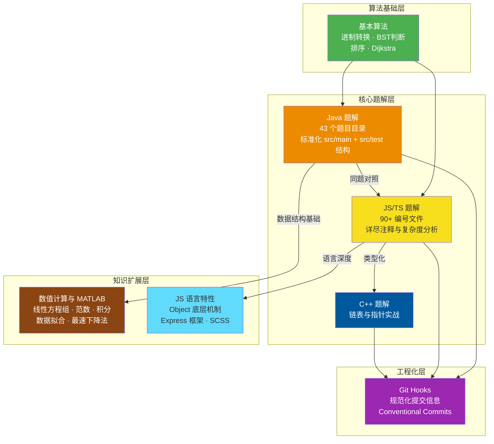

当你第一次打开这个仓库，可能会被满屏的数字编号文件和中文目录名搞得一头雾水——`1.js` 是什么？`P198` 又代表什么？别担心，这正是本文要帮你理清的。**Algorithm Zoo** 是一个以 LeetCode 题解为核心、横跨 Java / JavaScript / TypeScript / C++ 四种语言的学习型仓库，它不仅提供可运行的代码，还附有详细注释、复杂度分析和优化思路，是一份面向初学者的算法学习地图。

Sources: [README.md](README.md#L1-L8)

## 项目定位与核心价值

这个仓库的本质是一个**个人算法训练笔记的系统化沉淀**。它不是一本教科书，而是一个"边做边学"的实战记录——每一道题都保留了思考过程：从暴力解法到优化解法，从时间复杂度 O(n²) 到 O(n) 的演进路径。对于初学者而言，这种"先有直觉、再求优化"的学习路径比直接给出最优解更有教育意义。

仓库的三个核心特征：**多语言对照**（同一道题用 Java 和 JS 分别实现，便于对比语言特性）、**结构化组织**（Java 目录按题号+题目名归档，JS 目录按编号检索）、**知识延伸**（从 LeetCode 题解扩展到数值计算、MATLAB、前端框架等关联领域）。

Sources: [README.md](README.md#L16-L42)

## 整体架构总览

在深入任何一行代码之前，先从宏观上理解这个仓库的架构。下图展示了项目的六大模块及其内在关联：



架构分为四层：**核心题解层**是仓库的主体，包含 Java、JS/TS、C++ 三种语言的 LeetCode 实现；**算法基础层**提供独立于 LeetCode 的经典算法实现（如 Dijkstra 最短路径）；**知识扩展层**将算法思维延伸到数值计算和前端工程领域；**工程化层**则保障代码提交的规范性。

Sources: [README.md](README.md#L46-L78)

## 多语言覆盖对比

不同语言在这个仓库中承担着不同的学习角色。下表清晰地展示了各语言的定位差异：

| 维度 | ☕ Java | ⚡ JavaScript / TypeScript | ⚙️ C++ |
|------|---------|---------------------------|--------|
| **文件组织** | 每题独立目录，含 `src/main` + `src/test` | 按题号命名（如 `1.js`、`198.ts`） | 单文件 `test.cpp` |
| **题目数量** | 43 个题目目录 | 90+ 个编号文件 | 1 个示例 |
| **代码风格** | 面向对象，规范的包声明和类结构 | 函数式为主，附详细注释块 | 指针操作，结构体定义 |
| **注释深度** | README 含题目描述和链接 | 内嵌复杂度分析 + 优化思路 | 基础注释 |
| **学习侧重** | 架构规范、测试分离 | 算法思路演化、多解法对比 | 内存管理、指针实战 |
| **典型示例** | [Solution.java](Java/两数之和P1/src/main/Solution.java#L1-L20) | [1.js](JS/1.js#L1-L56) | [test.cpp](cpp/test.cpp#L1-L60) |

**关键洞察**：Java 和 JS/TS 之间存在大量同题对照关系。例如 LeetCode 198（打家劫舍），Java 版采用标准 dp 数组写法 `dp[i] = Math.max(dp[i-2] + nums[i], dp[i-1])`，而 JS 版则用 `Math.max(...dp.slice(0, i-1)) + nums[i]` 的展开写法——两种实现思路的差异本身就是极佳的学习素材。[Java 版](Java/打家劫舍P198/src/main/Solution.java#L4-L19) | [JS 版](JS/198.js#L1-L11)

Sources: [README.md](README.md#L82-L114)

## 可视化目录结构

以下是仓库的精简目录树，帮助你快速定位感兴趣的内容：

```
algorithm/
│
├── Java/                          # ☕ Java 题解（43 个题目）
│   ├── 两数之和P1/                 # P 后数字 = LeetCode 题号
│   │   ├── README.md              #   题目描述与链接
│   │   └── src/
│   │       ├── main/Solution.java #   核心解法
│   │       └── test/Test.java     #   测试用例
│   ├── 爬楼梯P70/
│   ├── 打家劫舍P198/
│   ├── 接雨水/
│   ├── 二叉树/                    #   独立数据结构专题
│   └── ...（共 43 个目录）
│
├── JS/                            # ⚡ JavaScript / TypeScript 题解
│   ├── 1.js                       # LeetCode 1: 两数之和
│   ├── 198.js / 198.ts            # 同一题的 JS 与 TS 版本对照
│   ├── 堆.js                      # 经典算法：最小堆与最大堆
│   ├── 归并排序.js                 # 经典算法：归并排序
│   ├── 排列组合模拟.js             # 经典算法：回溯全排列
│   ├── Object/                    # JS 对象底层机制探索
│   ├── express/                   # Express 框架实践
│   ├── node-ts/                   # TypeScript 编译配置
│   └── tsconfig.json              # TS 编译选项
│
├── cpp/                           # ⚙️ C++ 实现
│   └── test.cpp                   # 合并两个有序链表
│
├── 基本算法/                       # 📚 基础算法专题
│   ├── 二进制转十进制/
│   ├── 十进制转二进制/
│   ├── 平衡二叉树判断/
│   ├── 排序/
│   └── 迪杰拉特斯/                # Dijkstra 最短路径
│
├── math/                          # 🔬 数值计算理论
│   ├── 解线性方程组/               # LU分解 · 雅可比迭代 · 高斯消元
│   ├── 向量和矩阵范数/
│   ├── 数值积分/
│   ├── 数据拟合/
│   └── 最速下降法/
│
├── matlab/                        # 📊 MATLAB 实现
│   ├── matlab_learn/              #   系统学习模块
│   ├── 雅可比迭代/                #   数值方法实现
│   └── 线性方程组精确解/
│
├── scss/                          # 🎨 SCSS 预处理器
├── githook/                       # 🔧 Git 提交规范钩子
├── LICENSE                        # MIT 开源协议
└── README.md                      # 项目说明文档
```

Sources: [README.md](README.md#L46-L78)

## 题解代码的两种风格

这个仓库最独特的学习价值在于，同一种算法思想在不同语言中的表达方式截然不同。以两道经典题目为例：

**LeetCode 1 · 两数之和**：Java 版使用双层循环的暴力解法，代码结构工整但时间复杂度 O(n²)；JS 版则在注释中保留了原始暴力思路，同时给出了 HashMap 优化解法，将复杂度降至 O(n)。这种"先有直觉，再求优化"的呈现方式，正是初学者最需要的学习路径。[Java 版](Java/两数之和P1/src/main/Solution.java#L4-L19) | [JS 版](JS/1.js#L1-L56)

**LeetCode 42 · 接雨水**：JS 版采用"找最高点、左右分别扫描"的策略，先定位最高柱的索引，再分别从左右两端向最高点遍历，累加可接雨水量。这种解法思路直观，适合初学者理解接雨水问题的核心——**每个位置能接的雨水量取决于其左右两侧最高柱的较小值**。[JS 版](JS/42.js#L5-L24)

**经典算法 · 堆**：JS 版独立实现了最小堆和最大堆的完整类，包含 `insert`、`up`（上浮）、`down`（下沉）、`pop`、`peek` 五个核心操作。代码中 `(index - 1) >> 1` 这种位运算求父节点的方式，比 `Math.floor((index-1)/2)` 更高效，是值得留意的小技巧。[堆.js](JS/堆.js#L1-L153)

Sources: [1.js](JS/1.js#L1-L56)

## 学习路线建议

仓库的 README 提供了四阶段学习路线，从入门基础到高级挑战层层递进。结合本 Wiki 的目录结构，推荐以下阅读顺序：

| 阶段 | 学习重点 | 推荐阅读 |
|------|---------|---------|
| **入门** | 项目全貌、环境搭建、目录约定 | [项目概述](1-xiang-mu-gai-shu-duo-yu-yan-suan-fa-xue-xi-bao-ku) → [快速开始](2-kuai-su-kai-shi-huan-jing-da-jian-yu-yun-xing) → [仓库架构](3-cang-ku-jia-gou-yu-mu-lu-yue-ding) |
| **基础** | 数组、字符串、简单排序 | [JS/TS 题解检索](6-javascript-typescript-ti-jie-bian-hao-jian-suo-yu-duo-chong-jie-fa-dui-bi) → [双指针与滑动窗口](9-shuang-zhi-zhen-yu-hua-dong-chuang-kou-zi-fu-chuan-yu-shu-zu-wen-ti) |
| **进阶** | 动态规划、贪心、回溯 | [动态规划入门](8-dong-tai-gui-hua-ru-men-cong-fei-bo-na-qi-dao-da-jia-jie-she) → [贪心策略](10-tan-xin-ce-lue-jia-you-zhan-wen-ti-yu-tiao-yue-you-xi) → [回溯法](11-hui-su-fa-pai-lie-zu-he-yu-gua-hao-sheng-cheng) |
| **深入** | 数据结构、数值计算 | [二叉树](13-er-cha-shu-bian-li-cha-ru-yu-ping-heng-xing-pan-duan) → [堆](14-dui-zui-xiao-dui-yu-zui-da-dui-de-wan-zheng-shi-xian) → [线性方程组求解](22-xian-xing-fang-cheng-zu-qiu-jie-gao-si-xiao-yuan-lu-fen-jie-yu-ya-ke-bi-die-dai) |

Sources: [README.md](README.md#L187-L213)

## 仓库元信息速查

| 项目属性 | 详情 |
|---------|------|
| **项目名称** | Algorithm Zoo |
| **开源协议** | MIT License（Copyright 2024 liheng） |
| **语言覆盖** | Java · JavaScript · TypeScript · C++ · MATLAB · SCSS |
| **题解规模** | Java 43 题 · JS/TS 90+ 文件 · C++ 1 题 |
| **Node 依赖** | TypeScript ^6.0.3 |
| **TS 编译目标** | ES2015，CommonJS 模块，严格模式 |
| **Git 提交规范** | Conventional Commits（feat/fix/docs/style/refactor/test/chore） |

Sources: [LICENSE](LICENSE#L1-L5) | [package.json](JS/package.json#L1-L5) | [tsconfig.json](JS/tsconfig.json#L1-L11) | [commit-msg](githook/commit-msg#L1-L13)

## 下一步

你已经了解了项目的全貌——它是一个从 LeetCode 题解出发、延伸至数值计算和前端工程的多语言学习宝库。接下来，建议按照以下顺序深入探索：

1. **[快速开始：环境搭建与运行](2-kuai-su-kai-shi-huan-jing-da-jian-yu-yun-xing)** —— 在本地把代码跑起来，这是所有学习的第一步
2. **[仓库架构与目录约定](3-cang-ku-jia-gou-yu-mu-lu-yue-ding)** —— 理解文件命名规则和目录组织逻辑，让后续导航更高效
3. **[Java 题解体系](5-java-ti-jie-ti-xi-xiang-mu-jie-gou-yu-jie-ti-mo-ban)** —— 从最规范的 Java 解法模板开始，建立算法思维的基本框架

算法学习之路，始于足下。