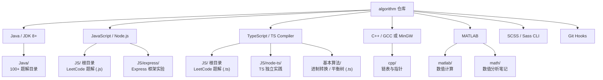
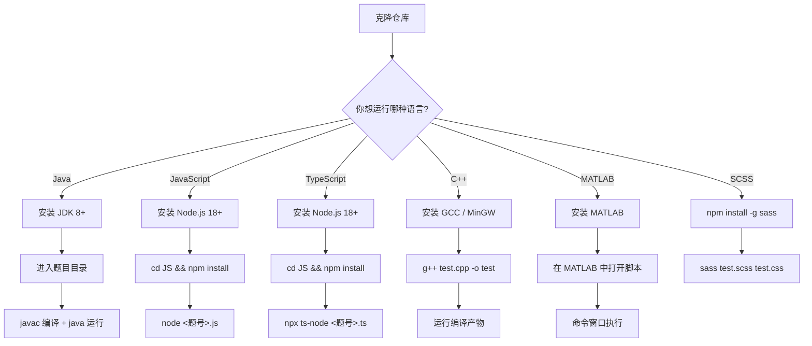

本页是一份面向初学者的**环境搭建与运行指南**，帮助你从零开始配置本仓库所需的全部运行时环境，并成功执行第一个算法题解。仓库涵盖 Java、JavaScript/TypeScript、C++、MATLAB 四大语言栈，外加 SCSS 预处理器与 Git Hooks 工程化配置——你需要根据自己感兴趣的语言模块选择性安装，无需一次性配置全部环境。

Sources: [README.md](README.md#L1-L271)

## 整体环境架构概览

在动手安装之前，先理解仓库的**多语言运行时架构**。各语言模块彼此独立，没有跨语言依赖，你可以按需搭建任意子集。



Sources: [README.md](README.md#L48-L78)

## 前置条件：必装工具

无论你选择哪个语言模块，以下工具是**通用前提**：

| 工具 | 最低版本 | 用途 | 安装验证命令 |
|------|---------|------|-------------|
| **Git** | 2.x | 克隆仓库、Git Hooks | `git --version` |
| **代码编辑器** | — | 推荐 VS Code（多语言通用） | — |

克隆仓库：

```bash
git clone https://github.com/your-username/algorithm.git
cd algorithm
```

Sources: [README.md](README.md#L120-L126)

## Java 环境搭建与运行

### 安装 JDK

本项目 Java 代码兼容 **JDK 8 及以上**版本。推荐安装 LTS 版本（JDK 8、11 或 21）。

| 安装方式 | 说明 |
|---------|------|
| [Oracle JDK](https://www.oracle.com/java/technologies/downloads/) | 官方发行版 |
| [Adoptium / Eclipse Temurin](https://adoptium.net/) | 开源推荐，社区维护 |
| Windows 包管理器 | `winget install EclipseAdoptium.Temurin.21.JDK` |

验证安装：

```bash
java -version
javac -version
```

### 项目结构约定

每道 LeetCode 题目对应一个独立目录，内部遵循 **`src/main` + `src/test`** 双包结构：

```
Java/两数之和P1/
├── README.md              # 题目链接与说明
└── src/
    ├── main/
    │   └── Solution.java  # 算法实现（包名：两数之和P1.src.main）
    └── test/
        └── Test.java      # 测试入口（包名：两数之和P1.src.test）
```

**关键约定**：Java 源文件使用中文目录名作为包名（如 `package 两数之和P1.src.main`），测试类通过 `import 两数之和P1.src.main.Solution` 引入解题类。

Sources: [Solution.java](Java/两数之和P1/src/main/Solution.java#L1-L20), [Test.java](Java/两数之和P1/src/test/Test.java#L1-L14)

### 编译与运行

进入题目目录，执行编译和运行：

```bash
cd Java/两数之和P1

# 编译：将源码输出到 out 目录
javac -cp src src/main/Solution.java src/test/Test.java -d out

# 运行：执行测试类
java -cp out 两数之和P1.src.test.Test
```

预期输出：

```
[0, 1]
```

**编译参数解析**：

| 参数 | 含义 |
|------|------|
| `-cp src` | 将 `src` 设为类路径根目录，使 `import` 可按包结构解析 |
| `-d out` | 编译后的 `.class` 文件输出到 `out` 目录 |
| `两数之和P1.src.test.Test` | 运行时使用**全限定类名**（包名.类名） |

> ⚠️ **常见问题**：如果出现 `找不到类` 错误，请确认 `-cp` 指向的是 `out` 目录（编译后）而非 `src` 目录，且全限定类名与 `package` 声明一致。

Sources: [README.md](README.md#L128-L134)

## JavaScript 环境搭建与运行

### 安装 Node.js

推荐安装 **Node.js 18+ LTS** 版本。

| 安装方式 | 说明 |
|---------|------|
| [Node.js 官网](https://nodejs.org/) | 推荐下载 LTS 版本 |
| Windows 包管理器 | `winget install OpenJS.NodeJS.LTS` |
| nvm-windows | 多版本管理，适合进阶用户 |

验证安装：

```bash
node -v
npm -v
```

### 运行 LeetCode 题解

`JS/` 目录下的 `.js` 文件以 LeetCode 题目编号命名，每个文件都是**独立可运行**的：

```bash
cd JS

# 运行两数之和（LeetCode #1）
node 1.js
```

预期输出：

```
[ 0, 1 ]
```

文件内自带 `console.log()` 调用，无需额外编写测试入口。例如 `1.js` 底部直接打印 `twoSum([2, 7, 11, 15, 1], 9)` 的结果。

Sources: [1.js](JS/1.js#L1-L56)

### 安装依赖

`JS/` 根目录的 `package.json` 仅声明了 TypeScript 编译器依赖：

```bash
cd JS
npm install
```

安装后 `node_modules/` 中将包含 `typescript`，供 `.ts` 文件编译使用。

Sources: [package.json](JS/package.json#L1-L6)

### Express 子项目

`JS/express/` 是独立的 Express 框架实验项目，拥有自己的 `package.json`：

```bash
cd JS/express
npm install    # 安装 Express 5.x
node express_test.js   # 启动服务器
```

服务器启动后访问 `http://localhost:3000/test` 即可验证。

Sources: [package.json](JS/express/package.json#L1-L16), [express_test.js](JS/express/express_test.js#L1-L29)

## TypeScript 环境搭建与运行

### 配置说明

TypeScript 编译器已在 `JS/` 的依赖中声明（`typescript: ^6.0.3`），配置由 `tsconfig.json` 统一管理：

```json
{
  "compilerOptions": {
    "moduleDetection": "force",
    "target": "ES2015",
    "module": "commonjs",
    "strict": true,
    "esModuleInterop": true,
    "skipLibCheck": true
  }
}
```

| 配置项 | 值 | 含义 |
|-------|-----|------|
| `target` | `ES2015` | 编译输出目标为 ES6 |
| `module` | `commonjs` | 模块系统兼容 Node.js |
| `strict` | `true` | 开启全部严格类型检查 |
| `esModuleInterop` | `true` | 允许 CommonJS/ESModule 互导入 |

Sources: [tsconfig.json](JS/tsconfig.json#L1-L11), [package.json](JS/package.json#L1-L6)

### 运行方式

**方式一：使用 ts-node 直接运行（推荐）**

```bash
cd JS

# 安装依赖（如果尚未安装）
npm install

# 使用 npx 直接运行 .ts 文件
npx ts-node 1.ts
```

**方式二：node-ts 子项目**

```bash
cd JS/node-ts
npx ts-node test_ts.ts
```

**方式三：先编译再运行**

```bash
cd JS
npx tsc 1.ts          # 编译生成 1.js
node 1.js             # 运行编译产物
```

Sources: [README.md](README.md#L146-L149)

### 基本算法目录中的 TypeScript

`基本算法/` 目录同样包含 `.ts` 文件，如进制转换和平衡二叉树判断。这些文件使用了 `export` 模块导出，运行时需要注意模块解析：

```typescript
// 基本算法/二进制转十进制/TwoToTen.ts
const twoToTen = function (nums: number) {
    let str = nums.toString()
    let num = 0
    for (let i = str.length - 1; i >= 0; i--) {
        num += Math.pow(2, +(str.length - 1 - i)) * +(str[i])
    }
    return num
}
export { twoToTen }
```

运行含 `export` 的文件时，推荐使用 `ts-node` 或先 `tsc` 编译。

Sources: [TwoToTen.ts](基本算法/二进制转十进制/TwoToTen.ts#L1-L16)

## C++ 环境搭建与运行

### 安装编译器

| 平台 | 推荐编译器 | 安装方式 |
|------|-----------|---------|
| Windows | MinGW-w64 | `winget install MSYS2.MSYS2` 后通过 pacman 安装 |
| Windows | MSVC | 安装 Visual Studio Build Tools |
| macOS | Clang | Xcode Command Line Tools (`xcode-select --install`) |
| Linux | GCC | `sudo apt install g++` |

验证安装：

```bash
g++ --version
```

### 编译与运行

```bash
cd cpp

# 编译
g++ test.cpp -o test

# 运行（Windows）
test.exe

# 运行（Linux/macOS）
./test
```

预期输出（合并两个有序链表）：

```
1 -> 1 -> 2 -> 3 -> 4 -> 4 -> null
```

> 📌 仓库中已包含预编译的 `test.exe`（Windows 平台）及运行时 DLL（`libgcc_s_seh-1.dll`、`libstdc++-6.dll`、`libwinpthread-1.dll`）。如果在 Windows 上直接运行遇到 DLL 缺失，请将上述 DLL 与 `test.exe` 置于同一目录。

Sources: [test.cpp](cpp/test.cpp#L1-L60)

## MATLAB 环境搭建与运行

### 安装 MATLAB

MATLAB 为商业软件，需从 [MathWorks 官网](https://www.mathworks.com/products/matlab.html) 获取许可证并安装。部分高校提供免费教育版授权。

### 运行方式

MATLAB 脚本（`.m` 文件）需在 MATLAB 环境中执行：

```matlab
% 在 MATLAB 命令窗口中运行
cd('matlab/雅可比迭代')
test    % 执行 test.m，加载 test.mat 并调用 jacob 函数
```

**典型工作流**：

```
打开 MATLAB → 切换到目标目录 → 在命令窗口输入脚本名（不带 .m 后缀）→ 回车执行
```

MATLAB 子项目中的 `.mat` 文件是二进制数据文件，由 `load` 命令加载。可用 `whos -file test.mat` 验证数据文件内容。

Sources: [test.m](matlab/雅可比迭代/test.m#L1-L4), [learn.md](matlab/matlab_learn/learn.md#L1-L30)

## SCSS 环境搭建与运行

### 安装 Sass 编译器

```bash
# 全局安装 Dart Sass
npm install -g sass
```

### 编译与运行

```bash
cd scss

# 单次编译
sass test.scss test.css

# 监听模式（文件变动自动编译）
sass --watch test.scss:test.css
```

编译产物 `test.css` 已存在于仓库中，可直接查看。

Sources: [test.scss](scss/test.scss#L1-L11)

## 环境搭建流程总览

以下是完整的搭建决策流程，帮助你快速定位所需步骤：



Sources: [README.md](README.md#L118-L149)

## 常见问题排查

| 症状 | 可能原因 | 解决方案 |
|------|---------|---------|
| `java: 找不到或无法加载主类` | 全限定类名与包声明不匹配 | 确认 `java -cp out` 后的类名包含完整包路径 |
| `javac 编码错误` | 源文件含中文，默认编码不匹配 | 使用 `javac -encoding UTF-8` 编译 |
| `Cannot find module 'typescript'` | JS 目录依赖未安装 | 执行 `cd JS && npm install` |
| `g++ 不是内部命令` | MinGW 未加入 PATH | 将 MinGW `bin` 目录添加到系统 PATH |
| `.mat 文件加载失败` | 文件路径含中文或路径错误 | 使用绝对路径或切换到 MATLAB 当前工作目录 |
| `node 1.js 无输出` | 文件未在 `JS/` 目录下执行 | 确认工作目录为 `JS/` |

Sources: [.gitignore](.gitignore#L1-L8), [README.md](README.md#L219-L228)

## 下一步

环境就绪后，建议按照以下路径深入探索：

1. **了解仓库全貌** → [项目概述：多语言算法学习宝库](1-xiang-mu-gai-shu-duo-yu-yan-suan-fa-xue-xi-bao-ku)
2. **熟悉目录约定** → [仓库架构与目录约定](3-cang-ku-jia-gou-yu-mu-lu-yue-ding)
3. **规范你的贡献** → [代码规范与贡献流程](4-dai-ma-gui-fan-yu-gong-xian-liu-cheng)
4. **开始刷题** → 根据你安装的语言选择：
   - [Java 题解体系：项目结构与解题模板](5-java-ti-jie-ti-xi-xiang-mu-jie-gou-yu-jie-ti-mo-ban)
   - [JavaScript / TypeScript 题解：编号检索与多种解法对比](6-javascript-typescript-ti-jie-bian-hao-jian-suo-yu-duo-chong-jie-fa-dui-bi)
   - [C++ 题解：链表与指针实战](7-c-ti-jie-lian-biao-yu-zhi-zhen-shi-zhan)