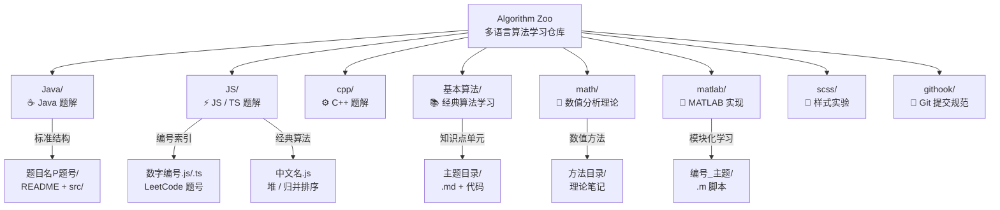

本页是 Algorithm Zoo 仓库的**架构地图**——你将看清每一层目录的设计意图、命名规则与文件组织约定。无论你是想快速定位某道 LeetCode 题解，还是理解 `math/` 与 `matlab/` 的职责边界，这里都给出了明确的答案。

Sources: [README.md](README.md#L1-L271)

## 全局架构总览

仓库以**编程语言**为一级分区、以**算法题目或知识点**为二级单元，构建了一张"语言 × 题目"的多维索引网。下图展示了顶层目录的职责分工与数据流向：



Sources: [README.md](README.md#L46-L78)

## 核心目录结构一览

以下是仓库顶层目录的精简结构，标注了每个一级目录的定位与内容特征：

```
algorithm/
├── Java/              ☕ 结构化题解：每题一个独立目录
├── JS/                ⚡ 扁平化题解：LeetCode 编号即文件名
├── cpp/               ⚙️ C++ 题解与编译产物
├── 基本算法/           📚 经典算法：排序、树、图、进制转换
├── math/              📐 数值分析：范数、积分、方程组求解
├── matlab/            🔢 MATLAB：基础语法到数值计算
├── scss/              🎨 SCSS 变量与编译实验
├── githook/           🔧 提交信息格式校验钩子
├── .gitignore         📋 Git 忽略规则
├── LICENSE            📜 MIT 开源协议
└── README.md          📖 项目总览与使用指南
```

Sources: [README.md](README.md#L46-L78), [.gitignore](.gitignore#L1-L8)

## Java 题解目录约定

**设计原则**：Java 目录采用"一题一目录"的**面向对象组织模式**，每道题目拥有完整的标准化结构，适合在 IDE 中独立编译运行。

### 目录命名规则

目录名由**中文题目名** + **可选的 LeetCode 题号后缀**组成。题号后缀以大写 `P` 开头，紧跟题号数字，便于快速识别题目来源：

| 命名模式 | 示例 | 含义 |
|----------|------|------|
| `题目名P题号` | `两数之和P1`、`爬楼梯P70`、`打家劫舍P198` | LeetCode 标准题目，P 后数字即题号 |
| `题目名`（无题号） | `买卖股票的最佳时机`、`接雨水` | 按中文名称组织，未标注题号 |

Sources: [Java/两数之和P1/src/main/Solution.java](Java/两数之和P1/src/main/Solution.java#L1-L20), [Java/打家劫舍P198/src/main/Solution.java](Java/打家劫舍P198/src/main/Solution.java#L1-L20)

### 标准内部结构

绝大多数 Java 题目遵循以下固定结构，这种布局模仿了 Maven 的 `src/main` / `src/test` 约定：

```
题目名P题号/
├── README.md                  # 题目描述与 LeetCode 链接
└── src/
    ├── main/
    │   └── Solution.java      # 核心算法实现
    └── test/
        └── Test.java          # 本地测试用例
```

其中 `Solution.java` 的 **package 声明**遵循与目录路径完全一致的命名——例如 `两数之和P1` 目录下的类声明为 `package 两数之和P1.src.main;`，测试类则声明为 `package 两数之和P1.src.test;` 并 import 对应的 Solution 类。这种约定保证了各题目之间的**完全隔离**，每个目录可以直接用 `javac` 编译运行。

Sources: [Java/两数之和P1/src/main/Solution.java](Java/两数之和P1/src/main/Solution.java#L1-L20), [Java/两数之和P1/src/test/Test.java](Java/两数之和P1/src/test/Test.java#L1-L14)

### 变体结构

部分题目根据需要存在扩展目录：

| 变体 | 示例 | 说明 |
|------|------|------|
| 含 `resources/` | `跳跃游戏/` | 存放题目截图、示意图等辅助资源 |
| 扁平结构 | `二叉树/` | 数据结构类题目，多个 `.java` 文件平铺 + 独立 `.md` 文档 |
| README 内容 | 各目录 | 统一格式：`## 题目名` + `[地址](LeetCode链接)` |

Sources: [Java/二叉树/BinaryTree.md](Java/二叉树/BinaryTree.md#L1-L127)

## JavaScript / TypeScript 题解目录约定

**设计原则**：JS 目录采用**扁平化、编号驱动**的组织模式——文件名即检索索引，无需进入子目录即可定位题目。

### 文件命名规则

| 命名模式 | 示例 | 含义 |
|----------|------|------|
| `题号.js` | `1.js`、`198.js`、`347.js` | LeetCode 题目对应的 JavaScript 解法 |
| `题号.ts` | `134.ts`、`198.ts`、`26.ts` | 同一题目的 TypeScript 版本 |
| `题号_序号.js` | `2_1.js`、`26_1.js`、`27_1.js` | 同一题目的**多种解法**，序号区分 |
| `中文名.js` | `堆.js`、`归并排序.js`、`排列组合模拟.js` | 经典算法的完整实现，独立于 LeetCode 编号体系 |
| `q数字.js` / `q_数字.js` | `q1.js`、`q_1.js`、`q_2.js` | 非 LeetCode 来源的**自定义练习题** |

**关键细节**：`.js` 与 `.ts` 并非总是成对出现。某些题目仅有 JS 版本（如 `1.js` 无对应 `1.ts`），某些仅有 TS 版本。这反映了学习过程中的渐进式练习轨迹——早期以 JS 为主，后期逐步引入 TS 类型约束。

Sources: [JS/1.js](JS/1.js#L1-L56), [JS/2_1.js](JS/2_1.js#L1-L85), [JS/堆.js](JS/堆.js#L1-L153), [JS/归并排序.js](JS/归并排序.js#L1-L30)

### 子目录职责

JS 目录下的子目录承担了**语言特性探索**的职能，不属于 LeetCode 题解体系：

| 子目录 | 内容 | 说明 |
|--------|------|------|
| `Object/` | `defineProperty_test.js`、`instanceof.js`、`setPrototypeOf_test.js`、`value_test.js` | JavaScript 对象底层机制实验 |
| `express/` | Express 框架学习 + 独立 `package.json` | Node.js 后端入门实践 |
| `node-ts/` | `test_ts.ts` + 独立 `package.json` | TypeScript 编译运行环境 |
| `txt/` | `1.txt` ~ `12.txt` | 早期练习的**备份快照**，以 `.txt` 保存代码片段 |

Sources: [JS/Object/defineProperty_test.js](JS/Object/defineProperty_test.js#L1-L58), [JS/express/package.json](JS/express/package.json#L1-L16), [JS/txt/1.txt](JS/txt/1.txt#L1-L21)

### TypeScript 编译配置

`JS/tsconfig.json` 定义了仓库级别的 TypeScript 编译规则：目标 ES2015、CommonJS 模块系统、严格模式启用。这意味着所有 `.ts` 文件在类型安全的环境下编写，编译产物兼容 Node.js 运行时。

Sources: [JS/tsconfig.json](JS/tsconfig.json#L1-L11), [JS/package.json](JS/package.json#L1-L6)

## C++ 题解目录约定

`cpp/` 目录目前结构较为轻量，包含一个 `test.cpp` 源文件及编译产物（`.exe`、`.dll`）。源文件遵循 LeetCode 风格的类定义模式：`Solution` 类 + `main()` 函数构造测试用例。该目录适合存放性能敏感的底层算法实现。

Sources: [cpp/test.cpp](cpp/test.cpp#L1-L60)

## 基本算法目录约定

**设计原则**：`基本算法/` 以**算法主题**为组织单元，每个主题是一个独立目录，内含 Markdown 文档与代码实现的配对组合。

```
基本算法/
├── 二进制转十进制/     TwoToTen.md + TwoToTen.ts
├── 十进制转二进制/     TenTotwo.md + TenTotwo.ts
├── 平衡二叉树判断/     BTScheck.md + bts_check.ts
├── 排序/              sort.md
└── 迪杰拉特斯/        infinite.js + test.js
```

该目录与 `JS/` 的区别在于：`基本算法/` 聚焦**经典算法的系统性学习**，每个主题配有独立的 `.md` 理论文档；而 `JS/` 则聚焦**LeetCode 题目的实战练习**。两者互为补充——先在 `基本算法/` 理解原理，再到 `JS/` 刷题巩固。

Sources: [基本算法/迪杰拉特斯/test.js](基本算法/迪杰拉特斯/test.js#L1-L41)

## 数值计算目录约定

仓库在数值计算领域有两个互补的目录：`math/` 侧重**理论笔记**，`matlab/` 侧重**工程实现**。

### math/ — 理论与笔记

```
math/
├── 向量和矩阵范数/
├── 数值积分/
├── 数据拟合/
├── 最速下降法/
└── 解线性方程组/
    ├── LU分解/
    ├── 雅可比迭代/
    └── 高斯消元/
```

`math/` 按数值分析的经典知识体系组织，每个子目录对应一个数值方法，内部存放理论推导笔记。

Sources: [math/](math/)

### matlab/ — 实现与脚本

```
matlab/
├── matlab_learn/              # 系统化学习模块
│   ├── 01_basic_syntax/       # 编号前缀表示学习顺序
│   ├── 02_arrays_matrices/
│   ├── 03_plotting/
│   ├── 04_functions/
│   ├── 05_file_io/
│   ├── mat/                   # 数据文件(.mat)操作
│   ├── 工具箱/                # 自定义工具函数
│   └── 模块化/                # 函数封装实践
├── 水平层面的大地电磁测深/     # 专业领域应用
├── 线性方程组精确解/          # 与 math/ 主题对应的实现
└── 雅可比迭代/                # 迭代法的完整实现
```

`matlab_learn/` 下的编号前缀（`01_` ~ `05_`）清晰标注了学习路径的先后顺序——从基础语法到文件 IO，循序渐进。每个模块内含一个与目录同名的 `.m` 脚本文件。顶层的专业主题目录则与 `math/` 的理论笔记形成**理论 → 实现**的闭环。

Sources: [matlab/](matlab/)

## 工程化配置目录约定

### githook/ — 提交信息校验

`githook/commit-msg` 是一个 Shell 脚本，强制所有 Git 提交信息遵循 **Conventional Commits** 规范：`<type>: <description>`。允许的类型包括 `feat`、`fix`、`docs`、`style`、`refactor`、`test`、`chore`。不符合格式的提交会被拒绝，确保仓库提交历史的可读性与自动化兼容性。

Sources: [githook/commit-msg](githook/commit-msg#L1-L13)

### scss/ — 样式预处理实验

`scss/` 包含 SCSS 源文件（`test.scss`）及其编译产物（`.css` + `.css.map`），用于前端样式预处理器的学习实验。

Sources: [scss/test.scss](scss/test.scss#L1-L11)

### .gitignore — 忽略规则

仓库的 `.gitignore` 过滤了 IDE 配置（`.idea`、`.vscode`）、Java 项目文件（`*.iml`）、`node_modules/` 以及自定义的 `字节码/` 目录，保持仓库干净。

Sources: [.gitignore](.gitignore#L1-L8)

## 目录约定速查对比

| 维度 | Java/ | JS/ | 基本算法/ | matlab/ |
|------|-------|-----|----------|---------|
| **组织方式** | 一题一目录 | 扁平编号文件 | 一主题一目录 | 一主题一目录 |
| **命名特征** | 中文名 + P题号 | 数字编号 | 中文主题名 | 编号前缀 + 主题 |
| **代码结构** | `src/main` + `src/test` | 单文件自包含 | `.md` + 代码配对 | `.m` 脚本 |
| **语言** | Java | JS / TS | TS / JS / 混合 | MATLAB |
| **文档形式** | 每题 README.md | 文件头注释块 | 独立 .md 文件 | 代码内注释 |
| **适用场景** | 面试刷题 | 快速验证 | 系统学习 | 数值计算 |

Sources: [Java/两数之和P1/](Java/两数之和P1/src/main/Solution.java#L1-L20), [JS/1.js](JS/1.js#L1-L56), [基本算法/迪杰拉特斯/test.js](基本算法/迪杰拉特斯/test.js#L1-L41), [matlab/](matlab/)

## 下一步阅读建议

理解了仓库的架构约定后，建议按以下路径深入：

1. **[代码规范与贡献流程](4-dai-ma-gui-fan-yu-gong-xian-liu-cheng)** — 掌握代码风格要求和 Git 提交规范，为参与贡献做好准备
2. **[Java 题解体系：项目结构与解题模板](5-java-ti-jie-ti-xi-xiang-mu-jie-gou-yu-jie-ti-mo-ban)** — 深入 Java 目录的标准结构与 Solution 模板
3. **[JavaScript / TypeScript 题解：编号检索与多种解法对比](6-javascript-typescript-ti-jie-bian-hao-jian-suo-yu-duo-chong-jie-fa-dui-bi)** — 理解 JS 目录的编号体系与注释规范