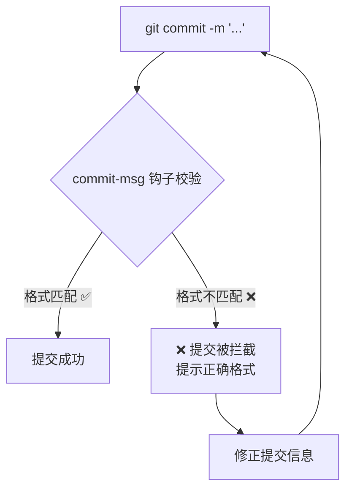
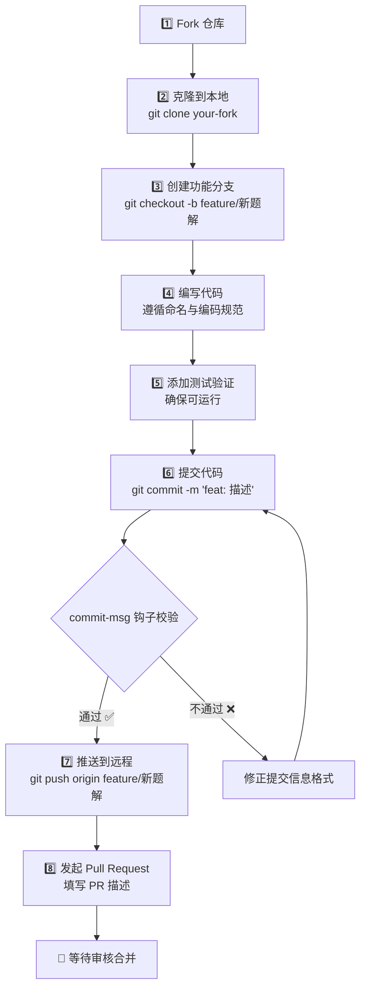

本页是 Algorithm Zoo 项目的**编码规范手册与贡献操作指南**。无论你是第一次提交算法题解，还是想为现有代码补充优化思路，这里都会明确告诉你：文件怎么命名、代码怎么写、提交信息怎么填、Pull Request 怎么走。掌握这些约定，你的贡献就能无缝融入仓库的现有体系。

Sources: [README.md](README.md#L232-L255), [githook/commit-msg](githook/commit-msg#L1-L13), [.gitignore](.gitignore#L1-L8)

---

## 提交信息规范：Git Hooks 强制校验

项目在 `githook/` 目录下配置了 **commit-msg** 钩子，每次 `git commit` 都会自动校验提交信息格式。格式不合规的提交会被直接拦截——这不是建议，而是**硬性约束**。

### 格式规则

提交信息必须遵循以下正则模式：

```
<type>: <description>
```

其中 `<type>` 只允许以下 7 种取值：

| 类型 | 含义 | 典型示例 |
|------|------|----------|
| **feat** | 新增功能或题解 | `feat: 添加两数之和题解` |
| **fix** | 修复 Bug | `fix: 修复动态规划边界条件` |
| **docs** | 文档变更 | `docs: 更新README项目结构` |
| **style** | 代码格式调整（不影响逻辑） | `style: 统一缩进为4空格` |
| **refactor** | 重构（不新增功能也不修复 Bug） | `refactor: 提取公共排序方法` |
| **test** | 添加或修改测试 | `test: 补充回文数测试用例` |
| **chore** | 构建/工具变更 | `chore: 更新TypeScript依赖` |

如果你写了类似 `update code` 或 `fix bug` 这样不含类型前缀的信息，钩子会拒绝提交并提示正确格式。

### 校验流程



> 💡 **新手提示**：如果你不确定钩子是否生效，可以在提交前手动测试——故意写一条格式错误的信息（如 `test commit`），看到拦截提示就说明钩子正常工作。

Sources: [githook/commit-msg](githook/commit-msg#L1-L13)

---

## 文件命名与目录约定

本仓库采用**多语言并列**的目录布局，每种语言有各自的命名体系。理解这些约定是正确添加新题解的前提。

### Java 目录结构

每道 LeetCode 题目对应 `Java/` 下的一个独立文件夹，**文件夹名采用中文题名 + 题号**的格式：

```
Java/
├── 两数之和P1/              # "P1" 表示 LeetCode 第 1 题
│   ├── README.md            # 题目说明与链接
│   └── src/
│       ├── main/
│       │   └── Solution.java   # 核心算法实现
│       └── test/
│           └── Test.java       # 测试入口
├── 爬楼梯P70/
├── 接雨水/                   # 也有不带题号的命名
└── ...
```

**关键约定**：

- **Solution.java** 是算法核心，package 声明必须与目录路径一致（如 `package 两数之和P1.src.main;`）
- **Test.java** 是运行入口，负责实例化 Solution 并打印结果
- **README.md** 包含题目描述与 LeetCode 链接

Sources: [Java/两数之和P1/src/main/Solution.java](Java/两数之和P1/src/main/Solution.java#L1-L20), [Java/两数之和P1/src/test/Test.java](Java/两数之和P1/src/test/Test.java#L1-L14)

### JavaScript / TypeScript 命名

JS/TS 题解直接以 **LeetCode 题目编号**作为文件名，简洁明了：

```
JS/
├── 1.js          # LeetCode 1: 两数之和
├── 134.ts        # LeetCode 134: 加油站（TypeScript 版）
├── 134.js        # 同一题的 JavaScript 编译产物
├── 20_1.js       # 同一题的另一种解法（后缀 _1 区分）
├── 26_1.ts
├── 堆.js         # 经典算法用中文命名
├── 归并排序.js
├── Object/       # 语言特性实验
├── express/      # Express 框架学习
└── node-ts/      # TypeScript 运行环境
```

**关键约定**：

- 编号即文件名：`1.js`、`198.ts`，一个文件一道题
- 同题多解法：用 `_1`、`_2` 后缀区分（如 `20.js` 和 `20_1.js`）
- `.js` 与 `.ts` 并存：`.ts` 是源码，`.js` 是 TypeScript 编译输出
- 经典算法（非 LeetCode）：允许使用中文命名（如 `堆.js`、`归并排序.js`）

Sources: [JS/1.js](JS/1.js#L1-L56), [JS/20_1.js](JS/20_1.js#L1)

### C++ 命名

C++ 目前以单文件形式存放在 `cpp/` 目录下，使用 `test.cpp` 作为主文件名，遵循 LeetCode 标准的 `Solution` 类 + `main()` 测试入口模式。

Sources: [cpp/test.cpp](cpp/test.cpp#L1-L60)

### 基本算法目录

`基本算法/` 用于存放**非 LeetCode 的基础算法学习**，每个算法一个独立子目录，内含 `.md` 说明文档与 `.ts` 实现：

```
基本算法/
├── 二进制转十进制/
│   ├── TwoToTen.md
│   └── TwoToTen.ts
├── 排序/
│   └── sort.md
└── 迪杰拉特斯/
```

Sources: [基本算法/二进制转十进制/TwoToTen.ts](基本算法/二进制转十进制/TwoToTen.ts#L1-L16)

---

## 代码编写规范

### 通用原则

项目 README 中明确列出了以下代码规范，适用于所有语言：

| ✅ 应该做 | ❌ 不应该做 |
|-----------|------------|
| 使用有意义的变量命名 | 硬编码魔数 |
| 添加必要的注释说明 | 重复/冗余代码 |
| 分析时间和空间复杂度 | 无注释的"谜语代码" |
| 考虑边界情况 | 忽略空输入等边界 |

Sources: [README.md](README.md#L232-L241)

### Java 代码规范

**类结构**：每道题的 `Solution.java` 遵循统一的模板——一个 `Solution` 类 + 一个解题方法。`Test.java` 则负责实例化并调用：

```java
// Solution.java —— 核心算法
package 两数之和P1.src.main;

public class Solution {
    public int[] twoSum(int[] nums, int target) {
        // 算法实现
    }
}

// Test.java —— 测试入口
package 两数之和P1.src.test;
import 两数之和P1.src.main.Solution;

public class Test {
    public static void main(String[] args) {
        Solution solution = new Solution();
        System.out.println(Arrays.toString(solution.twoSum(...)));
    }
}
```

**核心要点**：

- **package 声明**必须匹配目录路径，否则编译失败
- Solution 类只包含算法逻辑，不包含 `main` 方法
- Test 类通过 `import` 引入 Solution，在 `main` 中执行验证

Sources: [Java/两数之和P1/src/main/Solution.java](Java/两数之和P1/src/main/Solution.java#L1-L20), [Java/两数之和P1/src/test/Test.java](Java/两数之和P1/src/test/Test.java#L1-L14), [Java/接雨水/src/main/Solution.java](Java/接雨水/src/main/Solution.java#L1-L39)

### JavaScript 代码规范

JS 题解采用**文件头注释 + 函数实现 + console.log 验证**的三段式结构。以 `1.js` 为例，其注释模板堪称本项目最规范的范例：

```javascript
/**
 * ========================================
 * LeetCode 1. 两数之和 (Two Sum)
 * ========================================
 * - 外层循环从索引0开始
 * - 内层循环从i+1开始，避免重复比较
 * - 找到两数之和等于target时，记录下标并返回
 * 
 * 【代码分析】
 * ✅ 优点：思路直观，容易理解
 * ❌ 缺点：时间复杂度O(n²)，效率较低
 * 
 * 【优化思路】
 * 使用哈希表将查找时间从O(n)降到O(1)
 * 
 * 【复杂度对比】
 * 当前：时间O(n²) 空间O(1)
 * 优化：时间O(n)   空间O(n)
 **/
```

**注释模板要素**：

1. **题目标识**：LeetCode 编号 + 中英文题名
2. **算法思路**：用条目式描述核心逻辑
3. **代码分析**：优缺点双向评估
4. **优化思路**：指向更优解法
5. **复杂度对比**：当前实现 vs 优化实现的时间和空间复杂度

Sources: [JS/1.js](JS/1.js#L1-L56)

### TypeScript 代码规范

TypeScript 文件需在头部声明类型注解，变量使用 `:type` 语法。项目 `tsconfig.json` 开启了 `strict: true` 严格模式，这意味着所有变量都必须有明确的类型：

```typescript
// 变量声明带类型注解
let gas: number[] = [5, 1, 2, 3, 4]
let cost: number[] = [4, 4, 1, 5, 1]
let start: number[] = []  // 有效起点

// 函数声明带参数与返回值类型
const twoToTen = function (nums: number): number {
    // ...
}
```

**TypeScript 编译配置**（`tsconfig.json` 关键项）：

| 配置项 | 值 | 作用 |
|--------|-----|------|
| `target` | ES2015 | 编译目标为 ES6 |
| `module` | commonjs | 使用 CommonJS 模块系统 |
| `strict` | true | 开启所有严格类型检查 |
| `esModuleInterop` | true | 允许 CommonJS/ES 模块互导 |
| `skipLibCheck` | true | 跳过第三方库类型检查 |

Sources: [JS/tsconfig.json](JS/tsconfig.json#L1-L11), [JS/134.ts](JS/134.ts#L1-L16), [基本算法/二进制转十进制/TwoToTen.ts](基本算法/二进制转十进制/TwoToTen.ts#L1-L16)

### C++ 代码规范

C++ 题解遵循 LeetCode 标准模板：`struct ListNode` 定义数据结构、`class Solution` 封装算法、`main()` 手动构造测试数据并打印结果。这与在线评测系统的代码格式保持一致，方便直接复制提交。

Sources: [cpp/test.cpp](cpp/test.cpp#L1-L60)

---

## .gitignore 排除规则

项目通过 `.gitignore` 排除以下内容，确保仓库干净、体积可控：

| 规则 | 排除对象 | 原因 |
|------|----------|------|
| `/.idea` | JetBrains IDE 配置 | 编辑器私有配置 |
| `/.vscode` | VS Code 配置 | 编辑器私有配置 |
| `/.git` | Git 内部目录 | 版本控制元数据 |
| `/字节码` | Java 编译产物 | 编译输出，非源码 |
| `*.iml` | IntelliJ 模块文件 | IDE 私有配置 |
| `node_modules/` | Node.js 依赖 | 依赖包体积大，通过 `npm install` 重建 |

> ⚠️ **注意**：添加新题解时，确保不会误提交 IDE 配置文件或 `node_modules`。如果使用了新的构建工具，请同步更新 `.gitignore`。

Sources: [.gitignore](.gitignore#L1-L8)

---

## 完整贡献流程

结合 README 中的贡献指南和 Git Hooks 校验，以下是向 Algorithm Zoo 贡献代码的完整流程：



### 各步骤详解

**步骤 1-2：Fork 与克隆**

在 GitHub 页面点击 Fork，然后克隆你自己的仓库到本地。这样做的好处是你可以自由地在自己的 Fork 上实验，不影响主仓库。

**步骤 3：创建功能分支**

分支命名建议以类型为前缀，与提交信息的 type 对应：

| 分支前缀 | 适用场景 |
|-----------|----------|
| `feature/` 或 `feat/` | 新增题解 |
| `fix/` | 修复已有代码的 Bug |
| `docs/` | 文档修改 |
| `refactor/` | 代码重构 |

**步骤 4-5：编写代码并验证**

按照上文所述的命名约定和编码规范编写代码。新增 Java 题解需创建完整的 `题目名P题号/src/main/Solution.java` 和 `src/test/Test.java` 结构；新增 JS 题解则创建 `题号.js` 文件。写完后务必本地运行确认无报错。

**步骤 6：提交代码**

提交信息必须符合 `<type>: <description>` 格式。查看仓库的 Git 历史，你可以看到项目已有的提交风格：

```
feat: 集合
feat: 回溯
feat: 动态规划
fix: 目录
docs: 更新readme
```

**步骤 7-8：推送与发起 PR**

推送后到 GitHub 页面发起 Pull Request，在 PR 描述中写明：解决了什么问题、使用了什么算法、时间/空间复杂度是多少。

Sources: [README.md](README.md#L245-L255)

---

## 常见问题与避坑指南

| 问题 | 原因 | 解决方案 |
|------|------|----------|
| 提交被拦截，提示"格式错误" | 提交信息缺少类型前缀 | 改为 `feat: 描述` 格式 |
| Java 编译失败，找不到类 | package 声明与目录路径不一致 | 确保 package 名匹配目录层级 |
| TypeScript 编译报类型错误 | strict 模式下缺少类型注解 | 为所有变量和参数添加 `:type` |
| 误提交了 `node_modules` | `.gitignore` 未覆盖该路径 | 检查 `.gitignore`，必要时添加规则 |
| 同一道题已有文件，如何添加新解法 | 需避免文件名冲突 | JS/TS 使用 `_1`、`_2` 后缀区分 |
| Java README.md 内容与题名不匹配 | 部分 README 内容是复制后未修改 | 创建新题解时务必更新 README.md |

---

## 下一步学习路径

现在你已经掌握了本项目的代码规范与贡献流程，可以按以下顺序继续深入：

1. **[仓库架构与目录约定](3-cang-ku-jia-gou-yu-mu-lu-yue-ding)** — 更全面地了解目录组织逻辑
2. **[Java 题解体系：项目结构与解题模板](5-java-ti-jie-ti-xi-xiang-mu-jie-gou-yu-jie-ti-mo-ban)** — 深入学习 Java 题解的完整结构
3. **[Git Hooks：规范化提交信息](24-git-hooks-gui-fan-hua-ti-jiao-xin-xi)** — 了解 commit-msg 钩子的技术实现细节
4. **[TypeScript 配置与类型化算法实践](19-typescript-pei-zhi-yu-lei-xing-hua-suan-fa-shi-jian)** — 掌握 TypeScript 在算法中的类型标注技巧