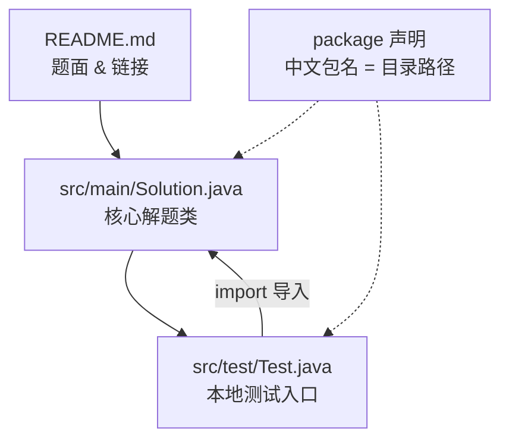
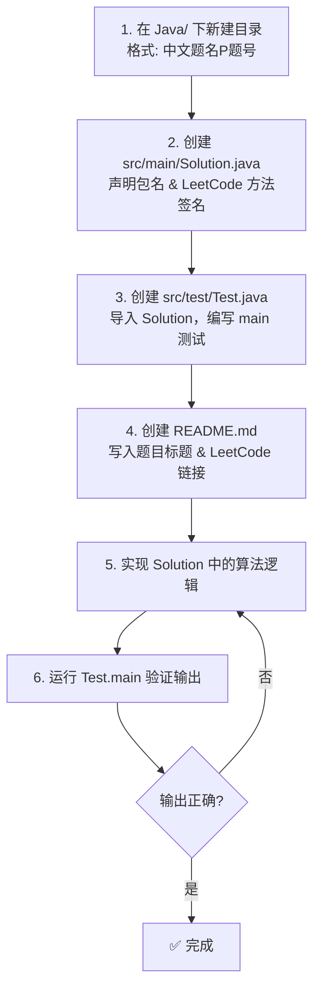

本页系统梳理 `Java/` 目录下的 LeetCode 题解工程体系。你将了解每道题的目录如何组织、代码文件之间的调用关系、以及如何利用已有的解题模板快速上手新题目。无论你是第一次打开本仓库，还是想参照已有代码规范提交新解法，这里都是你的起点。

## 目录结构总览

Java 题解区采用**按题目独立建目录**的方式组织，每个题目目录是一个自包含的微型工程。目录名使用中文题名，部分题目在名称末尾追加 LeetCode 题号（如 `P1`、`P198`）以便快速检索。整体结构如下图所示：

```
Java/
├── 两数之和P1/          ← 带题号的标准结构
│   ├── README.md
│   └── src/
│       ├── main/
│       │   └── Solution.java
│       └── test/
│           └── Test.java
├── 接雨水/              ← 不带题号的标准结构
│   ├── README.md
│   └── src/
│       ├── main/
│       │   └── Solution.java
│       └── test/
│           └── test.java
├── 二叉树/              ← 特殊结构：数据结构专题，无 src 分层
│   ├── BinaryTree.java
│   ├── BinaryTree.md
│   └── TreeNode.java
└── ...                  ← 共 35 个题目目录
```

Sources: [两数之和P1/src/main/Solution.java](Java/两数之和P1/src/main/Solution.java#L1-L20), [接雨水/src/test/test.java](Java/接雨水/src/test/test.java#L1-L13), [二叉树/TreeNode.java](Java/二叉树/TreeNode.java#L1-L13)

## 标准题目目录模型

绝大多数题目目录遵循同一套**三层分离**结构。下面的 Mermaid 图展示了各文件之间的依赖与调用关系——先读 README 了解题意，再阅读 Solution 中的核心算法，最后通过 Test 验证输出。

> **前提说明**：下图使用 Mermaid 语法绘制。箭头方向表示"调用/依赖"关系，即 Test 依赖 Solution，README 独立存在提供题面信息。



### 三层文件职责

| 层级 | 文件 | 职责 | 示例 |
|------|------|------|------|
| **文档层** | `README.md` | 记录题目标题、LeetCode 链接，部分包含完整题面 | `[地址](https://leetcode.cn/problems/...)` |
| **核心层** | `src/main/Solution.java` | 实现题解逻辑，方法签名与 LeetCode 保持一致 | `public int[] twoSum(int[] nums, int target)` |
| **验证层** | `src/test/Test.java` | 构造测试用例，`main` 方法中实例化 Solution 并打印结果 | `System.out.println(Arrays.toString(solution.twoSum(...)))` |

Sources: [两数之和P1/README.md](Java/两数之和P1/README.md#L1-L2), [两数之和P1/src/main/Solution.java](Java/两数之和P1/src/main/Solution.java#L1-L20), [两数之和P1/src/test/Test.java](Java/两数之和P1/src/test/Test.java#L1-L14)

## 包命名与导入约定

本项目的一个显著特征是使用**中文目录名作为 Java 包名**。包声明严格镜像目录路径，这保证了每个题目的 Solution 类可以在 Test 类中被正确导入。

**包声明规则**：`package <目录名>.src.main;`，目录名含中文和题号时原样保留。

```java
// 目录: Java/两数之和P1/src/main/Solution.java
package 两数之和P1.src.main;

public class Solution {
    public int[] twoSum(int[] nums, int target) { ... }
}
```

**测试文件导入规则**：`import <目录名>.src.main.Solution;`，与包声明一一对应。

```java
// 目录: Java/两数之和P1/src/test/Test.java
package 两数之和P1.src.test;

import 两数之和P1.src.main.Solution;

public class Test {
    public static void main(String[] args) {
        Solution solution = new Solution();
        System.out.println(Arrays.toString(solution.twoSum(new int[]{2, 7, 11, 15}, 9)));
    }
}
```

这一约定的优势在于：每个题目目录天然形成独立的 Java 包命名空间，即使不同题目都有名为 `Solution` 的类，也不会产生冲突。但需要注意，编译时需确保类路径（classpath）正确指向 `Java/` 根目录。

Sources: [两数之和P1/src/main/Solution.java](Java/两数之和P1/src/main/Solution.java#L1), [两数之和P1/src/test/Test.java](Java/两数之和P1/src/test/Test.java#L1-L13), [打家劫舍P198/src/test/Test.java](Java/打家劫舍P198/src/test/Test.java#L1-L11)

## 解题代码模板详解

### 标准模板：Solution 类

Solution 类是解题的核心载体，其方法签名严格遵循 LeetCode 的 OJ 接口要求。下面以一个完整的动态规划题目为例，展示模板的关键组成：

```java
package 打家劫舍P198.src.main;        // ① 包声明：镜像目录路径

public class Solution {                // ② 类名：统一为 Solution
    public int rob(int[] nums) {        // ③ 方法签名：与 LeetCode 一致
        if (nums.length == 0) {return 0;}
        if (nums.length == 1 && nums[0]==0) {return 0;}
        if (nums.length == 1) {return nums[0];}
        if (nums.length == 2) {return Math.max(nums[0], nums[1]);}
        int[] dp = new int[nums.length]; // ④ 核心算法逻辑
        dp[0] = nums[0];
        dp[1] = Math.max(nums[0], nums[1]);
        for (int i = 2; i < nums.length; i++) {
            dp[i] = Math.max(dp[i-2] + nums[i], dp[i-1]);
        }
        return dp[nums.length-1];        // ⑤ 返回结果
    }
}
```

模板要点归纳：

| 要素 | 规范 | 说明 |
|------|------|------|
| 包声明 | `package <中文目录名>.src.main;` | 必须与物理目录路径完全一致 |
| 类名 | `Solution`（默认） | 设计类题目可能使用其他名称（如 `RandomizedSet`） |
| 方法签名 | 与 LeetCode 题面完全一致 | 保证代码可直接粘贴至 OJ 提交 |
| 注释 | 中文注释说明核心思路 | 部分代码含英文注释或两种语言混合 |
| 备选解法 | 以注释形式保留在源码中 | 如验证回文串的旧版双指针解法 |

Sources: [打家劫舍P198/src/main/Solution.java](Java/打家劫舍P198/src/main/Solution.java#L1-L20), [插入删除和获取随机元素/src/main/RandomizedSet.java](Java/插入删除和获取随机元素/src/main/RandomizedSet.java#L1-L34), [验证回文串/src/main/Solution.java](Java/验证回文串/src/main/Solution.java#L1-L77)

### 测试模板：Test 类

Test 类承担本地验证的职责，通过 `main` 方法手动构造测试用例并打印输出。模板固定、编写成本低：

```java
package 打家劫舍P198.src.test;          // 包声明

import 打家劫舍P198.src.main.Solution;  // 导入被测类

public class Test {
    public static void main(String[] args) {
        Solution solution = new Solution();            // 实例化
        System.out.println(solution.rob(new int[]{1,2,3,1}));    // 测试用例1
        System.out.println(solution.rob(new int[]{2,7,9,3,1}));  // 测试用例2
    }
}
```

Sources: [打家劫舍P198/src/test/Test.java](Java/打家劫舍P198/src/test/Test.java#L1-L11)

## 特殊结构：语言特性探索文件

部分题目的 `src/test/` 目录下包含多个测试文件，它们不仅验证题解，还用于**探索 Java 语言特性**。这些文件以被探索的 API 或语法命名，是理解代码中特定用法的重要参考。

| 题目目录 | 测试文件 | 探索的语言特性 |
|---------|---------|--------------|
| 验证回文串 | `testcharAt.java` | `String.charAt()` 索引访问 |
| 验证回文串 | `testisLetterOrDigit.java` | `Character.isLetterOrDigit()` 字符分类 |
| 验证回文串 | `testLength.java` | 字符串长度相关 API |
| 赎金信 | `toCharArray.java` | `String.toCharArray()` 字符数组转换 |
| 赎金信 | `for语法糖.java` | 增强 for 循环语法 |

以 `toCharArray.java` 为例，它独立演示了如何将字符串转为字符数组并遍历——这正是 `赎金信` 题解中 `for (char c : magazine.toCharArray())` 的底层机制：

```java
package 赎金信.src.test;

public class toCharArray {
    public static void main(String[] args) {
        String str = "hello world";
        char[] chars = str.toCharArray();
        for (char aChar : chars) {
            System.out.println(aChar);
        }
    }
}
```

当你阅读题解代码时遇到不熟悉的 Java API，可以先在同目录的测试文件中找到它的最小可运行示例，理解行为后再回到主逻辑。

Sources: [赎金信/src/test/toCharArray.java](Java/赎金信/src/test/toCharArray.java#L1-L13), [验证回文串/src/test/testisLetterOrDigit.java](Java/验证回文串/src/test/testisLetterOrDigit.java#L1-L12), [验证回文串/src/test/testcharAt.java](Java/验证回文串/src/test/testcharAt.java#L1-L13)

## 特殊结构：数据结构专题（二叉树）

`二叉树` 目录与标准题目目录的结构不同，它没有 `src/main/test` 分层，而是将所有文件平铺在根目录下。这是因为二叉树作为**通用数据结构**，其节点定义和操作方法需要被多个题目复用，而非服务于单一 LeetCode 题目。

```
二叉树/
├── BinaryTree.java    ← 树的操作类：插入、前/中/后序遍历
├── BinaryTree.md      ← 完整的中文文档：概念、类型、遍历、应用
└── TreeNode.java      ← 节点定义：value、left、right
```

`TreeNode.java` 定义了最基础的二叉树节点结构，这是所有树形题目的基石：

```java
package 二叉树;

class TreeNode {
    int value;
    TreeNode left;
    TreeNode right;

    TreeNode(int value) {
        this.value = value;
        left = null;
        right = null;
    }
}
```

`BinaryTree.java` 则封装了基于此节点的插入与三种遍历操作。当你在其他链表或树形题目中需要使用二叉树结构时，可以直接引用这套定义。如需深入了解二叉树的遍历与平衡性判断，推荐阅读 [二叉树：遍历、插入与平衡性判断](13-er-cha-shu-bian-li-cha-ru-yu-ping-heng-xing-pan-duan)。

Sources: [二叉树/TreeNode.java](Java/二叉树/TreeNode.java#L1-L13), [二叉树/BinaryTree.java](Java/二叉树/BinaryTree.java#L1-L80), [二叉树/BinaryTree.md](Java/二叉树/BinaryTree.md#L1-L127)

## 特殊结构：设计类题目

LeetCode 中的设计类题目（如 O(1) 时间插入、删除和获取随机元素）要求实现一个**特定名称的类**，而非标准的 `Solution` 类。本项目对此的处理方式是：将主文件命名为 LeetCode 要求的类名。

```java
// 文件: 插入删除和获取随机元素/src/main/RandomizedSet.java
package 插入删除和获取随机元素.src.main;

public class RandomizedSet {
    public RandomizedSet() { ... }
    public boolean insert(int val) { ... }
    public boolean remove(int val) { ... }
    public void getRandom() { ... }
}
```

文件末尾保留了 LeetCode 的使用说明注释，指明了实例化与调用方式，这是从 OJ 模板直接拷贝的规范格式。

Sources: [插入删除和获取随机元素/src/main/RandomizedSet.java](Java/插入删除和获取随机元素/src/main/RandomizedSet.java#L1-L34), [插入删除和获取随机元素/src/test/Test.java](Java/插入删除和获取随机元素/src/test/Test.java#L1-L5)

## 题目分类与完成状态

当前 `Java/` 目录共包含 35 个题目目录，覆盖了 LeetCode 经典面试题目的多种算法范式。下表按**算法思想**分类整理，并标注每道题的完成状态——"已完成"表示 Solution 中包含可运行的核心算法逻辑，"待完善"表示方法体为空或仅返回占位值。

### 动态规划

| 题目 | 题号 | 核心思路 | 状态 |
|------|------|---------|------|
| 爬楼梯P70 | 70 | 状态转移 `dp[i] = dp[i-1] + dp[i-2]` | ✅ 已完成 |
| 斐波那契数P509 | 509 | 变量滚动优化空间至 O(1) | ✅ 已完成 |
| 第N个泰波那契数P1137 | 1137 | 三变量滚动 | ✅ 已完成 |
| 打家劫舍P198 | 198 | `dp[i] = max(dp[i-2]+nums[i], dp[i-1])` | ✅ 已完成 |
| 不同路径P62 | 62 | 二维 DP 初始化首行首列 | ✅ 已完成 |
| 最小路径和P64 | 64 | 原地修改 grid 数组 | ✅ 已完成 |
| 删除并获得点数P740 | 740 | 打家劫舍变体 | ⏳ 待完善 |
| 使用最小花费爬楼梯P746 | 746 | 爬楼梯变体 | ⏳ 待完善 |
| 不同路径IIP63 | 63 | 含障碍物的路径 DP | ⏳ 待完善 |

### 双指针与滑动窗口

| 题目 | 题号 | 核心思路 | 状态 |
|------|------|---------|------|
| 盛最多水的容器 | 11 | 左右指针向内收缩 | ✅ 已完成（暴力法） |
| 长度最小的子数组 | 209 | 滑动窗口左右指针 | ✅ 已完成 |
| 找到字符串中所有字母异位词 | 438 | 固定窗口 + 字符计数 | ✅ 已完成 |
| 无重复字符的最长子串P3 | 3 | 滑动窗口 | ⏳ 待完善 |

### 贪心策略

| 题目 | 题号 | 核心思路 | 状态 |
|------|------|---------|------|
| 买卖股票的最佳时机 | 121 | 遍历维护最小价格 | ✅ 已完成 |
| 买卖股票的最佳时机2 | 122 | 所有正收益累加 | ✅ 已完成 |
| 跳跃游戏 | 55 | 维护最远可达位置 | ✅ 已完成 |
| H指数 | 274 | 排序后线性扫描 | ✅ 已完成 |
| 分发糖果 | 135 | 双向遍历 | ⏳ 待完善 |

### 哈希表与字符串

| 题目 | 题号 | 核心思路 | 状态 |
|------|------|---------|------|
| 两数之和P1 | 1 | 暴力双重循环 | ✅ 已完成 |
| 赎金信 | 383 | 26 字母计数数组 | ✅ 已完成 |
| 同构字符串 | 205 | 双向字符映射数组 | ✅ 已完成 |
| 验证回文串 | 125 | 双指针 + `isLetterOrDigit` | ✅ 已完成 |
| 回文数P9 | 9 | — | ✅ 已完成 |
| 整数反转P9 | 7 | — | ✅ 已完成 |
| 罗马数字转整数 | 13 | — | ✅ 已完成 |
| 整数转罗马数字 | 12 | — | ✅ 已完成 |
| 最长公共前缀 | 14 | — | ✅ 已完成 |
| 找出字符串中第一个匹配项的下标 | 28 | — | ✅ 已完成 |
| 最小覆盖子串 | 76 | — | ✅ 已完成 |
| 三数之和 | 15 | 排序 + 双指针 | ⏳ 待完善 |
| 单词规律 | 290 | — | ✅ 已完成 |

### 数组操作

| 题目 | 题号 | 核心思路 | 状态 |
|------|------|---------|------|
| 轮转数组 | 189 | 三次翻转法 | ✅ 已完成 |
| 除自身以外数组的乘积 | 238 | 左右前缀积两遍扫描 | ✅ 已完成 |
| 航班预订统计 | 1109 | 差分数组 | ✅ 已完成 |
| 多数元素 | 169 | — | ✅ 已完成 |
| 最后一个单词的长度 | 58 | — | ✅ 已完成 |

### 链表与设计

| 题目 | 题号 | 核心思路 | 状态 |
|------|------|---------|------|
| 插入删除和获取随机元素 | 380 | 设计类 `RandomizedSet` | ⏳ 待完善 |
| 两数相加P2 | 2 | 链表逐位相加 | ⏳ 待完善 |

Sources: [爬楼梯P70/src/main/Solution.java](Java/爬楼梯P70/src/main/Solution.java#L1-L23), [长度最小的子数组/src/main/Solution.java](Java/长度最小的子数组/src/main/Solution.java#L1-L56), [跳跃游戏/src/main/Solution.java](Java/跳跃游戏/src/main/Solution.java#L1-L19), [赎金信/src/main/Solution.java](Java/赎金信/src/main/Solution.java#L1-L26), [轮转数组/src/main/Solution.java](Java/轮转数组/src/main/Solution.java#L1-L33), [除自身以外数组的乘积/src/main/Solution.java](Java/除自身以外数组的乘积/src/main/Solution.java#L1-L24)

## 编码风格与注释模式

通过逐一检视已完成的 Solution 文件，可以归纳出三种典型的注释风格：

**风格一：行内中文注释**——在关键算法步骤旁用中文说明意图，是最常见的模式。例如 `赎金信` 的字符计数逻辑：`// 遍历magazine字符串，统计每个字符出现的次数`。[赎金信/src/main/Solution.java](Java/赎金信/src/main/Solution.java#L1-L26)

**风格二：英文简短注释**——用极简的英文标注核心变量或决策点。例如 `跳跃游戏`：`int maxPosition = 0; // record maxPoistion`、`// good solution`。[跳跃游戏/src/main/Solution.java](Java/跳跃游戏/src/main/Solution.java#L1-L19)

**风格三：Javadoc + 备选解法注释**——对方法提供完整的参数说明文档，并在源码中以注释形式保留备选或旧版解法。例如 `长度最小的子数组` 使用了 Javadoc 格式的 `@param` / `@return` 说明，并在文件尾部以注释保留了暴力解法；`验证回文串` 更是将整个旧版双指针实现以块注释形式保留。[长度最小的子数组/src/main/Solution.java](Java/长度最小的子数组/src/main/Solution.java#L1-L56), [验证回文串/src/main/Solution.java](Java/验证回文串/src/main/Solution.java#L1-L77)

此外，部分题目在 Solution 类的 `main` 方法中以注释形式嵌入了测试代码（如 `H指数`、`轮转数组`），这种做法将验证逻辑与核心逻辑放在同一文件中，方便快速调试但不符合标准模板的三层分离规范。

Sources: [H指数/src/main/Solution.java](Java/H指数/src/main/Solution.java#L1-L27), [轮转数组/src/main/Solution.java](Java/轮转数组/src/main/Solution.java#L1-L33)

## 多语言扩展

极少数题目目录的 `src/main/` 下包含非 Java 的解法文件，作为跨语言参考：

| 题目目录 | 附加文件 | 语言 |
|---------|---------|------|
| 斐波那契数P509 | `Solution.py`、`Solution.c` | Python、C |
| 三数之和 | `Solution.py` | Python |

这些文件与 `Solution.java` 并列放置在同一目录下，命名遵循 `<类名>.<扩展名>` 的惯例。它们不是 Java 编译流程的一部分，仅供对照阅读不同语言的实现差异。如需系统了解 JavaScript/TypeScript 题解，请参阅 [JavaScript / TypeScript 题解：编号检索与多种解法对比](6-javascript-typescript-ti-jie-bian-hao-jian-suo-yu-duo-chong-jie-fa-dui-bi)。

Sources: [斐波那契数P509/src/main/Solution.java](Java/斐波那契数P509/src/main/Solution.java#L1-L21)

## README 文档规范

各题目的 `README.md` 目前存在两种深度的文档模式：

**简洁模式**（多数题目）：仅包含题目标题和 LeetCode 链接，一行即可完成。

```markdown
## 买卖股票的最佳时机2
[地址](https://leetcode.cn/problems/rotate-array/description/?envType=study-plan-v2&envId=top-interview-150)
```

**详细模式**（少数题目）：包含完整的题目描述、示例输入输出和约束条件。例如 `跳跃游戏` 的 README 给出了完整的题面、两个示例及通义的分析思路；`H指数` 的 README 包含了 h 指数的维基百科定义和详细示例。这种模式对离线阅读和理解题意非常友好。

> **注意**：当前部分 README 的标题与目录名不一致（如 `打家劫舍P198/README.md` 的标题写着"多数元素"），这是历史遗留问题，阅读时请以目录名为准。

Sources: [两数之和P1/README.md](Java/两数之和P1/README.md#L1-L2), [跳跃游戏/README.md](Java/跳跃游戏/README.md#L1-L19), [H指数/README.md](Java/H指数/README.md#L1-L26)

## 快速上手：新建一道 Java 题解

当你准备为一道新的 LeetCode 题目添加 Java 解法时，按照以下流程操作即可与现有工程保持一致：



**步骤一：创建目录**。目录名建议使用中文题名 + 题号后缀（如 `最长回文子串P5`），便于在文件管理器中直观定位。

**步骤二：编写 Solution.java**。包声明必须与目录路径完全对应，方法签名照抄 LeetCode 题面：

```java
package 最长回文子串P5.src.main;

public class Solution {
    public String longestPalindrome(String s) {
        // 在此实现你的解法
        return "";
    }
}
```

**步骤三：编写 Test.java**。导入 Solution 类，在 `main` 方法中构造至少两个测试用例：

```java
package 最长回文子串P5.src.test;

import 最长回文子串P5.src.main.Solution;

public class Test {
    public static void main(String[] args) {
        Solution solution = new Solution();
        System.out.println(solution.longestPalindrome("babad"));
        System.out.println(solution.longestPalindrome("cbbd"));
    }
}
```

**步骤四：编写 README.md**。至少包含题目标题和 LeetCode 链接，鼓励补充完整题面：

```markdown
## 最长回文子串
[地址](https://leetcode.cn/problems/longest-palindromic-substring/)
```

**步骤五至六**：实现算法 → 运行验证 → 循环修正，直到测试用例输出与预期一致。

## 延伸阅读

本页聚焦于 Java 题解的工程结构与模板规范。要深入理解各类算法思想的实现细节，推荐按以下路径继续探索：

- **动态规划体系**：从 [动态规划入门：从斐波那契到打家劫舍](8-dong-tai-gui-hua-ru-men-cong-fei-bo-na-qi-dao-da-jia-jie-she) 开始，理解状态转移方程的设计方法
- **双指针与窗口**：[双指针与滑动窗口：字符串与数组问题](9-shuang-zhi-zhen-yu-hua-dong-chuang-kou-zi-fu-chuan-yu-shu-zu-wen-ti) 系统讲解窗口收缩与扩展的时机判断
- **贪心策略**：[贪心策略：加油站问题与跳跃游戏](10-tan-xin-ce-lue-jia-you-zhan-wen-ti-yu-tiao-yue-you-xi) 分析局部最优如何推导全局最优
- **跨语言对比**：[JavaScript / TypeScript 题解：编号检索与多种解法对比](6-javascript-typescript-ti-jie-bian-hao-jian-suo-yu-duo-chong-jie-fa-dui-bi) 提供同一问题的多语言实现参照