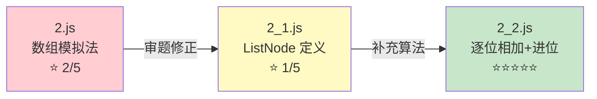

本页是 `JS/` 目录下所有 LeetCode 题解的完整检索与深度分析。该目录以 **LeetCode 题目编号**为文件命名核心，同时维护 JS 原始解法与 TS 类型化重写两套代码体系，部分题目还保留了 `_1`、`_2` 后缀的**迭代演进版本**——从初始思路到优化方案的完整解题轨迹一览无余。无论你是想按编号快速定位某道题的解法，还是对比同一题目的多种思路差异，本页都能提供精确导航。

Sources: [1.js](JS/1.js#L1-L56), [2.js](JS/2.js#L1-L66), [3.js](JS/3.js#L1-L83)

## 目录结构与命名约定

`JS/` 目录的文件命名遵循一套高度可预测的规则，掌握这套规则即可通过 LeetCode 题号直接定位到对应文件：

| 命名模式 | 含义 | 示例 |
|---|---|---|
| `{编号}.js` | 题目的 JavaScript 初始解法 | `1.js` → 两数之和 |
| `{编号}.ts` | 题目的 TypeScript 类型化版本 | `19.ts` → 删除链表倒数第N个节点 |
| `{编号}_1.js` / `{编号}_1.ts` | 第一种替代/优化解法 | `26_1.js` → 删除有序数组中的重复项（双指针版） |
| `{编号}_2.js` | 第二种替代/优化解法 | `2_2.js` → 两数相加（链表逐位相加版） |
| `q{编号}.js` / `q_{编号}.ts` | 非标准编号题目 | `q_1.ts` → 板球计分逻辑 |
| 中文命名 | 独立数据结构/算法实现 | `堆.js`、`归并排序.js`、`排列组合模拟.js` |

Sources: [1.js](JS/1.js#L1-L2), [2_1.js](JS/2_1.js#L1-L4), [2_2.js](JS/2_2.js#L1-L9), [26_1.js](JS/26_1.js#L1-L5), [堆.js](JS/堆.js#L1-L10)

`txt/` 子目录存放的是早期通过 `txt.bat` 脚本批量从 `.js` 文件转换的文本备份，属于历史快照；`Object/` 子目录包含 JavaScript 对象机制的实验代码；`express/` 和 `node-ts/` 是框架与 TS 运行环境的配置目录。

Sources: [txt.bat](JS/txt.bat#L1-L16), [tsconfig.json](JS/tsconfig.json#L1-L11), [package.json](JS/package.json#L1-L5)

## 完整题目索引与分类

以下按算法思想对全部题目进行分类，标注各题的文件覆盖情况与核心解法策略：

### 哈希表与集合

| 题号 | 题目 | JS | TS | 核心策略 |
|---|---|---|---|---|
| 1 | 两数之和 | ✅ `1.js` | — | Map 存补数 → O(n) |
| 202 | 快乐数 | ✅ `202.js` | ✅ `202.ts` | Set 检测循环 |
| 2540 | 最小公共值 | ✅ `2540.js` | ✅ `2540.ts` | Set 交集 |
| 2657 | 找到前缀子数组 | ✅ `2657.js` | ✅ `2657.ts` | Set 增量判重 |
| 347 | 前K个高频元素 | ✅ `347.js` | — | Map 计频 + 排序 |
| 349 | 两个数组的交集 | ✅ `349.js` | — | Set 去重交集 |

Sources: [1.js](JS/1.js#L30-L40), [202.ts](JS/202.ts#L1-L27), [2540.ts](JS/2540.ts#L1-L13), [2657.ts](JS/2657.ts#L1-L18), [347.js](JS/347.js#L1-L22)

### 双指针与滑动窗口

| 题号 | 题目 | JS | TS | 核心策略 |
|---|---|---|---|---|
| 3 | 无重复字符的最长子串 | ✅ `3.js` | — | 滑动窗口 + Map |
| 15 | 三数之和 | ✅ `15.js` | — | 排序 + 双指针 |
| 26 | 删除有序数组中的重复项 | ✅ `26.js` / `26_1.js` | ✅ `26.ts` / `26_1.ts` | Map去重 / 双指针+splice |
| 27 | 移除元素 | ✅ `27.js` / `27_1.js` | ✅ `27.ts` / `27_1.ts` | Set+filter / splice循环 |
| 42 | 接雨水 | ✅ `42.js` | — | 找最高点 + 左右双向扫描 |
| 220 | 存在重复元素 III | ✅ `220.js` | ✅ `220.ts` | 窗口内遍历 + 剪枝 |

Sources: [3.js](JS/3.js#L68-L80), [15.js](JS/15.js#L1-L53), [26_1.js](JS/26_1.js#L1-L20), [27_1.js](JS/27_1.js#L1-L16), [42.js](JS/42.js#L5-L24), [220.ts](JS/220.ts#L1-L32)

### 链表操作

| 题号 | 题目 | JS | TS | 核心策略 |
|---|---|---|---|---|
| 2 | 两数相加 | ✅ `2.js` / `2_1.js` / `2_2.js` | — | 数组模拟→链表模拟→逐位相加 |
| 19 | 删除链表倒数第N个节点 | ✅ `19.js` | ✅ `19.ts` | 两趟遍历求长度 |
| 21 | 合并两个有序链表 | ✅ `21.js` | — | 递归合并 |
| 24 | 两两交换链表节点 | — | ✅ `24.ts` | 递归交换 |
| 61 | 旋转链表 | — | ✅ `61.ts` | 链尾链接到链头 |
| 82 | 删除排序链表重复元素 II | ✅ `82.js` / `82_1.js` | — | 双指针跳过重复段 |
| 83 | 删除排序链表重复元素 | ✅ `83.js` | — | 单指针去重 |
| 92 | 反转链表 II | ✅ `92.js` | — | 区间反转 |
| 133 | 克隆图 | ✅ `133.js` | — | DFS + Map 深拷贝 |

Sources: [2_2.js](JS/2_2.js#L14-L36), [19.ts](JS/19.ts#L22-L53), [24.ts](JS/24.ts#L15-L24), [82.js](JS/82.js#L18-L65), [133.js](JS/133.js#L20-L45)

### 动态规划

| 题号 | 题目 | JS | TS | 核心策略 |
|---|---|---|---|---|
| 45 | 跳跃游戏 II | — | ✅ `45.ts` | 正向 DP：dp[i] = min(可达前驱的dp值) + 1 |
| 62 | 不同路径 | — | ✅ `62.ts` | 网格 DP：dp[i][j] = dp[i-1][j] + dp[i][j-1] |
| 64 | 最小路径和 | ✅ `64.js` | — | 网格 DP：dp[i][j] = min(上,左) + grid[i][j] |
| 70 | 爬楼梯 | ✅ `70.js` / `70_1.js` | — | 通项公式 / DP：dp[i] = dp[i-1] + dp[i-2] |
| 134 | 加油站 | ✅ `134.js` | ✅ `134.ts` | 暴力枚举有效起点 |
| 198 | 打家劫舍 | ✅ `198.js` | ✅ `198.ts` | DP：dp[i] = max(dp[0..i-2]) + nums[i] |
| 740 | 删除并获得点数 | ✅ `740.js` | ✅ `740.ts` | Map 聚合 + 打家劫舍模型 |
| 931 | 下降路径最小和 | ✅ `931.js` | — | 矩阵 DP：三方向取最小 |
| 2770 | 跳跃次数 | — | ✅ `2770.ts` | 正向 DP + Set 记录可达位置 |

Sources: [45.ts](JS/45.ts#L1-L20), [62.ts](JS/62.ts#L1-L24), [70_1.js](JS/70_1.js#L1-L19), [198.ts](JS/198.ts#L1-L12), [740.ts](JS/740.ts#L1-L26), [931.js](JS/931.js#L1-L21), [2770.ts](JS/2770.ts#L1-L27)

### 回溯法

| 题号 | 题目 | JS | TS | 核心策略 |
|---|---|---|---|---|
| 22 | 括号生成 | ✅ `22.js` | ✅ `22.ts` | (空文件，预留) |
| 46 | 全排列 | — | ✅ `46.ts` | 经典回溯：used 数组标记 + path 记录 |
| 77 | 组合 | — | ✅ `77.ts` | 回溯：start 参数控制起始位置 |

Sources: [46.ts](JS/46.ts#L1-L30), [77.ts](JS/77.ts#L1-L21)

### 栈与表达式

| 题号 | 题目 | JS | TS | 核心策略 |
|---|---|---|---|---|
| 150 | 逆波兰表达式求值 | ✅ `150.js` | — | 数组模拟栈 + splice 原地替换 |
| 224 | 基本计算器 | ✅ `224.js` | — | 栈处理括号 + signal 符号变量 |
| checkString | 括号匹配 | — | ✅ `checkString.ts` | 栈压入弹出验证 |

Sources: [150.js](JS/150.js#L1-L59), [224.js](JS/224.js#L1-L50), [checkString.ts](JS/checkString.ts#L1-L21)

### 堆与排序

| 题号 | 题目 | JS | TS | 核心策略 |
|---|---|---|---|---|
| 215 | 数组中第K大元素 | ✅ `215.js` | — | 自实现最小堆 + 维护k容量 |
| — | 最小堆/最大堆 | ✅ `堆.js` | — | 完整堆实现（insert/up/down/swap/pop/peek） |
| — | 归并排序 | ✅ `归并排序.js` | — | 分治递归 + merge合并有序数组 |
| — | 排列组合模拟 | ✅ `排列组合模拟.js` | ✅ `排列组合模拟.ts` | 回溯法全排列 |

Sources: [215.js](JS/215.js#L1-L87), [堆.js](JS/堆.js#L1-L153), [归并排序.js](JS/归并排序.js#L1-L30), [排列组合模拟.js](JS/排列组合模拟.js#L1-L26)

### 二叉树

| 题号 | 题目 | JS | TS | 核心策略 |
|---|---|---|---|---|
| 101 | 对称二叉树 | ✅ `101.js` | — | 递归/迭代 |
| 110 | 平衡二叉树 | ✅ `110.js` | ✅ `110.ts` | DFS 收集叶深 + 判断极差 |

Sources: [110.ts](JS/110.ts#L35-L64)

### 数学与位运算

| 题号 | 题目 | JS | TS | 核心策略 |
|---|---|---|---|---|
| 4 | 寻找两个正序数组的中位数 | ✅ `4.js` / `4_1.js` | ✅ `4_1.ts` | concat+sort / 二分分割线 |
| 7 | 整数反转 | ✅ `7.js` | — | 逐位取模 |
| 9 | 回文数 | ✅ `9.js` | — | 字符串反转比较 |
| 67 | 二进制求和 | — | ✅ `67.ts` | 模拟加法 + 32位填充 |
| 788 | 旋转数字 | ✅ `788.js` | ✅ `788.ts` | Map 分类 + 逐位校验 |

Sources: [4.js](JS/4.js#L48-L53), [9.js](JS/9.js#L5-L8), [67.ts](JS/67.ts#L1-L29), [788.ts](JS/788.ts#L23-L53)

### 字符串与数组

| 题号 | 题目 | JS | TS | 核心策略 |
|---|---|---|---|---|
| 5 | 最长回文子串 | ✅ `5.js` | — | 中心扩散法 |
| 14 | 最长公共前缀 | ✅ `14.js` | — | 纵向扫描 |
| 28 | 找出字符串中第一个匹配项 | — | ✅ `28.ts` | indexOf（内置API） |
| 48 | 旋转图像 | — | ✅ `48.ts` | Map 坐标映射 |
| 118 | 杨辉三角 | ✅ `118.js` | ✅ `118.ts` | 逐层构造 |
| 796 | 旋转字符串 | — | ✅ `796.ts` | 拼接 + 截断 |
| 1861 | 旋转盒子 | ✅ `1861.js` | ✅ `1861.ts` | 旋转矩阵 + 重力掉落 |

Sources: [5.js](JS/5.js#L94-L116), [28.ts](JS/28.ts#L1-L5), [48.ts](JS/48.ts#L1-L20), [118.ts](JS/118.ts#L1-L25), [1861.ts](JS/1861.ts#L1-L46)

### TypeScript 专项练习（LeetCode TS 题库）

这些题目是 LeetCode TypeScript 专项题库的练习，侧重于**类型系统与闭包设计**而非传统算法：

| 题号 | 题目 | 文件 | 核心技巧 |
|---|---|---|---|
| 2648 | 斐波那契生成器 | `2648.ts` | `Generator` + 解构赋值 `[a,b]=[b,a+b]` |
| 2665 | 计数器 II | `2665.ts` | 闭包 + `type Counter` 接口 |
| 2677 | 数组分块 | `2677.ts` | `slice` + 步长遍历 |
| 2704 | 相等还是不相等 | `2704.ts` | 闭包 + `throw Error` 异常控制流 |
| 2706 | 购买两块巧克力 | `2706.ts` | 两次 `Math.min` + `splice` |
| 2618 | 原型判断 | `2618.ts` | `instanceof` + `Object()` 装箱 |
| Number_test | 整数除法截断 | `Number_interger_test.ts` | `Math.floor` + 负数修正 |

Sources: [2648.ts](JS/2648.ts#L1-L18), [2665.ts](JS/2665.ts#L1-L35), [2704.ts](JS/2704.ts#L1-L31), [2618.ts](JS/2618.ts#L1-L41), [Number_interger_test.ts](JS/Number_interger_test.ts#L1-L12)

## 多解法对比：迭代演进模式

本仓库最独特的设计在于**同一题目保留多个版本的解法文件**，形成从"暴力直觉"到"最优策略"的完整解题演化链。以下通过三个典型案例深度剖析这一模式。

### 案例 1：两数之和（#1） — 哈希优化

[1.js](JS/1.js) 中的注释完整记录了从暴力到优化的思维跃迁。最初的暴力思路是双重循环 O(n²)，但文件实际已采用 Map 哈希表优化版本。核心逻辑是：遍历数组时，对每个元素 `nums[i]` 检查其是否已在 Map 中（即是否存在之前的元素需要当前值作为补数），若命中则直接返回，否则将 `target - nums[i]` 作为 key 存入 Map。这一策略将"查找配对"从 O(n) 降至 O(1)，总复杂度从 O(n²) 降至 O(n)，空间代价为 O(n)。

Sources: [1.js](JS/1.js#L30-L42), [txt/1.txt](JS/txt/1.txt#L6-L20)

### 案例 2：两数相加（#2） — 三版本演进链

这是本仓库中版本迭代最丰富的题目，完整展示了从"错误建模"到"正确实现"的三个阶段：



- **2.js**：将链表错误地当数组处理，用 `Math.pow` 计算位权后转整数相加。致命缺陷是超出 `Number.MAX_SAFE_INTEGER` 时精度丢失，且完全违背了题目"链表操作"的本意。[2.js](JS/2.js#L45-L65)
- **2_1.js**：正确定义了 `ListNode` 构造函数，但核心加法逻辑未实现，注释中给出了标准解法的伪代码。关键突破是引入了**哨兵节点（dummy）**概念。[2_1.js](JS/2_1.js#L64-L84)
- **2_2.js**：完整实现了逐位相加 + 进位的标准解法。`carry = Math.floor(v3 / 10)` 取进位，`v3 % 10` 取当前位，`while(p1 || p2)` 处理链表不等长，最后的 `if(carry)` 处理末尾进位。[2_2.js](JS/2_2.js#L14-L36)

Sources: [2.js](JS/2.js#L1-L66), [2_1.js](JS/2_1.js#L1-L85), [2_2.js](JS/2_2.js#L1-L42)

### 案例 3：删除有序数组中的重复项（#26） — 数据结构 vs 原地操作

两个版本的对比揭示了 LeetCode "原地修改"约束的本质区别：

| 维度 | `26.js` / `26.ts` (Map版) | `26_1.js` / `26_1.ts` (双指针版) |
|---|---|---|
| 数据结构 | `new Map()` 额外空间 | 无额外数据结构 |
| 操作方式 | `nums = [...map.keys()]` 重赋值 | `nums.splice(r, 1)` 原地删除 |
| 是否原地修改 | ❌ 创建新数组 | ✅ 修改原数组 |
| 时间复杂度 | O(n) | O(n²)（splice 每次移动后续元素） |
| LeetCode 评判 | ⚠️ 可能不通过（重赋值断开引用） | ✅ 通过 |

关键认知：LeetCode 的"原地修改"要求调用者通过原引用看到修改结果，`nums = [...]` 赋值只是让局部变量指向新数组，调用者的原数组不受影响。而 `splice` 虽然效率不是最优，但确实是在原数组上操作。更优的原地方案应使用**快慢双指针 + 覆盖**而非 `splice`。

Sources: [26.js](JS/26.js#L3-L19), [26_1.js](JS/26_1.js#L1-L20)

### 案例 4：移除元素（#27） — 同题双策略

与 #26 类似的模式：`27.js` 使用 `Set` + `filter` 组合（非原地），`27_1.js` 使用 `splice` 循环删除（原地）。TS 版本完整复刻了两种策略。

Sources: [27.js](JS/27.js#L1-L18), [27_1.ts](JS/27_1.ts#L1-L14)

## JS 与 TS 代码对照：类型系统的影响

同一题目的 JS 和 TS 版本并非简单的"加类型注解"，而是体现了**类型约束对代码结构的深层影响**。以下从三个维度分析：

### 维度 1：链表节点定义的差异

JS 版本使用函数构造器，TS 版本使用 class + 属性声明：

```javascript
// JS (19.js)
function ListNode(val, next) {
    this.val = (val === undefined ? 0 : val)
    this.next = (next === undefined ? null : next)
}
```

```typescript
// TS (19.ts)
class ListNode {
    val: number
    next: ListNode | null
    constructor(val?: number, next?: ListNode | null) {
        this.val = (val === undefined ? 0 : val)
        this.next = (next === undefined ? null : next)
    }
}
```

TS 版本必须声明 `val: number` 和 `next: ListNode | null`，这迫使开发者在编写算法逻辑时显式处理 `null` 的情况——例如 `p1.next ? p1.next : null` 而非直接 `p1.next`，从编译期就消除了潜在的空指针风险。

Sources: [19.js](JS/19.js#L14-L19), [19.ts](JS/19.ts#L12-L19)

### 维度 2：类型注解驱动的防御性编程

[27_1.ts](JS/27_1.ts#L1-L14) 中 `function removeElement(nums: number[], val: number): number` 的签名明确约束了入参和返回值类型，对比 JS 版本的隐式 `any`，TS 编译器在调用端就能发现类型不匹配。在 [740.ts](JS/740.ts#L1-L26) 中，`map.get(i)` 返回 `number | undefined`，这提醒开发者需要用 `map.get(i) ? map.get(i) : 0` 做空值防护。

### 维度 3：编译产物与源码的关系

值得注意的是，`19.js` 实际上是 `19.ts` 的 TypeScript 编译产物（文件头包含 `"use strict"` 和 `Object.defineProperty(exports, "__esModule", { value: true })`），而 `1.js` 则是手写的 JS 原始解法。这意味着部分 `.js` 文件和 `.ts` 文件并非"同一思路的两种写法"，而是**源码与编译产物的关系**。区分方法是观察文件头是否包含编译器注入的样板代码。

Sources: [19.js](JS/19.js#L1-L3), [27_1.ts](JS/27_1.ts#L1-L14), [740.ts](JS/740.ts#L1-L26)

## 核心数据结构实现：最小堆与最大堆

[堆.js](JS/堆.js) 和 [215.js](JS/215.js) 中包含了一套完整的堆实现，是本仓库中少有的"数据结构先行、算法应用"的案例。这套实现覆盖了堆的六个核心操作：

| 操作 | 最小堆实现 | 复杂度 |
|---|---|---|
| `insert(val)` | push 到末尾 + `up()` 上浮 | O(log n) |
| `up(index)` | 与父节点 `(index-1)>>1` 比较交换 | O(log n) |
| `down(index)` | 与较小子节点比较交换 | O(log n) |
| `pop()` | 交换堆顶与末尾 + 删除末尾 + `down(0)` | O(log n) |
| `peek()` | 返回 `heap[0]` | O(1) |
| `size()` | 返回 `heap.length` | O(1) |

这套堆结构在 [215.js](JS/215.js#L72-L83) 中被用于求解"数组中第K大元素"：构建最小堆后不断 `pop()` 直到堆容量为 k，此时堆顶即为第 K 大元素。最小堆与最大堆的差异仅在于 `up()` 和 `down()` 中的比较方向（`<` vs `>`）。

Sources: [堆.js](JS/堆.js#L3-L64), [215.js](JS/215.js#L2-L62)

## 自评注释体系：从错误中学习

本仓库大量题解文件头部的注释块构成了一套**自评体系**，包含评分、优缺点分析、优化思路和复杂度对比。这套体系的核心价值在于：它不只是记录"正确答案"，而是诚实地标记了**思维过程中的盲点和误区**。

以 [4.js](JS/4.js#L1-L41) 为例，注释明确指出当前解法 `concat + sort` 虽然逻辑正确，但**浪费了"已排序"这一关键条件**，时间复杂度 O((m+n)log(m+n)) 远高于最优的 O(log(min(m,n))) 二分分割线法。再如 [2.js](JS/2.js#L18-L22) 中标注了"审题错误"——把链表当数组用，以及 JS 数值精度问题。

这种"保留错误、标注改进"的文档风格，使得每份代码都成为一个**可追溯的学习节点**，而非仅仅是一份正确答案的快照。

Sources: [4.js](JS/4.js#L1-L41), [2.js](JS/2.js#L18-L22), [5.js](JS/5.js#L1-L67)

## 非标准题目与辅助文件

除了按 LeetCode 编号组织的题目外，`JS/` 目录还包含一些非标准编号的练习文件：

| 文件 | 内容 | 特点 |
|---|---|---|
| `q1.js` | 数字位校验函数 | 存在循环条件 bug (`i<n_str` 应为 `i<n_str.length`) |
| `q2.js` | 双调数组求和比较 | 数组切割 + reduce 求和 |
| `q_1.ts` | 板球计分逻辑 | 条件分支 + 类型判断 |
| `q_2.ts` | 交替二进制串 | 模式串生成 + 差异计数 |
| `1665.ts` | 完成任务最小初始能量 | 排序 + 贪心模拟 |
| `2615.js` | 数组等距元素和 | O(n²) 暴力遍历 |
| `3761.js` | 镜像对最小距离 | 反转数字 + 双重循环 |
| `归并排序.js` | 归并排序实现 | 分治递归 + 合并 |
| `排列组合模拟.js` | 全排列回溯 | 经典回溯模板 |

Sources: [q1.js](JS/q1.js#L1-L20), [q2.js](JS/q2.js#L1-L46), [q_1.ts](JS/q_1.ts#L1-L30), [q_2.ts](JS/q_2.ts#L1-L20), [1665.ts](JS/1665.ts#L1-L17), [归并排序.js](JS/归并排序.js#L1-L30)

## TypeScript 编译环境

TS 文件的编译环境由 [tsconfig.json](JS/tsconfig.json#L1-L11) 配置，核心参数：`target: ES2015`（编译到 ES6）、`module: commonjs`（Node.js 模块系统）、`strict: true`（全量严格模式）。依赖仅 `typescript: ^6.0.3`，通过 `npx tsc` 即可编译 `.ts` 文件到对应的 `.js` 产物。

Sources: [tsconfig.json](JS/tsconfig.json#L1-L11), [package.json](JS/package.json#L1-L5)

## 延伸阅读

- 同一题目在 Java 中的解法体系，参见 [Java 题解体系：项目结构与解题模板](5-java-ti-jie-ti-xi-xiang-mu-jie-gou-yu-jie-ti-mo-ban)
- 动态规划相关题目（#45、#62、#64、#70、#198、#740、#931）的系统性讲解，参见 [动态规划入门：从斐波那契到打家劫舍](8-dong-tai-gui-hua-ru-men-cong-fei-bo-na-qi-dao-da-jia-jie-she)
- 双指针与滑动窗口（#3、#15、#26、#42）的通用解题范式，参见 [双指针与滑动窗口：字符串与数组问题](9-shuang-zhi-zhen-yu-hua-dong-chuang-kou-zi-fu-chuan-yu-shu-zu-wen-ti)
- 最小堆/最大堆的完整实现分析，参见 [堆：最小堆与最大堆的完整实现](14-dui-zui-xiao-dui-yu-zui-da-dui-de-wan-zheng-shi-xian)
- 链表操作（#2、#19、#21、#24、#82）的系统梳理，参见 [链表操作：合并、反转与环检测](15-lian-biao-cao-zuo-he-bing-fan-zhuan-yu-huan-jian-ce)
- TypeScript 类型配置与类型化算法的更多实践，参见 [TypeScript 配置与类型化算法实践](19-typescript-pei-zhi-yu-lei-xing-hua-suan-fa-shi-jian)