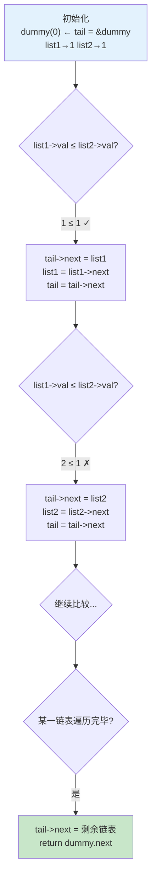

本页聚焦于仓库中 `cpp/` 目录下的 C++ 链表题解，以 LeetCode 21（合并两个有序链表）为核心案例，深入剖析 C++ 指针操作链表的底层机制。同时横跨仓库内的 JavaScript/TypeScript 与 Java 链表实现进行多语言对照，提炼出**哨兵节点、双指针遍历、递归翻转**三大核心范式，帮助你从"会写链表题"跃迁到"理解指针的内存语义"。

Sources: [test.cpp](cpp/test.cpp#L1-L60), [2_2.js](JS/2_2.js#L1-L42), [21.js](JS/21.js#L1-L33)

## C++ 链表代码全景

`cpp/` 目录当前包含一个完整的可编译 C++ 文件 `test.cpp`，它实现了 LeetCode 21（合并两个有序链表），并在 `main` 函数中构造测试链表、调用算法、打印结果——这是一个**自包含的单文件工程**，无需额外构建系统即可直接编译运行：

```
cpp/
├── test.cpp              ← 核心题解：ListNode 定义 + Solution 类 + 测试入口
├── test.exe              ← 已编译的可执行文件（MinGW g++ 编译产物）
├── libgcc_s_seh-1.dll    ← MinGW 运行时依赖
├── libstdc++-6.dll       ← C++ 标准库运行时
└── libwinpthread-1.dll   ← 线程库运行时
```

与 [Java 题解体系](5-java-ti-jie-ti-xi-xiang-mu-jie-gou-yu-jie-ti-mo-ban) 的三层分离结构（README + Solution + Test）不同，C++ 目录采用**单文件一体化**策略——节点定义、算法类、辅助函数、测试入口全部集中在 `test.cpp` 中。这种模式在算法练习场景下效率最高：一个命令 `g++ test.cpp -o test && ./test` 即可完成编译与验证。

Sources: [test.cpp](cpp/test.cpp#L1-L10)

## ListNode 结构体：C++ 指针语义的根基

C++ 的链表节点定义与 JavaScript/Java 有着根本性的差异——**指针 vs 引用**的语义鸿沟。以下是仓库中三种语言的 `ListNode` 定义对比：

| 特性 | C++ `struct ListNode` | JavaScript `function ListNode` | Java `class ListNode` |
|------|----------------------|-------------------------------|----------------------|
| **节点定义** | `struct` + 原始指针 | 构造函数 + 对象引用 | `class` + 对象引用 |
| **空值表示** | `nullptr`（类型安全的空指针） | `null` / `undefined` | `null` |
| **成员访问** | `node->val`（箭头运算符） | `node.val`（点运算符） | `node.val`（点运算符） |
| **内存管理** | 手动 `new` / `delete` | 自动垃圾回收 | 自动垃圾回收 |
| **构造函数** | 初始化列表 `: val(0), next(nullptr)` | 函数体赋值 `this.val = ...` | 构造方法 `this.val = ...` |
| **默认参数** | 支持 `ListNode(int x = 0)` | 运行时判断 `val === undefined` | 方法重载 |

Sources: [test.cpp](cpp/test.cpp#L4-L10), [21.js](JS/21.js#L3-L6), [19.ts](JS/19.ts#L12-L19)

### C++ 节点定义的三层构造函数

```cpp
struct ListNode {
    int val;
    ListNode* next;
    ListNode() : val(0), next(nullptr) {}           // 无参：默认值 0, nullptr
    ListNode(int x) : val(x), next(nullptr) {}      // 单参：指定值, next 为空
    ListNode(int x, ListNode* next) : val(x), next(next) {}  // 全参：指定值与后继
};
```

这三层构造函数的设计直接映射了链表操作中的三种典型场景：**创建空节点**（哨兵节点初始化）、**创建尾节点**（`new ListNode(5)`）、**插入已知后继**（`new ListNode(3, existingNode)`）。其中 `: val(0), next(nullptr)` 是 C++ 的**成员初始化列表**，相比函数体内赋值，它在性能上更优——直接初始化而非先默认构造再赋值。而 `nullptr` 是 C++11 引入的类型安全空指针常量，取代了旧式的 `NULL` 宏，杜绝了整型与指针的隐式转换歧义。

Sources: [test.cpp](cpp/test.cpp#L4-L10)

### `->` 箭头运算符：指针访问的唯一通道

当 `node` 是指针类型（`ListNode*`）时，必须使用 `->` 访问成员，而非 `.`。这一语法规则背后是 C++ 的类型系统约束：

```
ListNode  obj;       obj.val    ✓  对象用点运算符
ListNode* ptr;       ptr->val   ✓  指针用箭头运算符
ListNode* ptr;       ptr.val    ✗  编译错误：指针没有成员
ListNode  obj;       obj->val   ✗  编译错误：对象不支持 ->
```

在 `test.cpp` 的 `mergeTwoLists` 中，`list1` 和 `list2` 的类型是 `ListNode*`，因此所有成员访问都使用 `->`：`list1->val`、`list1->next`、`tail->next`。这也是 C++ 链表代码区别于 JS/Java 最显著的视觉特征——JS 和 Java 中无论变量是对象还是引用，一律使用 `.` 运算符。

Sources: [test.cpp](cpp/test.cpp#L14-L31)

## 核心案例：合并两个有序链表（LeetCode 21）

`test.cpp` 中的 `Solution::mergeTwoLists` 采用**迭代 + 哨兵节点**策略，这是链表合并问题的标准范式。下面通过执行流程图与代码逐行对照来剖析其指针操作逻辑。

### 算法执行流程

> **前提说明**：下图展示 `mergeTwoLists` 在输入 `list1 = 1→2→4`、`list2 = 1→3→4` 时的指针推进过程。每个步骤中，绿色节点表示已接入结果链表的节点，蓝色节点表示当前待比较的 `list1`/`list2` 指针位置。



### 逐行代码解剖

```cpp
ListNode* mergeTwoLists(ListNode* list1, ListNode* list2) {
    ListNode dummy(0);                    // ① 栈上哨兵节点——无需 delete
    ListNode* tail = &dummy;              // ② tail 取地址——指向栈对象

    while (list1 != nullptr && list2 != nullptr) {  // ③ 双链并行推进
        if (list1->val <= list2->val) {   // ④ 稳定排序：等值时取 list1
            tail->next = list1;           // ⑤ 挂接：修改 tail 的 next 指针
            list1 = list1->next;          // ⑥ 推进：list1 前移一步
        } else {
            tail->next = list2;
            list2 = list2->next;
        }
        tail = tail->next;                // ⑦ tail 前移到刚挂接的节点
    }

    tail->next = (list1 != nullptr) ? list1 : list2;  // ⑧ 尾部拼接剩余链表
    return dummy.next;                    // ⑨ 返回真正的头节点（跳过哨兵）
}
```

**关键设计决策**的深层含义：

| 行号 | 技术点 | 为什么这样写 |
|------|--------|-------------|
| ① | `ListNode dummy(0)` 在栈上分配 | 哨兵节点分配在栈上，函数返回时自动销毁，无需 `delete`，避免了堆内存泄漏 |
| ② | `tail = &dummy` | `&` 取地址运算符获取栈对象的指针，使 `tail` 能通过 `->next` 修改 `dummy` 的成员 |
| ③ | `!= nullptr` 显式判空 | C++ 中裸指针判空的最佳实践，比隐式布尔转换 (`while(list1 && list2)`) 更具表达力 |
| ⑤⑥ | 先挂接再推进 | 顺序不可颠倒——如果先推进 `list1`，则原节点丢失，`tail->next` 将指向错误的地址 |
| ⑧ | 三目运算符拼接 | 本质是"O(1) 尾部连接"，无需逐节点复制；未被遍历完的链表直接整体挂接 |

Sources: [test.cpp](cpp/test.cpp#L14-L31)

### 哨兵节点：消除头节点特例的通用技巧

**哨兵节点（dummy node）**是链表操作中最重要的模式之一。没有它，你需要在循环前单独处理"结果链表为空时的第一次赋值"这一边界条件。对比有无哨兵节点的代码结构：

```cpp
// ❌ 无哨兵节点：需要特判头节点
ListNode* head = nullptr;
ListNode* tail = nullptr;
while (list1 && list2) {
    ListNode* chosen = (list1->val <= list2->val) ? list1 : list2;
    if (!head) {
        head = chosen;        // 第一次需要特殊赋值
        tail = chosen;
    } else {
        tail->next = chosen;  // 之后才能走通用逻辑
    }
    // ... 还要处理 chosen 推进
}

// ✅ 有哨兵节点：循环体完全统一
ListNode dummy(0);
ListNode* tail = &dummy;
while (list1 && list2) {
    tail->next = (list1->val <= list2->val) ? list1 : list2;
    // ... 通用逻辑，无特判
}
return dummy.next;
```

哨兵节点将"初始化"和"迭代"两种逻辑统一为一种，消除了 `if (!head)` 的分支——这不仅是代码简洁性的提升，更是**正确性的保障**，因为边界条件往往是最容易出错的地方。

Sources: [test.cpp](cpp/test.cpp#L14-L31)

## 递归 vs 迭代：合并链表的两种哲学

仓库中同一道 LeetCode 21 存在两种截然不同的实现风格——C++ 版本使用**迭代**，JS 版本使用**递归**。这种对照恰好揭示了链表操作的两种核心思维模式。

### JS 递归版（[21.js](JS/21.js#L14-L26)）

```javascript
var mergeTwoLists = function (l1, l2) {
    if (l1 === null) return l2;
    else if (l2 === null) return l1;
    else if (l1.val < l2.val) {
        l1.next = mergeTwoLists(l1.next, l2);  // 递归处理剩余部分
        return l1;
    } else {
        l2.next = mergeTwoLists(l1, l2.next);
        return l2;
    }
};
```

### C++ 迭代版（[test.cpp](cpp/test.cpp#L14-L31)）

```cpp
ListNode* mergeTwoLists(ListNode* list1, ListNode* list2) {
    ListNode dummy(0);
    ListNode* tail = &dummy;
    while (list1 != nullptr && list2 != nullptr) {
        if (list1->val <= list2->val) {
            tail->next = list1; list1 = list1->next;
        } else {
            tail->next = list2; list2 = list2->next;
        }
        tail = tail->next;
    }
    tail->next = (list1 != nullptr) ? list1 : list2;
    return dummy.next;
}
```

### 深度对比

| 维度 | 递归版 | 迭代版 |
|------|--------|--------|
| **代码量** | 10 行（极简） | 12 行（略长） |
| **思维模型** | "取较小者，剩余交给递归" | "逐步比较，逐步挂接" |
| **空间复杂度** | O(m+n) 递归栈深度 | O(1) 仅使用固定指针变量 |
| **栈溢出风险** | 链表超长时可能栈溢出 | 无栈溢出风险 |
| **等值处理** | `l1.val < l2.val` 时不等号（等值走 else） | `list1->val <= list2->val`（等值取 list1） |
| **语言倾向** | JavaScript/函数式语言更自然 | C++/系统语言更安全 |
| **哨兵节点** | 不需要（递归自身处理边界） | 必需（否则需特判头节点） |

递归版的核心洞察是：**合并两个有序链表 = 取出头节点较小者 + 合并剩余部分**。这种"自相似"结构天然适配递归。但 C++ 中递归的隐患在于栈空间有限（默认约 1-8MB），当链表长度达到数万节点时可能触发栈溢出。迭代版虽然需要手动维护 `tail` 指针，但其 O(1) 的空间复杂度使其成为 C++ 链表操作的**首选范式**。

Sources: [21.js](JS/21.js#L14-L26), [test.cpp](cpp/test.cpp#L14-L31)

## 仓库链表题解全谱系

`cpp/test.cpp` 当前仅覆盖了 LeetCode 21，但仓库的 JS/TS 目录中已积累了丰富的链表题目。下表梳理了所有链表相关题目及其在不同语言中的覆盖情况，为 C++ 题解的扩展提供路线图：

| 题号 | 题目 | C++ | JS | TS | Java | 核心指针技巧 | 难度 |
|------|------|-----|----|----|------|-------------|------|
| 2 | 两数相加 | — | ✅ `2.js`/`2_1.js`/`2_2.js` | — | ✅ `两数相加P2` | 哨兵节点 + 进位传递 | 中等 |
| 19 | 删除链表倒数第N个节点 | — | ✅ `19.js` | ✅ `19.ts` | — | 快慢指针（两趟扫描版） | 中等 |
| 21 | 合并两个有序链表 | ✅ `test.cpp` | ✅ `21.js` | — | — | 哨兵节点 + 迭代合并 | 简单 |
| 24 | 两两交换链表节点 | — | ✅ `24.js` | ✅ `24.ts` | — | 递归交换相邻对 | 中等 |
| 61 | 旋转链表 | — | ✅ `61.js` | ✅ `61.ts` | — | 成环 + 断链 | 中等 |
| 82 | 删除排序链表重复元素 II | — | ✅ `82.js`/`82_1.js` | — | — | 双指针跳过重复段 | 中等 |
| 83 | 删除排序链表重复元素 | — | ✅ `83.js` | — | — | 单指针原地去重 | 简单 |
| 92 | 反转链表 II | — | ✅ `92.js` | — | — | 区间定位 + 局部反转 | 中等 |
| 133 | 克隆图 | — | ✅ `133.js` | — | — | DFS + Map 深拷贝 | 中等 |

Sources: [test.cpp](cpp/test.cpp#L1-L60), [2_2.js](JS/2_2.js#L1-L42), [19.ts](JS/19.ts#L1-L59), [24.ts](JS/24.ts#L1-L28), [61.ts](JS/61.ts#L1-L25), [82.js](JS/82.js#L1-L65), [83.js](JS/83.js#L1-L28), [92.js](JS/92.js#L1-L79)

### JS 链表题解中的典型代码模式

从 JS 文件中可以提取出几类可迁移至 C++ 的经典指针操作模式：

**模式一：两趟扫描定位节点（LeetCode 19 — 删除倒数第 N 个）**

`19.ts` 的策略是先遍历一次获取链表长度 `list_length`，再从头走 `list_length - n - 1` 步定位到待删除节点的前驱。C++ 翻译版应改用**快慢指针一次遍历**：快指针先走 n 步，然后快慢同步推进，快指针到达尾部时慢指针恰好在待删除节点的前驱位置。

Sources: [19.ts](JS/19.ts#L22-L53)

**模式二：递归翻转相邻对（LeetCode 24 — 两两交换）**

`24.ts` 展示了一种优雅的递归结构：`p = head.next; head.next = swapPairs(p.next); p.next = head; return p;`。这三行代码完成了"保存下一个 → 递归处理后续 → 反转当前对"的完整操作。C++ 翻译时需注意递归深度的栈限制。

Sources: [24.ts](JS/24.ts#L15-L24)

**模式三：成环-断链旋转（LeetCode 61 — 旋转链表）**

`61.ts` 的思路是将链表尾节点连到头部形成环，然后在恰当位置断开。具体步骤：遍历到倒数第二个节点（`head.next.next === null`），将 `head.next` 指向链表头（成环），再将原倒数第二个节点的 `next` 置空（断链）。这个模式体现了**链表 = 可修改指针的节点图**这一核心认知。

Sources: [61.ts](JS/61.ts#L11-L21)

**模式四：深拷贝 + 局部反转（LeetCode 92 — 反转链表 II）**

`92.js` 中定义了一个独立的 `reserveNodeList` 反转函数（注意函数名拼写为 reserve 而非 reverse），采用经典的三指针迭代法（`pre = null; p1 = head; while(p1) { temp = p1.next; p1.next = pre; pre = p1; p1 = temp; }`）。C++ 翻译时需额外关注 `JSON.parse(JSON.stringify(head))` 深拷贝操作——C++ 没有等价的序列化机制，需要手动实现链表的深拷贝函数。

Sources: [92.js](JS/92.js#L36-L47)

## C++ 链表编程的核心陷阱

从 JS/TS 迁移到 C++ 编写链表题时，以下四个陷阱最为致命：

### 陷阱 1：悬空指针（Dangling Pointer）

JS 中所有对象由垃圾回收器管理，不会出现"访问已释放内存"的问题。C++ 中 `delete` 一个节点后，指向该节点的指针变为悬空指针，解引用它是**未定义行为**——可能 crash，也可能"看起来正常"地返回错误数据。更危险的是，如果 `tail->next` 仍指向已 `delete` 的节点，后续遍历会读出垃圾值。

### 陷阱 2：内存泄漏（Memory Leak）

JS/Java 的垃圾回收器会自动释放不再被引用的链表节点。C++ 中通过 `new` 分配的节点必须手动 `delete`。在 `test.cpp` 的 `main` 函数中，`new ListNode(1)` 等节点创建后从未被释放——这在算法练习中通常可接受，但在工程代码中是严重的资源泄漏。标准的释放模式是遍历删除：

```cpp
void freeList(ListNode* head) {
    while (head) {
        ListNode* temp = head->next;  // 先保存下一个节点
        delete head;                   // 再删除当前节点
        head = temp;                   // 推进到下一个
    }
}
```

### 陷阱 3：栈对象 vs 堆对象的生命周期

`test.cpp` 中 `ListNode dummy(0)` 声明在栈上，这是正确的——因为 `dummy` 的生命周期覆盖了整个函数体。但如果将 `dummy` 声明为局部对象并返回其地址（`return &dummy`），则函数返回后栈帧被回收，返回的指针变成悬空指针。`return dummy.next` 是安全的，因为 `dummy.next` 指向的是堆上的节点，不随函数返回而失效。

### 陷阱 4：空指针解引用

JS 中访问 `null.val` 会立即抛出 `TypeError`，便于调试。C++ 中解引用 `nullptr`（如 `nullptr->val`）是未定义行为——可能段错误（Segmentation Fault），也可能静默返回垃圾值。因此 C++ 链表代码中**每一次指针解引用前都必须确认指针非空**，这正是 `while (list1 != nullptr && list2 != nullptr)` 循环条件的核心作用。

Sources: [test.cpp](cpp/test.cpp#L34-L59)

## 指针操作模式速查

下表归纳了链表操作中所有常见的指针操作模式，每项均标注了仓库中对应的题目实例：

| 模式 | 指针变量 | 操作序列 | 适用场景 | 仓库实例 |
|------|---------|---------|---------|---------|
| **哨兵挂接** | `dummy`, `tail` | `tail->next = node; tail = tail->next` | 构建新链表、合并链表 | [test.cpp](cpp/test.cpp#L15-L30) |
| **原地删除** | `prev`, `curr` | `prev->next = curr->next; delete curr` | 删除指定节点 | [83.js](JS/83.js#L12-L21) |
| **反转迭代** | `pre=null`, `curr` | `temp=curr->next; curr->next=pre; pre=curr; curr=temp` | 全链表/区间反转 | [92.js](JS/92.js#L36-L47) |
| **快慢指针** | `fast`, `slow` | `fast先走n步; 同步推进直到fast到尾` | 倒数定位、环检测 | [19.ts](JS/19.ts#L27-L43) |
| **递归翻转** | `head`, `next` | `next=head->next; head->next=rec(next->next); next->next=head` | 相邻交换、全链反转 | [24.ts](JS/24.ts#L15-L23) |
| **成环断链** | `tail`, `newHead` | `tail->next=head; 走k步; newHead=curr->next; curr->next=nullptr` | 旋转链表 | [61.ts](JS/61.ts#L13-L21) |

Sources: [test.cpp](cpp/test.cpp#L14-L31), [92.js](JS/92.js#L36-L47), [24.ts](JS/24.ts#L15-L23), [61.ts](JS/61.ts#L13-L21)

## 扩展路径：从单题到完整 C++ 题解体系

当前 `cpp/` 目录仅有 `test.cpp` 一个题解文件，但仓库中丰富的 JS/TS 链表实现为 C++ 扩展提供了清晰的蓝图。建议按以下优先级逐步扩展：

**第一阶段：补齐基础操作**——基于已有的 JS 实现，翻译 LeetCode 83（单指针去重）和 LeetCode 19（删除倒数第 N 个节点，改用快慢指针一次遍历优化）。这两个题目分别练习"原地修改"和"双指针定位"两大核心技能。

**第二阶段：攻克反转系列**——实现 LeetCode 206（反转链表）和 LeetCode 92（反转链表 II）。反转是链表操作的"元技能"，掌握后 24（两两交换）和 25（K 个一组翻转）自然迎刃而解。仓库中 [92.js](JS/92.js#L36-L47) 的 `reserveNodeList` 函数已提供了 JS 版本的三指针迭代反转模板。

**第三阶段：综合应用**——实现 LeetCode 2（两数相加）和 LeetCode 61（旋转链表）。这两题综合运用了哨兵节点、进位传递、成环断链等多种技巧。仓库中的 [2_2.js](JS/2_2.js#L14-L36) 和 [61.ts](JS/61.ts#L1-L25) 可直接作为翻译参考。

每个新题目建议沿用 `test.cpp` 的单文件结构：`ListNode` 定义复用 → `Solution` 类实现算法 → `printList` 辅助输出 → `main` 构造测试用例。当题目数量增多后，可将 `ListNode` 提取为公共头文件 `listnode.h`，各题解文件通过 `#include "listnode.h"` 引用，避免结构体定义的重复。

Sources: [test.cpp](cpp/test.cpp#L1-L60), [2_2.js](JS/2_2.js#L14-L36), [92.js](JS/92.js#L36-L47)

## 延伸阅读

- [链表操作：合并、反转与环检测](15-lian-biao-cao-zuo-he-bing-fan-zhuan-yu-huan-jian-ce) — 仓库中链表操作的专题深度剖析，覆盖更多反转与环检测的变体
- [双指针与滑动窗口：字符串与数组问题](9-shuang-zhi-zhen-yu-hua-dong-chuang-kou-zi-fu-chuan-yu-shu-zu-wen-ti) — 双指针思想在数组和字符串场景的应用，与链表双指针形成对照
- [JavaScript / TypeScript 题解：编号检索与多种解法对比](6-javascript-typescript-ti-jie-bian-hao-jian-suo-yu-duo-chong-jie-fa-dui-bi) — 仓库 JS/TS 题解的完整索引，包含所有链表题目的多版本解法