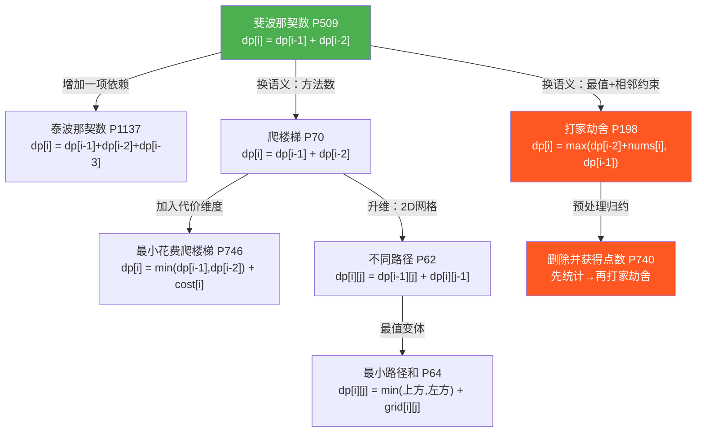
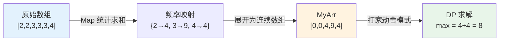
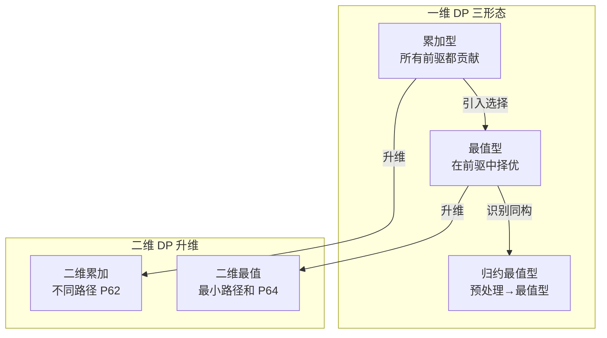

动态规划（Dynamic Programming，简称 DP）是算法学习中最具思维冲击力的范式之一——它不依赖某种特定的数据结构，而是要求你重新理解"问题"本身。本页以仓库中实际存在的代码为线索，沿着 **斐波那契 → 泰波那契 → 爬楼梯 → 打家劫舍 → 删除并获得点数** 这条递进路径，揭示一个核心认知：看似不同的题目，背后共享同一套状态转移逻辑。理解这条脉络，你将不再逐题死记硬背，而是能从问题结构中"读出"递推关系。

## 什么是动态规划：一个思维模型的建立

动态规划的本质是将一个大问题拆解为**重叠子问题**，并通过**记忆化**避免重复计算。每个子问题的解只依赖于更小子问题的解——这就是"状态转移"。理解 DP 的关键不在于记住某个公式，而在于三件事：

1. **定义状态**：`dp[i]` 代表什么含义？
2. **推导转移方程**：`dp[i]` 如何由已知的更小状态计算得出？
3. **确定边界条件**：最小的子问题直接给出答案，递推才能启动。

下面用一张概念关系图，展示本仓库中涉及的所有 DP 题目之间的演化关系：



图中的箭头表示"思维演化"方向——每一步只做**一个维度的改变**（增加依赖项、换语义、加约束、升维），这就是学习动态规划最有效的方式。

Sources: [Solution.java](Java/斐波那契数P509/src/main/Solution.java#L1-L21), [Solution.java](Java/打家劫舍P198/src/main/Solution.java#L1-L20), [198.js](JS/198.js#L1-L11)

## 起点：斐波那契数——最纯粹的递推

LeetCode 509 要求计算第 n 个斐波那契数。这是动态规划的"Hello World"：`F(0)=0, F(1)=1, F(n)=F(n-1)+F(n-2)`。仓库中提供了 Java、Python、C 三种语言的实现，核心思路一致——用迭代替代递归，用变量滚动替代数组。

### Java 实现：三变量滚动

```java
int two=1, zero=0, one=1;
if(n==0){return zero;}
if(n==1){return one;}
for (int i=2;i<=n;i++){
    two = zero+one;   // 状态转移：F(n) = F(n-1) + F(n-2)
    zero = one;       // 滚动：旧 F(n-2) 被丢弃
    one = two;        // 滚动：F(n-1) 前进一位
}
return two;
```

这里 `zero`、`one`、`two` 分别保存 `F(n-2)`、`F(n-1)`、`F(n)` 的值。每次循环只做一次加法和两次赋值，**空间复杂度 O(1)**，远优于开辟整个 dp 数组的 O(n) 方案。这种"滚动变量"技巧是后续所有题目空间优化的基础。

### Python 实现：元组解包的优雅

```python
def fribonacci(n):
    a, b = 0, 1
    for i in range(n):
        a, b = b, a + b
    return a
```

Python 的并行赋值让滚动变量的写法极其简洁——`a, b = b, a+b` 在一步内完成了"读取旧值"和"写入新值"，不存在中间变量污染的问题。这本质上是同一个算法，只是语言表达力不同。

| 维度 | Java 三变量 | Python 元组解包 | 朴素递归 |
|------|------------|----------------|---------|
| 时间复杂度 | O(n) | O(n) | O(2ⁿ) |
| 空间复杂度 | O(1) | O(1) | O(n) 栈空间 |
| 核心技巧 | 手动滚动 | 并行赋值 | 无 |
| 适用场景 | 通用 | Python 惯用 | 仅教学演示 |

**思考题**：为什么朴素递归的时间复杂度是 O(2ⁿ)？因为每次调用分裂为两个子调用，且子问题大量重叠——`fib(5)` 会重复计算 `fib(3)` 两次、`fib(2)` 三次。DP 的核心价值正是消除这种重复。

Sources: [Solution.java](Java/斐波那契数P509/src/main/Solution.java#L1-L21), [Solution.py](Java/斐波那契数P509/src/main/Solution.py#L1-L8), [Solution.c](Java/斐波那契数P509/src/main/Solution.c#L1-L21)

## 扩展：泰波那契数——依赖项的增加

LeetCode 1137 将斐波那契的递推关系从两项扩展到三项：`T(0)=0, T(1)=1, T(2)=1, T(n)=T(n-1)+T(n-2)+T(n-3)`。从算法角度看，这只是"多滚动一个变量"：

```java
int zero = 0, first = 1, second = 1, third = 2;
if(n == 0){return zero;}
if(n == 1){return first;}
if(n == 2){return second;}
for (int i = 3; i <= n; i++) {
    third = first + second + zero;  // 三项求和
    zero = first;    // 滚动第1步
    first = second;  // 滚动第2步
    second = third;  // 滚动第3步
}
return third;
```

注意边界条件从 2 个增加到 3 个——这是递推项增多的必然结果。**规律**：当状态转移方程依赖前 k 项时，需要 k 个边界条件和 k+1 个滚动变量。斐波那契 k=2，泰波那契 k=3，逻辑完全一致。

Sources: [Solution.java](Java/第N个泰波那契数P1137/src/main/Solution.java#L1-L25)

## 语义转换：爬楼梯——同一递推，不同含义

LeetCode 70 问：爬到第 n 阶楼梯有多少种方法，每次可以爬 1 阶或 2 阶？答案的递推关系 `dp[i] = dp[i-1] + dp[i-2]` 与斐波那契完全相同，但语义已经从"数列第 n 项"变成了"到达第 i 阶的方法数"。

### Java 实现：滚动变量

```java
public static int climbStairs(int n) {
    if (n <= 2) { return n; }
    int first = 1;   // dp[1] = 1
    int second = 2;  // dp[2] = 2
    for (int i = 3; i <= n; i++) {
        int third = first + second;  // dp[i] = dp[i-1] + dp[i-2]
        first = second;
        second = third;
    }
    return second;
}
```

### JavaScript 实现（DP 数组版）

```javascript
var climbStairs = function(n) {
  let dp = new Array(n);
  dp[0] = 1;  // 1阶有1种方法
  dp[1] = 2;  // 2阶有2种方法
  for(let i = 2; i < n; i++){
    dp[i] = dp[i-1] + dp[i-2];
  }
  return dp[n-1];
};
```

### JavaScript 实现（通项公式版）

仓库中还保存了一个基于 Binet 公式的解法，直接用**封闭形式**计算斐波那契数：

```javascript
let n = 10;
console.log(Math.floor(
  (1/Math.sqrt(5)) * 
  (Math.pow((1+Math.sqrt(5))/2, n+1) - Math.pow((1-Math.sqrt(5))/2, n+1))
));
```

这种方法时间复杂度 O(1)，但由于浮点精度问题，仅在 n 较小时可靠。它展示了同一问题的另一条数学路径，但工程实践中 DP 迭代才是通用解法。

| 解法 | 时间 | 空间 | 精度风险 | 适用性 |
|------|------|------|---------|--------|
| 滚动变量 | O(n) | O(1) | 无 | ★★★★★ |
| DP 数组 | O(n) | O(n) | 无 | ★★★★ |
| 通项公式 | O(1) | O(1) | 浮点溢出 | ★★ |

Sources: [Solution.java](Java/爬楼梯P70/src/main/Solution.java#L1-L23), [70_1.js](JS/70_1.js#L1-L19), [70.js](JS/70.js#L1-L4)

## 核心跨越：打家劫舍——从"求和"到"求最值"

LeetCode 198 是 DP 入门路上的一道分水岭。问题：一条街上有 n 个房子，每个房子有不同金额，不能偷相邻的两个房子，求能偷到的最大金额。

**关键差异**：前面的题目递推都是"加法"——`dp[i] = dp[i-1] + dp[i-2]`，意味着所有子问题的解都要用到。而打家劫舍引入了**选择**：对于第 i 个房子，偷还是不偷？这需要 `max` 运算来取舍。

### 状态转移方程

```
dp[i] = max(dp[i-2] + nums[i], dp[i-1])
```

- **偷第 i 家**：则第 i-1 家不能偷，金额 = `dp[i-2] + nums[i]`
- **不偷第 i 家**：金额 = `dp[i-1]`（到前一家为止的最大值）

### Java 实现：标准 DP 数组

```java
public int rob(int[] nums) {
    if (nums.length == 0) {return 0;}
    if (nums.length == 1 && nums[0]==0) {return 0;}
    if (nums.length == 1) {return nums[0];}
    if (nums.length == 2) {return Math.max(nums[0], nums[1]);}
    int[] dp = new int[nums.length];
    dp[0] = nums[0];
    dp[1] = Math.max(nums[0], nums[1]);
    for (int i = 2; i < nums.length; i++) {
        dp[i] = Math.max(dp[i-2] + nums[i], dp[i-1]);
    }
    return dp[nums.length-1];
}
```

这是教科书级的 DP 实现——边界处理完整，转移方程清晰，最终答案就是 `dp[n-1]`。[Solution.java](Java/打家劫舍P198/src/main/Solution.java#L1-L20)

### JavaScript/TypeScript 实现：另一种视角

```javascript
let nums = [1, 2, 3, 1];
let dp = new Array(nums.length).fill(0);
dp[0] = nums[0];
dp[1] = Math.max(nums[0], nums[1]);
for (let i = 2; i < nums.length; i++) {
    dp[i] = Math.max(...dp.slice(0, i - 1)) + nums[i];
}
```

仓库中的 JS/TS 实现采用了一个**等价但不同的转移方程**：`dp[i] = max(dp[0]...dp[i-2]) + nums[i]`。这里 `dp.slice(0, i-1)` 取出从 `dp[0]` 到 `dp[i-2]` 的所有值求最大值，再加上 `nums[i]`。

**为什么等价？** 因为 `dp` 数组是单调不减的——`dp[i-1]` 已经是前 i-1 个房子的最优解，所以 `max(dp[0]...dp[i-2])` 必然等于 `dp[i-2]`。但代价是每次迭代要扫描整个前缀，时间复杂度从 O(n) 退化为 O(n²)。这个对比恰好说明：**理解转移方程的数学本质，才能写出真正高效的代码**。

| 实现 | 转移方程 | 时间复杂度 | 空间复杂度 |
|------|---------|-----------|-----------|
| Java 版 | `max(dp[i-2]+nums[i], dp[i-1])` | O(n) | O(n) |
| JS/TS 版 | `max(...dp.slice(0,i-1))+nums[i]` | O(n²) | O(n) |

Sources: [Solution.java](Java/打家劫舍P198/src/main/Solution.java#L9-L15), [198.js](JS/198.js#L1-L11), [198.ts](JS/198.ts#L1-L12)

## 模式升华：删除并获得点数——归约为打家劫舍

LeetCode 740 是打家劫舍模式的进阶应用。问题：给你一个整数数组，选择一个数就能获得其点数，但之后必须删除所有等于该数 ±1 的数。求能获得的最大点数。

**核心洞察**：如果你选了数字 x，那么 x-1 和 x+1 都不能选——这与打家劫舍的"不能偷相邻房子"结构完全同构！只需做一步**预处理**：将所有相同数字的点数求和，按数字值排列成一个新数组。

### JavaScript/TypeScript 实现：预处理 + 打家劫舍

```javascript
let nums = [2, 2, 3, 3, 3, 4];
let map = new Map();
// 第一步：统计每个数字的点数总和
for (let i = 0; i < nums.length; i++) {
    if (map.has(nums[i])) {
        map.set(nums[i], map.get(nums[i]) + nums[i]);
    } else {
        map.set(nums[i], nums[i]);
    }
}
// 第二步：构造连续数组（值为0的位用0填充）
let MyArr = new Array(Math.max(...map.keys()) + 1).fill(0);
for (let i = 0; i < MyArr.length; i++) {
    MyArr[i] = map.get(i) ? map.get(i) : 0;
}
// 第三步：对 MyArr 执行打家劫舍
let dp = new Array(MyArr.length).fill(0);
dp[0] = MyArr[0];
dp[1] = Math.max(MyArr[1], MyArr[0]);
for (let i = 2; i < MyArr.length; i++) {
    dp[i] = Math.max(...dp.slice(0, i - 1)) + MyArr[i];
}
```

以输入 `[2, 2, 3, 3, 3, 4]` 为例，预处理后的数组为 `[0, 0, 4, 9, 4]`（下标 0 到 4），然后直接套用打家劫舍逻辑。**这道题的精髓不在于 DP 本身，而在于"问题归约"——识别出它与已知模式的同构关系**。这是算法能力从"会做"到"会想"的关键跃迁。



Sources: [740.js](JS/740.js#L1-L27), [740.ts](JS/740.ts#L1-L26)

## 升维视角：从一维到二维 DP

当问题的状态不再只依赖一个维度的前驱，而是需要两个维度联合描述时，DP 就从一维数组升级为二维矩阵。本仓库中的"不同路径"和"最小路径和"是两个典型代表。

### 不同路径（P62）：二维加法递推

LeetCode 62 问：一个 m×n 的网格，从左上角走到右下角，每次只能向右或向下，有多少条路径？

状态转移：`dp[i][j] = dp[i-1][j] + dp[i][j-1]`——到达 (i,j) 的路径数等于从上方来的和从左方来的之和。这本质上是斐波那契在二维空间的推广。

```java
int[][] f = new int[m][n];
for (int i = 0; i < m; ++i) { f[i][0] = 1; }  // 第一列：只有一种走法
for (int j = 0; j < n; ++j) { f[0][j] = 1; }  // 第一行：只有一种走法
for (int i = 1; i < m; ++i) {
    for (int j = 1; j < n; ++j) {
        f[i][j] = f[i - 1][j] + f[i][j - 1];
    }
}
return f[m - 1][n - 1];
```

### 最小路径和（P64）：二维最值递推

LeetCode 64 在不同路径的基础上加入了"权重"——每个格子有代价，求最小代价路径。递推从加法变为取最小值：

```java
// 原地修改 grid 作为 dp 数组
for(int i = 0; i < grid.length; i++) {
    for(int j = 0; j < grid[0].length; j++) {
        if(i == 0 && j == 0) continue;
        else if(i == 0)  grid[i][j] = grid[i][j - 1] + grid[i][j];
        else if(j == 0)  grid[i][j] = grid[i - 1][j] + grid[i][j];
        else grid[i][j] = Math.min(grid[i - 1][j], grid[i][j - 1]) + grid[i][j];
    }
}
```

Java 版本巧妙地**复用输入数组**作为 dp 数组，省去了额外空间。这与斐波那契中"滚动变量替代 dp 数组"的思想一脉相承——空间优化永远是 DP 实现的进阶话题。

| 题目 | 递推运算 | 状态含义 | 仓库实现 |
|------|---------|---------|---------|
| 不同路径 P62 | 加法 | 路径条数 | Java + JS/TS |
| 最小路径和 P64 | 取最小值 + 加法 | 最小代价 | Java（原地）+ JS |
| 下降路径最小和 P931 | 取最小值 + 加法 | 最小代价（三方向） | JS |

Sources: [Solution.java](Java/不同路径P62/src/main/Solution.java#L1-L24), [62.js](JS/62.js#L1-L22), [Solution.java](Java/最小路径和P64/src/main/Solution.java#L1-L20), [64.js](JS/64.js#L1-L20), [931.js](JS/931.js#L1-L21)

## 模式总结：一维 DP 的三种基本形态

通过以上题目的演化，我们可以提取出一维 DP 的三种基本递推模式：

| 模式 | 递推公式 | 代表题目 | 核心语义 |
|------|---------|---------|---------|
| **累加型** | `dp[i] = dp[i-1] + dp[i-2]` | 斐波那契、爬楼梯 | 所有子解都要收集 |
| **最值型** | `dp[i] = max(dp[i-2]+v, dp[i-1])` | 打家劫舍 | 在子解中择优 |
| **最值型 + 预处理** | 预处理 → 最值型 | 删除并获得点数 | 问题归约后同构 |



**学习建议**：不要试图一次记住所有题目的解法。掌握上述三种一维形态后，遇到新题时先问自己三个问题——(1) 状态是一维还是二维？(2) 子问题之间是累加关系还是择优关系？(3) 是否需要预处理才能套用已知模式？这三个问题的答案，足以覆盖入门阶段 80% 的 DP 题目。

Sources: [Solution.java](Java/斐波那契数P509/src/main/Solution.java#L1-L21), [Solution.java](Java/爬楼梯P70/src/main/Solution.java#L1-L23), [Solution.java](Java/打家劫舍P198/src/main/Solution.java#L1-L20), [740.js](JS/740.js#L1-L27)

## 仓库代码全景：DP 相关文件速查

下表汇总了本仓库中所有与动态规划直接相关的源码文件，方便你对照阅读：

| 题目 | LeetCode | Java 源码 | JS/TS 源码 | 实现完整度 |
|------|----------|----------|-----------|-----------|
| 斐波那契数 | P509 | [Solution.java](Java/斐波那契数P509/src/main/Solution.java) | — | ✅ 完整 |
| 泰波那契数 | P1137 | [Solution.java](Java/第N个泰波那契数P1137/src/main/Solution.java) | — | ✅ 完整 |
| 爬楼梯 | P70 | [Solution.java](Java/爬楼梯P70/src/main/Solution.java) | [70_1.js](JS/70_1.js), [70.js](JS/70.js) | ✅ 完整 |
| 最小花费爬楼梯 | P746 | [Solution.java](Java/使用最小花费爬楼梯P746/src/main/Solution.java) | — | ⚠️ 仅框架 |
| 打家劫舍 | P198 | [Solution.java](Java/打家劫舍P198/src/main/Solution.java) | [198.js](JS/198.js), [198.ts](JS/198.ts) | ✅ 完整 |
| 删除并获得点数 | P740 | [Solution.java](Java/删除并获得点数P740/src/main/Solution.java) | [740.js](JS/740.js), [740.ts](JS/740.ts) | ⚠️ Java 未实现 |
| 不同路径 | P62 | [Solution.java](Java/不同路径P62/src/main/Solution.java) | [62.js](JS/62.js), [62.ts](JS/62.ts) | ✅ 完整 |
| 最小路径和 | P64 | [Solution.java](Java/最小路径和P64/src/main/Solution.java) | [64.js](JS/64.js) | ✅ 完整 |
| 下降路径最小和 | P931 | — | [931.js](JS/931.js) | ✅ 完整 |

标记为 ⚠️ 的条目是你可以尝试补充的练习——仓库中已有框架代码，只需填入转移逻辑即可。

Sources: [目录结构](Java/斐波那契数P509/src/main/Solution.java#L1-L1), [198.js](JS/198.js#L1-L11), [740.js](JS/740.js#L1-L27)

## 下一步：从入门走向进阶

掌握了一维 DP 的三种基本形态后，你已具备阅读更高级 DP 问题的思维基础。以下是推荐的学习路径：

1. **补全未实现的题目**：P746（最小花费爬楼梯）和 P740（Java 版删除并获得点数）是绝佳的动手练习——框架代码已在仓库中等待你填入转移逻辑
2. **深入学习二维 DP**：前往 [双指针与滑动窗口：字符串与数组问题](9-shuang-zhi-zhen-yu-hua-dong-chuang-kou-zi-fu-chuan-yu-shu-zu-wen-ti) 了解更多数组问题的处理技巧
3. **探索贪心策略**：当 DP 的"全局最优"退化为"局部最优即可"时，贪心成为更高效的选择——参见 [贪心策略：加油站问题与跳跃游戏](10-tan-xin-ce-lue-jia-you-zhan-wen-ti-yu-tiao-yue-you-xi)
4. **回溯与 DP 的关系**：DP 是"自底向上"的记忆化回溯，理解这个联系请阅读 [回溯法：排列组合与括号生成](11-hui-su-fa-pai-lie-zu-he-yu-gua-hao-sheng-cheng)

动态规划的学习没有捷径，但有正确的路径——从简单递推出发，每次只增加一个维度的复杂度，让每一步都建立在已理解的模式之上。这就是本页从斐波那契走到打家劫舍的设计初衷。