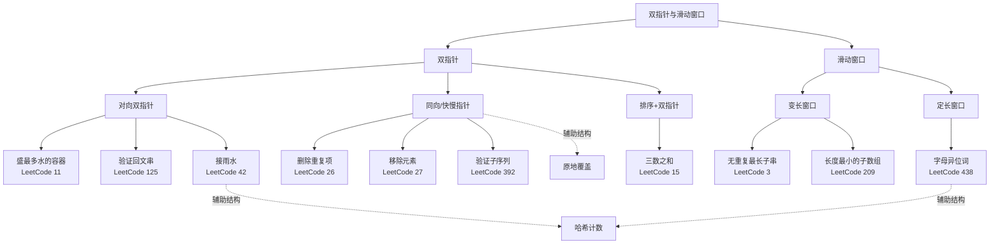
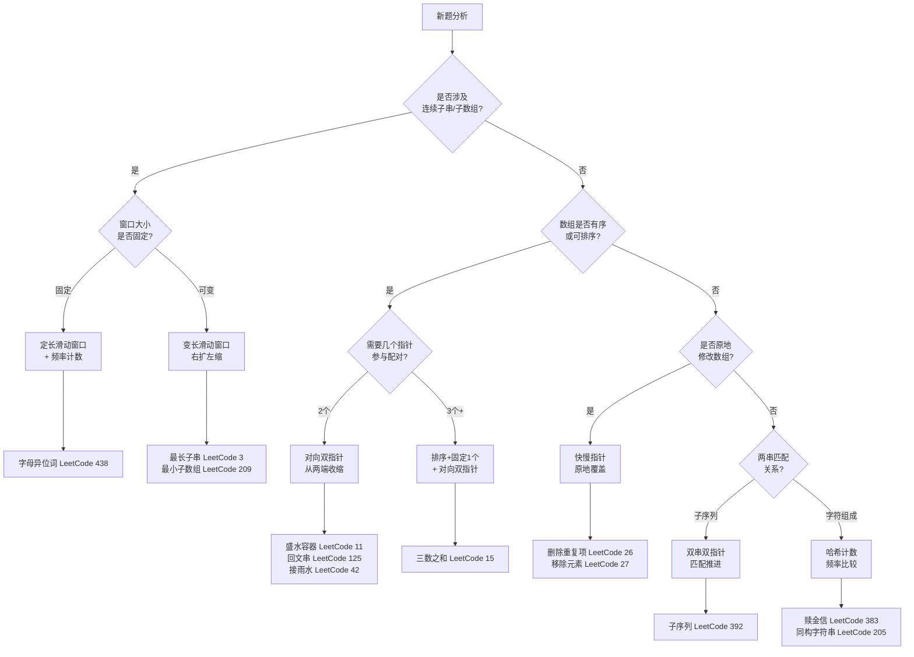

双指针与滑动窗口是解决字符串和数组问题的两大核心范式。它们共享一个深刻的直觉：**利用有序性或单调性，将暴力枚举的多余分支剪掉，使每个元素最多被访问常数次**。本页从仓库中 12 道真实题解出发，先建立统一的心智模型，再逐模式深入实现细节与常见陷阱，帮助你在遇到新题时快速归类、准确编码。

Sources: [3.js](JS/3.js#L1-L83), [11.js](JS/11.js#L1-L87), [Solution.java](Java/长度最小的子数组/src/main/Solution.java#L1-L56)

---

## 心智模型：两大范式的统一视角

双指针和滑动窗口看似不同，但底层逻辑一脉相承——**用两个游标界定一个区间，通过移动游标来探索解空间**。区别仅在于游标的移动策略：

| 维度 | 双指针 | 滑动窗口 |
|------|--------|----------|
| 核心动作 | 两个指针**独立移动**，寻找配对或对撞 | 左右指针**协同移动**，维护一个连续区间 |
| 典型场景 | 有序数组配对、回文检测、原地修改 | 子串/子数组满足某约束的最优解 |
| 窗口语义 | 区间不一定连续或固定 | 区间连续，窗口大小可变或固定 |
| 移动策略 | 根据比较结果决定谁移动 | 右指针扩展 → 条件满足时左指针收缩 |
| 复杂度保证 | 每个元素最多被两端各访问一次 | 右指针走一遍，左指针最多也走一遍 |

下面的关系图展示了本页涵盖的所有题型及其归属：



Sources: [3.js](JS/3.js#L12-L16), [11.js](JS/11.js#L25-L29), [Solution.java](Java/验证子序列/src/main/Solution.java#L8-L24), [Solution.java](Java/找到字符串中所有字母异位词/src/main/Solution.java#L7-L40)

---

## 模式一：对向双指针——从两端向中间收敛

**对向双指针**将一个指针放在数组头部、另一个放在尾部，根据比较结果决定移动哪一端。核心不变式是：**每次移动都在排除不可能产生更优解的候选**。

### 盛最多水的容器（LeetCode 11）

这是对向双指针的教科书。面积 = `min(height[left], height[right]) × (right - left)`。仓库中同时存在暴力解法和优化解法，正好形成对比。

**暴力解法**——双重循环枚举所有容器组合，时间 O(n²)：

```java
public int maxArea(int[] height) {
    int max_area = 0;
    for (int i = 0; i < height.length; i++) {
        for (int j = i + 1; j < height.length; j++) {
            int minHeight = Math.min(height[i], height[j]);
            int width = j - i;
            int tempArea = minHeight * width;
            max_area = Math.max(max_area, tempArea);
        }
    }
    return max_area;
}
```

**对向双指针优化**——关键洞察：面积由短板决定，移动较高的指针只会让宽度变小而高度不可能增加，所以**必须移动较矮的指针**。时间 O(n)：

```javascript
var maxArea = function(height) {
    let head = 0, foot = height.length - 1;
    let maxArea = 0;
    while (head < foot) {
        const area = Math.min(height[head], height[foot]) * (foot - head);
        maxArea = Math.max(maxArea, area);
        if (height[head] < height[foot]) {
            head++;
        } else {
            foot--;
        }
    }
    return maxArea;
};
```

| 方案 | 时间复杂度 | 空间复杂度 | 核心思想 |
|------|-----------|-----------|---------|
| 暴力枚举 | O(n²) | O(1) | 遍历所有组合 |
| 对向双指针 | O(n) | O(1) | 移动短板排除无效解 |

Sources: [Solution.java](Java/盛最多水的容器/src/main/Solution.java#L4-L23), [11.js](JS/11.js#L71-L86), [Test.java](Java/盛最多水的容器/src/test/Test.java#L8-L11)

### 验证回文串（LeetCode 125）

回文检测是对向双指针最自然的应用：左右指针从两端向中间靠拢，每次比较对应字符。

```java
public boolean isPalindrome(String s) {
    StringBuilder cleanedString = new StringBuilder();
    for (char c : s.toCharArray()) {
        if (Character.isLetterOrDigit(c)) {
            cleanedString.append(Character.toLowerCase(c));
        }
    }
    String filteredStr = cleanedString.toString();
    int left = 0, right = filteredStr.length() - 1;
    while (left < right) {
        if (filteredStr.charAt(left) != filteredStr.charAt(right)) {
            return false;
        }
        left++;
        right--;
    }
    return true;
}
```

这段代码先做预处理（过滤非字母数字字符、统一转小写），再用经典的双指针比较。值得注意的是，仓库中还保留了一版被注释掉的"原地跳过"实现——它试图不预处理而直接在原串上跳过非法字符，但存在一个微妙的 bug：匹配成功后直接 `return true` 而非继续循环，导致只检查了首尾一对字符就提前返回。这提醒我们，**对向双指针的循环必须完整遍历到 `left >= right`，任何提前返回都意味着逻辑错误**。

Sources: [Solution.java](Java/验证回文串/src/main/Solution.java#L4-L31), [Solution.java](Java/验证回文串/src/main/Solution.java#L41-L77)

### 接雨水（LeetCode 42）

接雨水可以看作"分段对向"：先找到全局最高点，然后分别从左端向最高点、从右端向最高点扫描。每一段内，左侧维护 `leftMax`，右侧维护 `rightMax`，当前柱子能接的雨水 = `max - height[i]`。

```java
public int trap(int[] height) {
    int n = height.length;
    if (n == 0) return 0;
    int maxHeight = 0;
    for (int i = 0; i < n; ++i) {
        if (height[i] > height[maxHeight]) maxHeight = i;
    }
    int totalArea = 0;
    int leftMax = 0;
    for (int i = 0; i < maxHeight; ++i) {
        if (height[i] > leftMax) leftMax = height[i];
        totalArea += leftMax - height[i];
    }
    int rightMax = 0;
    for (int i = n - 1; i > maxHeight; --i) {
        if (height[i] > rightMax) rightMax = height[i];
        totalArea += rightMax - height[i];
    }
    return totalArea;
}
```

JavaScript 版本的逻辑完全一致，仅语法不同。核心直觉：**水不会流过最高点，所以最高点两侧可以独立计算**。

Sources: [Solution.java](Java/接雨水/src/main/Solution.java#L4-L33), [42.js](JS/42.js#L5-L24), [test.java](Java/接雨水/src/test/test.java#L6-L11)

---

## 模式二：同向/快慢指针——原地修改与子序列匹配

**同向双指针**的两个指针从同一端出发，快指针先行探路，慢指针标记有效位置。这个模式的核心不变式是：**慢指针左侧始终是已处理好的有效数据**。

### 删除有序数组中的重复项（LeetCode 26）

仓库中存在三种实现，从最"直觉"到最"标准"，恰好展示了思维进化的过程。

**实现一：Map 去重（不符合原地修改要求）**——利用 `Map` 的键唯一性去重，但重新创建了数组，违反了 LeetCode 的原地修改规则：

```javascript
function removeDuplicates(nums) {
    const map = new Map();
    nums.forEach((item, index) => {
        if (!map.has(item)) map.set(item, index);
    });
    nums = [...map.keys()];
    return map.size;
}
```

**实现二：splice 删除（逻辑正确但效率低）**——用快慢指针检测相邻重复元素，遇到重复就 `splice` 删除。虽然满足原地修改，但 `splice` 本身是 O(n) 操作，总复杂度退化为 O(n²)：

```typescript
function removeDuplicates(nums: number[]): number {
    let l = 0, r = 1;
    while (r < nums.length) {
        if (nums[l] == nums[r]) {
            nums.splice(r, 1);
            continue;
        } else {
            l++;
            r++;
        }
    }
    return nums.length;
}
```

**标准快慢指针**——慢指针 `slow` 标记下一个不同元素的写入位置，快指针 `fast` 扫描所有元素。时间 O(n)，空间 O(1)，真正的原地修改：

```javascript
var removeDuplicates = function(nums) {
    let slow = 0;
    for (let fast = 1; fast < nums.length; fast++) {
        if (nums[fast] !== nums[slow]) {
            nums[++slow] = nums[fast];
        }
    }
    return slow + 1;
};
```

| 实现 | 时间 | 空间 | 是否原地 | 问题 |
|------|------|------|---------|------|
| Map 去重 | O(n) | O(n) | ❌ | 违反原地修改 |
| splice 删除 | O(n²) | O(1) | ⚠️ | splice 导致整体移位 |
| 快慢指针覆盖 | O(n) | O(1) | ✅ | 标准解法 |

### 移除元素（LeetCode 27）

与 LeetCode 26 同构，仓库中同样存在 Map 过滤版和 splice 版，问题也相同。标准做法是快慢指针覆盖：快指针扫描，当元素不等于 `val` 时写入慢指针位置。

Sources: [26.js](JS/26.js#L3-L14), [26_1.ts](JS/26_1.ts#L1-L18), [27.js](JS/27.js#L3-L15), [27_1.ts](JS/27_1.ts#L1-L13)

### 验证子序列（LeetCode 392）

两个字符串各持一个指针，在长串 `t` 上推进 `j`，仅当 `s[i] == t[j]` 时才推进 `i`。循环结束后若 `i` 到达 `s` 末尾，则 `s` 是 `t` 的子序列。

```java
public boolean isSubsequence(String s, String t) {
    int i = 0, j = 0;
    while (i < s.length() && j < t.length()) {
        if (s.charAt(i) == t.charAt(j)) i++;
        j++;
    }
    return i >= s.length();
}
```

这个模式的关键是**只在匹配时推进源串指针**，目标串指针每步都推进。如果将 `while` 条件改为仅由 `j` 控制、循环内判断 `i` 是否越界，逻辑同样成立，但当前写法更简洁。

Sources: [Solution.java](Java/验证子序列/src/main/Solution.java#L8-L24)

---

## 模式三：排序 + 双指针——多元素配对问题

当题目涉及数组中多个元素的和或配对关系时，**排序是对向双指针的前提条件**——只有在有序环境下，才能根据当前和的大小决定移动哪一端。

### 三数之和（LeetCode 15）

固定一个数 `nums[i]`，在右侧子数组上用对向双指针找两数之和等于 `-nums[i]`。仓库中的 JavaScript 实现展示了完整思路，但也暴露了几个典型错误：

```javascript
var threeSum = function (nums) {
    nums = nums.sort((a, b) => a - b);  // 排序
    let res = [];
    for (let i = 0; i < nums.length - 3; i++) {
        if (nums[i] + nums[i + 1] + nums[i + 2] > 0 
            && nums[i] + nums[nums.length - 1] + nums[nums.length - 2] < 0 
            || nums[i] == nums[i + i]) {  // ⚠️ bug: 应为 nums[i+1]
            continue;
        }
        let head = i + 1, foot = nums.length - 1;
        while (head < foot) {
            let sum = nums[i] + nums[head] + nums[foot];
            if (sum == 0) {
                res.push([nums[i], nums[head], nums[foot]]);
                head++; foot--;
            } else if (sum < 0) { head++; }
            else { foot--; }
        }
    }
    // 后置去重 — 应该在循环内跳过
    res = res.filter((item, index, arr) => 
        arr.findIndex(t => t[0] === item[0] && t[1] === item[1] && t[2] === item[2]) === index
    );
    return res;
};
```

这段代码有三个值得注意的问题：

| 问题 | 位置 | 说明 |
|------|------|------|
| 去重逻辑 bug | `nums[i] == nums[i + i]` | `i + i` 应为 `i + 1`，否则跳过逻辑在 `i > 0` 时索引越界 |
| 循环边界 | `i < nums.length - 3` | 应为 `i < nums.length - 2`，否则漏掉最后三元组 |
| 后置去重 | 末尾 `filter` | 正确做法是在 `i` 循环和 `head/foot` 循环内各自跳过重复值，避免产生重复三元组 |

**标准写法的去重策略**：外层 `if (i > 0 && nums[i] === nums[i-1]) continue` 跳过重复的 `i`；内层找到一组解后，`while (head < foot && nums[head] === nums[head-1]) head++` 和 `while (head < foot && nums[foot] === nums[foot+1]) foot--` 跳过重复的 `head/foot`。

Sources: [15.js](JS/15.js#L5-L51)

---

## 模式四：变长滑动窗口——约束驱动的动态收缩

**变长滑动窗口**的核心循环结构是：右指针无条件扩展，当窗口满足某约束时，左指针开始收缩直到约束被打破。这个"扩展→收缩"的节奏保证了每个元素恰好被加入一次、移除一次。

### 无重复字符的最长子串（LeetCode 3）

仓库中的 JavaScript 实现采用 `Map` 记录字符最近出现的位置，遇到重复时直接将左指针跳到上次出现位置的下一格：

```javascript
var lengthOfLongestSubstring = function (s) {
    let l = 0, res = 0;
    const map = new Map();
    for (let r = 0; r < s.length; r++) {
        if (map.has(s[r]) && map.get(s[r]) >= l) {
            l = map.get(s[r]) + 1;
        }
        res = Math.max(res, r - l + 1);
        map.set(s[r], r);
    }
    return res;
};
```

注意条件 `map.get(s[r]) >= l`——这是防止左指针回退的关键。以 `"abba"` 为例，当 `r=3`（第二个 `a`）时，`map` 中记录 `a` 的位置是 0，但此时 `l` 已经在处理第二个 `b` 时推进到了 2，所以 0 位置的那个 `a` 不在当前窗口内，不应触发收缩。如果写成 `map.get(s[r]) > l`（漏掉等号），则在重复字符恰好是左边界时会少移一位。

Sources: [3.js](JS/3.js#L68-L80)

### 长度最小的子数组（LeetCode 209）

这是变长窗口的经典：**求和 ≥ target 的最短子数组**。右指针扩展窗口累加，当 `sum >= target` 时左指针收缩并更新最小长度：

```java
public int minSubArrayLen(int target, int[] nums) {
    int left = 0, right = 0, sum = 0;
    int min = Integer.MAX_VALUE;
    while (right < nums.length) {
        sum += nums[right];
        while (sum >= target) {
            min = Math.min(min, right - left + 1);
            sum -= nums[left];
            left++;
        }
        right++;
    }
    return min == Integer.MAX_VALUE ? 0 : min;
}
```

仓库中还保留了被注释掉的暴力解法（双重循环，O(n²)），与滑动窗口的 O(n) 形成鲜明对比。滑动窗口之所以能做到 O(n)，是因为**左指针的移动是单调的**——它永远不会回退，所以两端指针各自最多遍历数组一次。

Sources: [Solution.java](Java/长度最小的子数组/src/main/Solution.java#L11-L43), [Solution.java](Java/长度最小的子数组/src/main/Solution.java#L46-L56), [Test.java](Java/长度最小的子数组/src/test/Test.java#L6-L11)

---

## 模式五：定长滑动窗口——窗口大小固定的模式匹配

定长窗口中窗口大小由问题参数决定（如模式串长度），右指针每前进一步，如果窗口超过定长则左指针同步前进一步。核心操作是**维护窗口内的计数/频率，并在窗口合法时检查是否满足条件**。

### 找到字符串中所有字母异位词（LeetCode 438）

用 `need[26]` 记录模式串 `p` 的字符频率，`window[26]` 记录当前窗口的字符频率。右指针每前进一步，将对应字符加入窗口；当窗口大小等于 `p.length()` 时，比较两个数组是否相同，然后左指针前进一步移出窗口最左字符：

```java
public List<Integer> findAnagrams(String s, String p) {
    int[] need = new int[26];
    for (char c : p.toCharArray()) need[c - 'a']++;
    int[] window = new int[26];
    List<Integer> result = new ArrayList<>();
    int left = 0, right = 0;
    while (right < s.length()) {
        char c1 = s.charAt(right);
        window[c1 - 'a']++;
        if (right - left + 1 == p.length()) {
            if (check(need, window)) result.add(left);
            char c2 = s.charAt(left);
            window[c2 - 'a']--;
            left++;
        }
        right++;
    }
    return result;
}
```

这段代码的节奏非常清晰：**右指针进 → 检查窗口 → 左指针出**。`check` 方法逐位比较两个长度为 26 的数组，每次 O(26)=O(1)。如果追求极致优化，可以用一个 `matchCount` 变量追踪匹配的字符数，避免每次调用 `check`，但当前写法在小写字母场景下已经足够高效。

Sources: [Solution.java](Java/找到字符串中所有字母异位词/src/main/Solution.java#L7-L50), [Test.java](Java/找到字符串中所有字母异位词/src/test/Test.java#L6-L14)

---

## 辅助模式：哈希计数——频率驱动的字符串匹配

某些问题虽然不直接使用双指针，但其"计数+比较"的思路与滑动窗口的 `need/window` 模式一脉相承。

### 赎金信（LeetCode 383）

用 `charCount[26]` 统计 `magazine` 的字符频率，再遍历 `ransomNote` 递减计数，一旦出现负数说明字符不足：

```java
public boolean canConstruct(String ransomNote, String magazine) {
    int[] charCount = new int[26];
    for (char c : magazine.toCharArray()) charCount[c - 'a']++;
    for (char c : ransomNote.toCharArray()) {
        if (--charCount[c - 'a'] < 0) return false;
    }
    return true;
}
```

### 同构字符串（LeetCode 205）

双向映射数组 `mapS[256]` 和 `mapT[256]` 确保字符一一对应。这与滑动窗口中 `need/window` 的"双计数"思路本质相同，只不过从频率统计变为了映射验证：

```java
for (int i = 0; i < s.length(); i++) {
    char charS = s.charAt(i), charT = t.charAt(i);
    if (mapS[charS] == 0 && mapT[charT] == 0) {
        mapS[charS] = charT;
        mapT[charT] = charS;
    } else if (mapS[charS] != charT || mapT[charT] != charS) {
        return false;
    }
}
```

Sources: [Solution.java](Java/赎金信/src/main/Solution.java#L6-L25), [Solution.java](Java/同构字符串/src/main/Solution.java#L4-L31)

---

## 综合对比与选型指南

面对一道新题，如何快速判断该用哪种模式？下面的决策流程图提供了系统化的归类方法：



### 复杂度速查表

| 题目 | 模式 | 时间 | 空间 | 仓库实现语言 |
|------|------|------|------|-------------|
| 盛最多水的容器 (11) | 对向双指针 | O(n) | O(1) | Java + JS |
| 验证回文串 (125) | 对向双指针 | O(n) | O(n)* | Java |
| 接雨水 (42) | 分段对向 | O(n) | O(1) | Java + JS |
| 删除重复项 (26) | 快慢指针 | O(n) | O(1) | JS + TS |
| 移除元素 (27) | 快慢指针 | O(n) | O(1) | JS + TS |
| 验证子序列 (392) | 双串双指针 | O(n+m) | O(1) | Java |
| 三数之和 (15) | 排序+双指针 | O(n²) | O(1)* | JS |
| 最长子串 (3) | 变长滑动窗口 | O(n) | O(min(n, charset)) | JS |
| 最小子数组 (209) | 变长滑动窗口 | O(n) | O(1) | Java |
| 字母异位词 (438) | 定长滑动窗口 | O(n) | O(1) | Java |
| 赎金信 (383) | 哈希计数 | O(n+m) | O(1) | Java |
| 同构字符串 (205) | 双向映射 | O(n) | O(1) | Java |

> *验证回文串预处理用 StringBuilder 额外 O(n) 空间；三数之和排序需 O(log n) 栈空间，结果列表不计入。

Sources: [Solution.java](Java/盛最多水的容器/src/main/Solution.java#L4-L23), [Solution.java](Java/验证回文串/src/main/Solution.java#L4-L31), [Solution.java](Java/接雨水/src/main/Solution.java#L4-L33), [26.js](JS/26.js#L3-L14), [27_1.ts](JS/27_1.ts#L1-L13), [Solution.java](Java/验证子序列/src/main/Solution.java#L8-L24), [15.js](JS/15.js#L5-L51), [3.js](JS/3.js#L68-L80), [Solution.java](Java/长度最小的子数组/src/main/Solution.java#L11-L43), [Solution.java](Java/找到字符串中所有字母异位词/src/main/Solution.java#L7-L50), [Solution.java](Java/赎金信/src/main/Solution.java#L6-L25), [Solution.java](Java/同构字符串/src/main/Solution.java#L4-L31)

---

## 常见陷阱与纠错实录

本仓库的真实代码中保留了若干典型错误，它们是最好的反面教材。

### 陷阱 1：原地修改用了额外空间

LeetCode 26 和 27 的 `Map/Set` 版本虽然逻辑正确，但重新创建了数组，违反"原地修改"的要求。**判断标准**：如果函数签名要求修改入参数组并返回长度，那么新数组对象不会被外部感知，结果错误。

### 陷阱 2：splice 导致 O(n²) 复杂度

`26_1.ts` 和 `27_1.ts` 使用 `splice` 删除元素，每次 `splice` 触发 O(n) 的元素移位，总复杂度退化为 O(n²)。正确做法是**快慢指针覆盖写入**，只赋值不移位。

### 陷阱 3：对向双指针提前返回

验证回文串的注释代码中，匹配成功后直接 `return true`，导致只检查了一对字符。正确逻辑是**仅在发现不匹配时提前 `return false`，否则必须走完整个循环**。

### 陷阱 4：滑动窗口左指针回退

无重复最长子串中，如果条件写成 `map.get(s[r]) > l`（漏掉等号），当重复字符恰好是当前左边界时会少移一位。正确条件是 `>= l`，确保左指针只前进不后退。

### 陷阱 5：三数之和的去重逻辑

`nums[i] == nums[i + i]` 是笔误（应为 `nums[i + 1]`），且后置 `filter` 去重效率低下。标准做法是在循环内跳过重复值，既避免产生重复结果，又保持 O(n²) 的时间复杂度。

Sources: [26.js](JS/26.js#L3-L14), [26_1.ts](JS/26_1.ts#L1-L18), [Solution.java](Java/验证回文串/src/main/Solution.java#L50-L77), [3.js](JS/3.js#L73-L74), [15.js](JS/15.js#L22-L24)

---

## 延伸学习

掌握了双指针与滑动窗口后，可以沿以下方向继续深入：

- **贪心策略**：接雨水和盛水容器中的"移动短板"本质上就是贪心——每步选择局部最优方向。详见 [贪心策略：加油站问题与跳跃游戏](10-tan-xin-ce-lue-jia-you-zhan-wen-ti-yu-tiao-yue-you-xi)
- **回溯法**：当滑动窗口无法覆盖所有组合（如排列、子集问题），需要回溯枚举。详见 [回溯法：排列组合与括号生成](11-hui-su-fa-pai-lie-zu-he-yu-gua-hao-sheng-cheng)
- **动态规划**：接雨水也可以用 DP 预处理左右最大值数组来解，思路更直接但空间为 O(n)。详见 [动态规划入门：从斐波那契到打家劫舍](8-dong-tai-gui-hua-ru-men-cong-fei-bo-na-qi-dao-da-jia-jie-she)
- **链表上的双指针**：快慢指针在链表中同样大放异彩，用于环检测、中点查找等。详见 [链表操作：合并、反转与环检测](15-lian-biao-cao-zuo-he-bing-fan-zhuan-yu-huan-jian-ce)