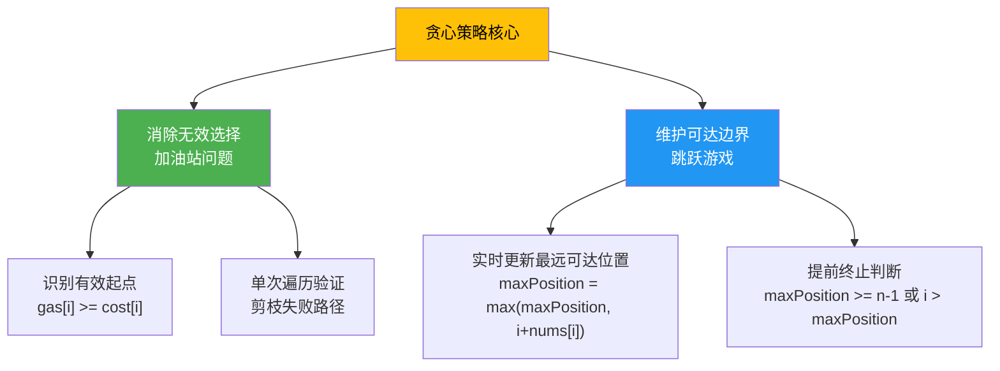

贪心算法（Greedy Algorithm）的核心思想是：在每一步选择中都采取当前状态下**最好**或**最优**的选择，从而希望导致结果是全局最优的。与动态规划不同，贪心策略不回溯、不存储所有子问题的解，而是依赖"局部最优性定理"来保证最终的全局最优。本页通过两个经典问题——加油站问题和跳跃游戏——展示贪心算法的典型应用模式：**消除无效选择**与**维护可达边界**。

Sources: [Solution.java](Java/跳跃游戏/src/main/Solution.java#L1-L19), [134.js](JS/134.js#L1-L85), [134.ts](JS/134.ts#L1-L94)

## 贪心策略的本质：局部最优与全局最优

贪心算法适用的核心前提是**最优子结构**和**贪心选择性质**。最优子结构指问题的最优解包含其子问题的最优解；贪心选择性质指可以通过局部最优选择来构造全局最优解。这与动态规划的关键区别在于：贪心在每一步做决策时，不依赖后续子问题的结果，而动态规划需要先解决所有子问题再回溯构造全局解。

下面展示本页涉及的两个贪心问题之间的概念关系：



这种思维模式的价值在于：通过在遍历过程中**即时剪枝**或**维护关键指标**，将原本可能需要 O(n²) 的暴力搜索降低到 O(n) 线性时间。接下来的两个问题将展示这种模式的具体应用。

Sources: [Solution.java](Java/跳跃游戏/src/main/Solution.java#L1-L19), [134.js](JS/134.js#L1-L85)

## 问题一：加油站——消除无效起点

LeetCode 134 要求在环形路线上找到唯一一个能够完成环行的加油站起始点。给定两个数组 `gas[i]`（第 i 站的加油量）和 `cost[i]`（从 i 站到 i+1 站的耗油量），如果总油量不小于总耗油量，则存在唯一解。

### 贪心选择：过滤无效起点

最直观的贪心策略是：**只从能起步的站点开始尝试**。即 `gas[i] >= cost[i]` 的位置才可能是有效起点。这直接将候选集合从 n 个减少到 k 个（k ≤ n），然后对每个候选进行一次环行验证。

仓库中的 JavaScript/TypeScript 实现采用了这一思路：

```javascript
let gas = [5, 1, 2, 3, 4];
let cost = [4, 4, 1, 5, 1];
let start = [];
for (let i = 0; i < l; i++) {
    if (gas[i] >= cost[i]) {
        start.push(i);  // 收集有效起点
    }
}
```

Sources: [134.js](JS/134.js#L1-L13), [134.ts](JS/134.ts#L1-L10)

### 验证逻辑：模拟环行与剪枝

对每个候选起点，模拟从该点出发的环行过程。关键在于**处理环形逻辑**——从起点走到末尾后，需要回到开头继续直到起点前一站。JavaScript 实现中将环行拆分为两个阶段：从起点到末尾，再从开头到起点。

```javascript
// 从起点到末尾
for (let m = start[i]; m < l; m++) {
    if (m === start[i]) {
        car_oil = gas[m];  // 起点加满油
    } else {
        car_oil = car_oil + gas[m] - cost[m - 1];
    }
    if (car_oil < 0) {
        disable = true;  // 油量耗尽，剪枝
        break;
    }
}
if (disable) continue;  // 当前起点失败，尝试下一个

// 从开头到起点前一站
for (let n = 0; n <= start[i]; n++) {
    if (n === 0) {
        car_oil = car_oil + gas[n] - cost[l - 1];  // 环形边界
    } else if (n === start[i]) {
        car_oil = car_oil - cost[n - 1];  // 到达起点，完成环行
    } else {
        car_oil = car_oil + gas[n] - cost[n - 1];
    }
    if (car_oil < 0) {
        disable = true;
        break;
    }
}
if (!disable) console.log(start[i]);  // 找到解
```

Sources: [134.js](JS/134.js#L38-L77), [134.ts](JS/134.ts#L42-L81)

### 复杂度分析与优化方向

当前实现的时间复杂度为 **O(k·n)**，其中 k 是有效起点的数量。在 worst case 下，所有站点都是有效起点，复杂度退化为 O(n²)。更优的贪心策略可以通过**全局总油量判断 + 单次遍历找起点**将复杂度降至 O(n)：

1. 如果 `totalGas < totalCost`，直接返回 -1
2. 如果能走到某站却无法继续，则从当前站到之前尝试过的所有站都不可能是起点，直接从当前站的下一站重新开始

这种"失败后直接跳过整段失败区域"的优化，是贪心策略在**区间剪枝**上的典型应用。

| 方法 | 时间复杂度 | 空间复杂度 | 核心思想 |
|------|-----------|-----------|---------|
| 当前实现（JS/TS） | O(k·n) | O(k) | 过滤无效起点，逐个验证 |
| 优化贪心 | O(n) | O(1) | 失败区间整体剪枝 |
| 暴力搜索 | O(n²) | O(1) | 尝试所有起点 |

Sources: [134.js](JS/134.js#L1-L85), [134.ts](JS/134.ts#L1-L94)

## 问题二：跳跃游戏——维护可达边界

LeetCode 55（跳跃游戏 I）问：给定非负整数数组 `nums`，初始位置在索引 0，`nums[i]` 表示从位置 i 能跳的最大步数。判断能否到达最后一个索引。

### 贪心策略：最远可达位置维护

核心贪心思想：**不需要知道具体跳几步，只需要知道"能跳多远"**。用一个变量 `maxPosition` 实时记录当前能到达的最远位置。遍历过程中：

- 如果当前索引 `i > maxPosition`，说明无法到达该位置，直接返回 false
- 否则更新 `maxPosition = max(maxPosition, i + nums[i])`
- 如果 `maxPosition >= n-1`，已经能到达终点，返回 true

仓库中的 Java 实现展示了这一简洁的思路：

```java
public boolean canJump(int[] nums) {
    int maxPosition = 0;
    for (int i = 0; i < nums.length; i++) {
        if (i > maxPosition) {
            return false;  // 无法到达当前位置
        }
        maxPosition = Math.max(maxPosition, i + nums[i]);  // 更新最远可达
        if (maxPosition >= nums.length - 1) {
            return true;  // 已能到达终点
        }
    }
    return false;
}
```

Sources: [Solution.java](Java/跳跃游戏/src/main/Solution.java#L1-L19), [test.java](Java/跳跃游戏/src/test/test.java#L1-L27)

### 执行过程示例

以 `nums = [2, 3, 1, 1, 4]` 为例：

| i | nums[i] | maxPosition (更新前) | i > maxPosition? | maxPosition (更新后) | 状态 |
|---|---------|---------------------|------------------|---------------------|------|
| 0 | 2 | 0 | false | max(0, 0+2) = 2 | 继续 |
| 1 | 3 | 2 | false | max(2, 1+3) = 4 | 继续且能到终点 |
| 2 | 1 | 4 | false | max(4, 2+1) = 4 | 继续但已达终点 |
| ... | ... | ... | ... | ... | 已返回 true |

关键在于：当 `i=1` 时，`maxPosition` 更新为 4，已经超过数组末尾索引 3，可以立即返回 true。

### 边界情况处理

测试用例覆盖了典型边界场景：

```java
int[] nums1 = {2,3,1,1,4};  // true，正常可达
int[] nums2 = {2,2,1,0,4};  // false，被困在 0 处
int[] nums3 = {1,0,1,0};    // false，第二个 0 导致无法前进
```

Sources: [test.java](Java/跳跃游戏/src/test/test.java#L1-L27)

## 问题三：跳跃游戏 II——最值贪心的变体

LeetCode 45（跳跃游戏 II）问：到达终点的**最少跳跃次数**是多少？虽然仓库中的 JS/TS 实现使用了动态规划（DP），但这个问题同样有贪心解法。

### DP 实现：理解基础思路

仓库中的实现采用 DP，状态定义 `dp[i]` 表示到达索引 i 的最小跳跃次数：

```javascript
let nums = [1, 2, 3];
let dp = new Array(nums.length).fill(0);
const dp_equation = (i) => {
    let res = [];
    for (let j = 0; j < i; j++) {
        if (nums[j] >= i - j) {  // 从 j 能跳到 i
            res.push(dp[j]);
        }
    }
    return Math.min(...res) + 1;  // 选择最小跳跃次数的前驱
};
dp[0] = 0;
for (let i = 1; i < nums.length; i++) {
    dp[i] = dp_equation(i);
}
```

Sources: [45.js](JS/45.js#L1-L21), [45.ts](JS/45.ts#L1-L20)

### 贪心优化：跳跃区间的边界选择

DP 解法时间复杂度 O(n²)。贪心优化思路是：**每次跳跃都选择能覆盖最远范围的位置**。具体实现：

- 维护 `currentEnd`（当前跳跃能到达的右边界）和 `farthest`（当前跳跃范围内能到达的最远位置）
- 遍历到 `currentEnd` 时，必须进行下一次跳跃，跳跃次数 +1
- 更新 `currentEnd = farthest`，继续下一轮

这种贪心策略保证每次跳跃都是"最优"的，将复杂度降至 O(n)。

| 方法 | 时间复杂度 | 空间复杂度 | 思想本质 |
|------|-----------|-----------|---------|
| DP（当前实现） | O(n²) | O(n) | 穷举所有前驱，选最小 |
| 贪心 | O(n) | O(1) | 每次跳到能覆盖最远的位置 |

Sources: [45.js](JS/45.js#L1-L21), [45.ts](JS/45.ts#L1-L20)

## 贪心策略的通用模式总结

通过对加油站问题和跳跃游戏的分析，可以提炼出贪心算法在不同场景下的应用模式：

### 模式一：剪枝无效选择（加油站）

- **识别无效条件**：`gas[i] < cost[i]` 的站点不可能是起点
- **局部验证全局**：每个候选点独立验证，失败即剪枝
- **优化方向**：失败区间整体跳过，避免重复遍历

### 模式二：维护状态边界（跳跃游戏）

- **状态定义**：`maxPosition` 表示当前可达最远位置
- **更新规则**：每步都尝试扩展边界，`maxPosition = max(maxPosition, i + nums[i])`
- **终止条件**：边界失效（`i > maxPosition`）或边界覆盖目标（`maxPosition >= n-1`）

### 贪心 vs. 动态规划

| 维度 | 贪心策略 | 动态规划 |
|------|---------|---------|
| 决策时机 | 每一步立即决策，不回溯 | 先计算所有子问题，再回溯 |
| 空间复杂度 | 通常 O(1) 或 O(k) | 通常 O(n) 或更高 |
| 适用场景 | 具有贪心选择性质 | 需要全局最优，依赖多步决策 |
| 代码复杂度 | 较简洁 | 需要状态定义和转移方程 |

Sources: [Solution.java](Java/跳跃游戏/src/main/Solution.java#L1-L19), [134.js](JS/134.js#L1-L85), [45.js](JS/45.js#L1-L21)

## 延伸学习路径

掌握贪心策略后，可以继续探索其他经典算法思想：

- **[回溯法：排列组合与括号生成](11-hui-su-fa-pai-lie-zu-he-yu-gua-hao-sheng-cheng)**：处理需要尝试所有可能性的组合问题
- **[双指针与滑动窗口：字符串与数组问题](9-shuang-zhi-zhen-yu-hua-dong-chuang-kou-zi-fu-chuan-yu-shu-zu-wen-ti)**：另一种高效遍历策略
- **[堆：最小堆与最大堆的完整实现](14-dui-zui-xiao-dui-yu-zui-da-dui-de-wan-zheng-shi-xian)**：贪心算法中常用的优先队列数据结构

这些算法思想互相补充，共同构成了解决复杂问题的工具箱。