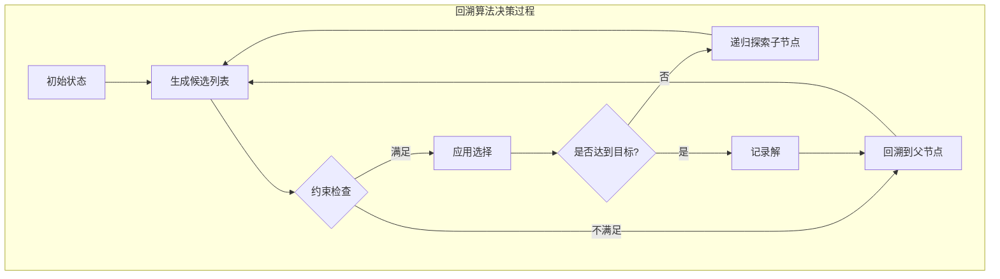

回溯法（Backtracking）是一种通过穷举所有可能情况来寻找问题解决方案的算法策略，其核心思想是"深度优先搜索 + 状态重置"。在遇到不满足约束条件的情况时，算法会回退到上一步，尝试其他可能的路径。这种算法天然适合解决排列组合、括号生成、子集、组合求和等问题。

## 回溯算法的核心机制

回溯算法本质上是一种暴力搜索的优化形式，它通过"尝试-回溯"的方式遍历解空间树。每个节点代表问题的一个状态，通过递归深入探索，在达到终止条件或发现当前路径无法得到有效解时，回退到上一状态继续探索其他分支。

**回溯算法的通用模板**可以概括为四个关键步骤：

```javascript
function backtrack(参数列表) {
    if (终止条件) {
        收集结果;
        return;
    }
    for (选择路径) {
        做选择;
        backtrack(下一层参数);
        撤销选择; // 状态重置，回溯的关键
    }
}
```

Sources: [JS/排列组合模拟.js](JS/排列组合模拟.js#L3-L20)

## 排列问题（Permutations）

**LeetCode 46：全排列**是回溯算法的经典应用场景。给定不含重复数字的数组 `nums`，返回其所有可能的排列组合。回溯法的核心在于使用 `used` 数组标记元素是否已被使用，确保每个排列中的元素唯一。

```javascript
let res = [];
const backtrack = (nums, path, used) => {
    if (path.length === nums.length) {
        res.push([...path]); // 深拷贝，避免引用问题
        console.log("完成一次排列");
        return;
    }
    for (let i = 0; i < nums.length; i++) {
        if (used[i]) continue; // 跳过已使用的元素
        used[i] = true;         // 做选择
        path.push(nums[i]);
        backtrack(nums, path, used);
        path.pop();             // 撤销选择
        used[i] = false;        // 状态重置
    }
};
let nums = [1, 2, 3];
let path = [];
let used = new Array(nums.length).fill(false);
backtrack(nums, path, used);
console.log(res);
```

**算法流程可视化**：

```mermaid
graph TD
    A[开始: path=[]] --> B[尝试添加1]
    B --> C[尝试添加2]
    C --> D[尝试添加3]
    D --> E{path.length==3}
    E -->|是| F[收集[1,2,3]]
    E -->|否| G[继续选择]
    F --> H[回溯: 移除3]
    H --> I[回溯: 移除2]
    I --> J[尝试添加3]
    J --> K[尝试添加2]
    K --> L[收集[1,3,2]]
    L --> M[完整回溯到根节点]
    M --> N[尝试添加2]
```

**关键实现细节**：
- 使用 `used[i]` 标记数组来避免重复选择同一元素
- `res.push([...path])` 使用展开运算符进行深拷贝，避免引用同一数组的指针
- 每次递归调用后必须执行 `path.pop()` 和 `used[i] = false`，这是回溯的核心

Sources: [JS/46.js](JS/46.js#L1-L28), [JS/46.ts](JS/46.ts#L1-L30)

## 组合问题（Combinations）

**LeetCode 77：组合**要求从 1 到 n 的数字中选取 k 个数字的所有组合。与排列问题不同，组合问题关注的是元素的选择而非顺序，因此需要通过 `start` 参数来避免重复选择同一位置之前的元素。

```javascript
let n = 4;
let k = 3;
let res = [];
const backtrack = (start, path) => {
    if (path.length === k) {
        res.push([...path]);
        return;
    }
    for (let i = start; i <= n; i++) {
        path.push(i);
        backtrack(i + 1, path); // 关键：从下一个位置开始，避免重复
        path.pop();
    }
};
backtrack(1, []);
console.log(res);
```

**组合问题的剪枝优化**可以通过 `for` 循环的边界条件实现。例如，当剩余可选元素不足以满足组合长度时，可以提前终止循环：

```javascript
// 优化后的边界条件
for (let i = start; i <= n - (k - path.length) + 1; i++) {
    path.push(i);
    backtrack(i + 1, path);
    path.pop();
}
```

**排列 vs 组合对比**：

| 特性 | 排列（Permutations） | 组合（Combinations） |
|------|---------------------|---------------------|
| 关注点 | 元素的顺序 | 元素的选择 |
| 避免重复机制 | `used` 数组标记 | `start` 参数控制起始位置 |
| 时间复杂度 | O(n × n!) | O(C(n,k) × k) |
| 空间复杂度 | O(n) | O(k) |

Sources: [JS/77.js](JS/77.js#L1-L19), [JS/77.ts](JS/77.ts#L1-L21)

## 括号生成问题（Generate Parentheses）

**LeetCode 22：生成括号**要求生成 n 对括号的所有有效组合。这个问题体现了回溯法在处理约束条件时的灵活性。有效括号的约束是：任意位置的左括号数量 >= 右括号数量，且最终左右括号数量相等。

**核心约束条件**：
- 左括号数量 `left < n`：可以添加左括号
- 右括号数量 `right < left`：可以添加右括号（必须已有左括号）
- 终止条件：`left === n && right === n`

```javascript
function generateParenthesis(n) {
    const res = [];
    const backtrack = (path, left, right) => {
        if (left === n && right === n) {
            res.push(path);
            return;
        }
        if (left < n) {
            backtrack(path + '(', left + 1, right);
        }
        if (right < left) {
            backtrack(path + ')', left, right + 1);
        }
    };
    backtrack('', 0, 0);
    return res;
}
```

**括号生成过程（n=2）**：

```mermaid
graph TD
    A[开始: path='', left=0, right=0] --> B{left < 2?}
    B -->|是| C[添加 '(']
    C --> D[path='(', left=1, right=0]
    D --> E{left < 2?}
    E -->|是| F[添加 '(']
    F --> G[path='(', left=2, right=0]
    G --> H{right < left?}
    H -->|是| I[添加 ')']
    I --> J[path='()', left=2, right=1]
    J --> K{right < left?}
    K -->|是| L[添加 ')']
    L --> M[path='()', left=2, right=2]
    M --> N{终止条件?}
    N -->|是| O[收集 '(())']
    O --> P[回溯]
    P --> Q[其他分支探索...]
```

Sources: [JS/22.js](JS/22.js#L1-L3)

## 字母组合问题（Letter Combinations）

**LeetCode 17：电话号码的字母组合**展示了如何处理多维度的回溯问题。给定数字字符串，每个数字对应多个字母，要求返回所有可能的字母组合。

```javascript
var letterCombinations = function (digits) {
    const map = {
        '2': ['a', 'b', 'c'],
        '3': ['d', 'e', 'f'],
        '4': ['g', 'h', 'i'],
        '5': ['j', 'k', 'l'],
        '6': ['m', 'n', 'o'],
        '7': ['p', 'q', 'r', 's'],
        '8': ['t', 'u', 'v'],
        '9': ['w', 'x', 'y', 'z'],
    }
    
    let res = [];
    
    const backtrack = (index, path) => {
        if (path.length === digits.length) {
            res.push(path);
            return;
        }
        const letters = map[digits[index]];
        for (const letter of letters) {
            backtrack(index + 1, path + letter);
        }
    };
    
    if (digits.length > 0) {
        backtrack(0, '');
    }
    
    return res;
};
```

**算法特点**：
- 不需要撤销操作：每次传递新的字符串，不修改原有状态
- 多层约束：每个数字对应多个字母，形成多层选择树
- 空输入处理：需要处理空字符串的特殊情况

Sources: [JS/17.js](JS/17.js#L1-L29)

## 回溯算法的复杂度分析与优化

**时间复杂度**：
- 排列问题：O(n × n!)，需要生成 n! 个排列，每个排列长度为 n
- 组合问题：O(C(n,k) × k)，需要生成 C(n,k) 个组合，每个组合长度为 k
- 括号生成：O(4^n / √n)，卡塔兰数列的第 n 项

**空间复杂度**：
- 递归栈深度：O(n)，最大递归深度取决于问题的规模
- 结果存储：O(N × n)，N 为结果数量，n 为单个结果长度

**常见优化策略**：

| 优化类型 | 方法 | 适用场景 |
|---------|------|---------|
| 剪枝优化 | 提前终止无效分支 | 组合问题、子集问题 |
| 去重优化 | 排序 + 跳过重复元素 | 包含重复元素的排列组合 |
| 状态压缩 | 位运算标记元素使用 | 元素数量较少的场景 |

**回溯算法的决策树模型**：



Sources: [JS/排列组合模拟.js](JS/排列组合模拟.js#L3-L20), [JS/46.js](JS/46.js#L1-L28)

## 实践建议与常见陷阱

**常见实现陷阱**：
1. **引用拷贝问题**：直接 `res.push(path)` 会导致所有结果指向同一个数组，必须使用 `res.push([...path])` 进行深拷贝
2. **状态重置遗漏**：递归返回后必须撤销选择，否则会污染其他分支的状态
3. **边界条件处理**：空输入、单元素输入等边界情况需要特殊处理

**调试技巧**：
- 在关键位置添加 `console.log` 输出当前路径和状态
- 使用递归深度限制避免无限递归
- 对于小规模问题，可以手动跟踪递归过程

**适用场景识别**：
- 问题需要找出所有可能的解（而非最优解）
- 解可以通过一系列选择构建
- 存在明确的终止条件和约束规则

回溯法虽然时间复杂度较高，但其实现简洁、逻辑清晰，对于中小规模数据或需要枚举所有解的问题具有不可替代的优势。掌握回溯法不仅是学习高级算法的基础，也是培养问题分解和递归思维的重要途径。

Sources: [JS/46.js](JS/46.js#L8-L18), [JS/77.js](JS/77.js#L6-L17)

## 延伸学习

理解回溯法后，建议继续学习以下相关算法思想：

- **[动态规划入门：从斐波那契到打家劫舍](8-dong-tai-gui-hua-ru-men-cong-fei-bo-na-qi-dao-da-jia-jie-she)**：对比递归与记忆化的效率差异
- **[贪心策略：加油站问题与跳跃游戏](10-tan-xin-ce-lue-jia-you-zhan-wen-ti-yu-tiao-yue-you-xi)**：学习局部最优选择策略
- **[深度优先遍历](JavaScript/深度优先遍历)**：回溯法的底层基础