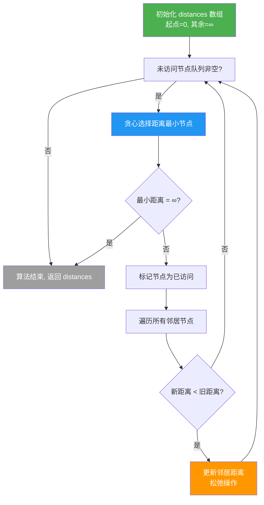

Dijkstra 算法是图论中最经典的**单源最短路径**算法，适用于非负权重的有向图和无向图。本页以仓库中的真实实现为线索，系统讲解 Dijkstra 算法的核心思想、代码实现以及优化空间。理解 Dijkstra 不仅需要掌握算法本身，更需要理解"贪心策略 + 松弛操作"这一底层设计模式。

## 算法核心：贪心选点与松弛操作

Dijkstra 算法的本质是一个**重复贪心选择**的过程。每次从未访问的节点中选择距离起点最近的节点，然后通过"松弛操作"更新其邻居的最短距离。这一过程基于一个关键不变式：**已被标记为已访问的节点，其最短距离已经确定，不会再被更新**。

核心思想可以概括为三个步骤的循环：

1. **初始化**：起点距离为 0，其他节点距离为无穷大
2. **贪心选点**：从未访问节点中选择距离最小的节点
3. **松弛操作**：通过选定节点更新其所有邻居的距离

仓库中的实现完整展示了这一过程。代码使用对象表示图的邻接表结构，每个节点的值是一个包含邻居及权重的对象。

```javascript
let graph = {
  A: { B: 1, C: 4 },
  B: { A: 1, C: 2, D: 5 },
  C: { A: 4, B: 2, D: 1 },
  D: { B: 5, C: 1 }
};
```

这个无向图中，每条边在两个方向都有记录。例如 A-B 边的权重为 1，在 A 的邻居中有 B:1，在 B 的邻居中有 A:1。邻接表表示法的优势在于查询某个节点的邻居是 O(1) 时间，非常适合 Dijkstra 这类需要频繁遍历邻居的算法。

Sources: [test.js](基本算法/迪杰拉特斯/test.js#L1-L6)

## 算法流程：从初始化到收敛

下面的流程图展示了 Dijkstra 算法的完整执行流程，以理解每个步骤的逻辑关系：



理解这个流程的关键在于理解"**贪心选择**"为什么是正确的——每次选择距离最小的节点，因为所有边权重非负，这个节点的最短路径不可能通过其他未访问节点得到更优的解。这个性质被称为"**最优子结构**"。

代码中的初始化部分清晰展示了这一设置：

```javascript
const distances = {};
const visited = new Set();
const nodes = Object.keys(graph);

// 初始化距离：起点为0，其余为Infinity
for (let node of nodes) {
  distances[node] = node === start ? 0 : Infinity;
}
```

这里使用 `Infinity` 表示"尚未到达"的状态。JavaScript 中的 Infinity 比任何有限数都大，这是非常适合表示初始距离的值。

Sources: [test.js](基本算法/迪杰拉特斯/test.js#L7-L17), [infinite.js](基本算法/迪杰拉特斯/infinite.js#L1-L5)

## 主循环：贪心选择与松弛

算法的核心循环体现了 Dijkstra 的精髓。每次循环做两件事：选最近点、更新邻居。

```javascript
while (nodes.length) {
  // 步骤1：选取当前未访问的距离最小节点
  nodes.sort((a, b) => distances[a] - distances[b]);
  const closestNode = nodes.shift();

  // 如果最小距离仍是Infinity，说明剩余节点不可达，可提前结束
  if (distances[closestNode] === Infinity) break;
  visited.add(closestNode);

  // 步骤2：松弛操作（更新邻居距离）
  for (let neighbor in graph[closestNode]) {
    if (!visited.has(neighbor)) {
      const newDistance = distances[closestNode] + graph[closestNode][neighbor];
      if (newDistance < distances[neighbor]) {
        distances[neighbor] = newDistance;
      }
    }
  }
}
```

这段代码的几个设计细节值得注意：

- **排序选点**：`nodes.sort()` 每次都重新排序，时间复杂度 O(n log n)。这意味着总时间复杂度是 O(V² log V)，其中 V 是节点数。这是朴素实现，后续会讨论如何优化。
- **提前终止**：当最小距离仍是 Infinity 时，说明剩余节点都不可达，可以直接退出循环。这是一个重要的剪枝优化。
- **visited 集合**：避免重复处理已确定最短路径的节点，保证每个节点只被"确定"一次。

松弛操作是整个算法的核心：

```javascript
const newDistance = distances[closestNode] + graph[closestNode][neighbor];
if (newDistance < distances[neighbor]) {
  distances[neighbor] = newDistance;
}
```

松弛的直观含义是：**如果从起点到当前节点的距离加上当前节点到邻居的距离，比原来记录的起点到邻居的距离更小，就更新这个距离**。这一操作反复进行，直到所有可达节点的距离都被"松弛"到最优值。

Sources: [test.js](基本算法/迪杰拉特斯/test.js#L18-L40)

## 复杂度分析与优化方向

朴素实现的 Dijkstra 算法存在明显的性能瓶颈。让我们分析当前实现的复杂度，并探讨优化方向。

### 复杂度分析

| 操作 | 频率 | 单次复杂度 | 总贡献 |
|------|------|-----------|--------|
| 排序选点 | V 次 | O(V log V) | O(V² log V) |
| 遍历邻居 | E 次 | O(1) | O(E) |
| 松弛操作 | E 次 | O(1) | O(E) |

其中 V 是节点数，E 是边数。总时间复杂度为 **O(V² log V + E)**。在稠密图（E ≈ V²）中，这接近 O(V² log V)。

### 优化方向：优先队列

关键瓶颈在于"排序选点"这一步。注意到我们实际上只需要**找到**最小距离的节点，不需要对整个数组排序。这正是最小堆（Min-Heap）的用武之地。

仓库中的 [堆.js](JS/堆.js) 实现了完整的最小堆和最大堆：

```javascript
class minHeap {
    constructor() {
        this.heap = []
    }
    
    // 插入元素
    insert(val) {
        this.heap.push(val)
        let index = this.heap.length - 1
        this.up(index)
    }
    
    // 获取堆顶元素
    peek() {
        return this.heap[0]
    }
    
    // 去除堆顶元素
    pop() {
        this.swap(0, this.heap.length - 1)
        this.heap.pop()
        this.down(0)
    }
}
```

使用最小堆优化后的 Dijkstra 算法：

| 操作 | 频率 | 单次复杂度 | 总贡献 |
|------|------|-----------|--------|
| 堆插入/更新 | E 次 | O(log V) | O(E log V) |
| 堆顶提取 | V 次 | O(log V) | O(V log V) |
| 遍历邻居 | E 次 | O(1) | O(E) |

总时间复杂度优化为 **O((V + E) log V)**。在稀疏图（E ≈ V）中，这从 O(V²) 降低到 O(V log V)，是质的飞跃。

Sources: [堆.js](JS/堆.js#L1-L36), [test.js](基本算法/迪杰拉特斯/test.js#L18-L40)

## 算法局限性：负权边处理

Dijkstra 算法有一个致命限制：**不能处理负权边**。这是由贪心选择策略决定的——当一个节点被标记为"已访问"时，我们假定它的最短路径已经确定。但如果存在负权边，可能会通过"绕远路再走负权边"的方式，使之前"确定"的距离变得不再最优。

考虑一个反例：
- A → B 权重 5
- A → C 权重 2
- C → B 权重 -3

Dijkstra 会先处理 A（距离 0），然后 C（距离 2），更新 B 为 -1。但如果我们先处理 B（距离 5），就错误地"确定"了 B 的最短距离，错过了通过 C 的更优路径。

处理负权边的正确算法是 **Bellman-Ford**（O(VE)）或 **SPFA**（Bellman-Ford 的队列优化版本）。这些算法不依赖贪心选择，而是通过多次松弛操作直到收敛，因此可以正确处理负权边（但不能处理负权环）。

## 实际应用：路由算法与网络规划

Dijkstra 算法在现实中有广泛的应用场景：

| 应用场景 | 图表示 | 权重含义 | 目标 |
|---------|--------|---------|------|
| 网络路由 | 路由器节点 + 物理链路 | 延迟/带宽代价 | 最小延迟路径 |
| 地图导航 | 交叉口 + 道路 | 行驶时间/距离 | 最快/最短路径 |
| 资源调度 | 任务 + 依赖关系 | 执行时间 | 最小总时长 |
| 社交网络 | 用户 + 关注关系 | 社交距离 | 最短关系链 |

仓库中的示例图可以建模为城市间的道路网络：

```javascript
console.log(distances);          // 输出: { A: 0, B: 1, C: 3, D: 4 }
console.log('最小距离是：', distances['D']);  // 输出: 最小距离是： 4
```

从 A 到 D 的最短路径是 A → B → C → D，总权重 1 + 2 + 1 = 4，优于直接路径 A → D（权重 4）或 A → B → D（权重 6）。

Sources: [test.js](基本算法/迪杰拉特斯/test.js#L41-L42)

## 算法变体与扩展

基于 Dijkstra 的核心思想，可以衍生出多个重要变体：

### 单源多终点 vs 全源最短路径

- **单源 Dijkstra**：计算从单一起点到所有其他节点的最短路径，复杂度 O((V + E) log V)
- **Floyd-Warshall**：计算所有节点对之间的最短路径，复杂度 O(V³)
- **Johnson 算法**：通过引入虚拟节点和 Bellman-Ford 预处理，使 Dijkstra 可以处理负权边，复杂度 O(VE + V² log V)

### 路径重建

当前的实现只计算最短距离，没有记录路径本身。如果需要输出具体路径，需要在松弛操作时记录**前驱节点**：

```javascript
const previous = {};  // 记录每个节点的前驱节点
// 在松弛操作中：
if (newDistance < distances[neighbor]) {
  distances[neighbor] = newDistance;
  previous[neighbor] = closestNode;  // 记录前驱
}
// 重建路径：从终点回溯到起点
function reconstructPath(previous, start, end) {
  const path = [];
  let current = end;
  while (current !== start) {
    path.unshift(current);
    current = previous[current];
  }
  path.unshift(start);
  return path;
}
```

### A* 算法：带启发式的 Dijkstra

A* 算法是 Dijkstra 的改进版，通过引入**启发式函数**（heuristic）来引导搜索方向。在地图导航等场景中，可以显著减少需要探索的节点数量。启发式函数通常使用"直线距离"作为到目标节点的估计代价。

## 学习路径与进阶建议

理解 Dijkstra 是掌握图论算法的重要里程碑。建议按照以下路径深入学习：

1. **基础图遍历**：[DFS/BFS 基础](12-tu-lun-ji-chu-dijkstra-zui-duan-lu-jing-suan-fa)（本页）
   - 理解图的表示方法（邻接矩阵、邻接表）
   - 掌握深度优先搜索和广度优先搜索

2. **最短路径体系**：
   - Dijkstra（非负权重）→ Bellman-Ford（负权重）→ Floyd-Warshall（全源）
   - 理解不同算法的适用场景和复杂度权衡

3. **数据结构优化**：
   - [堆与优先队列](14-dui-zui-xiao-dui-yu-zui-da-dui-de-wan-zheng-shi-xian)
   - 理解如何用合适的数据结构优化算法瓶颈

4. **图论高级主题**：
   - 最小生成树（Prim、Kruskal）
   - 最大流（Ford-Fulkerson、Edmonds-Karp）
   - 强连通分量（Tarjan、Kosaraju）

图论的魅力在于它将抽象的数学结构映射到丰富的现实问题。Dijkstra 算法看似简单，但其背后的贪心思想、松弛操作、最优子结构等概念，贯穿了整个算法设计领域。掌握这些思想，才能真正理解算法设计的精髓。