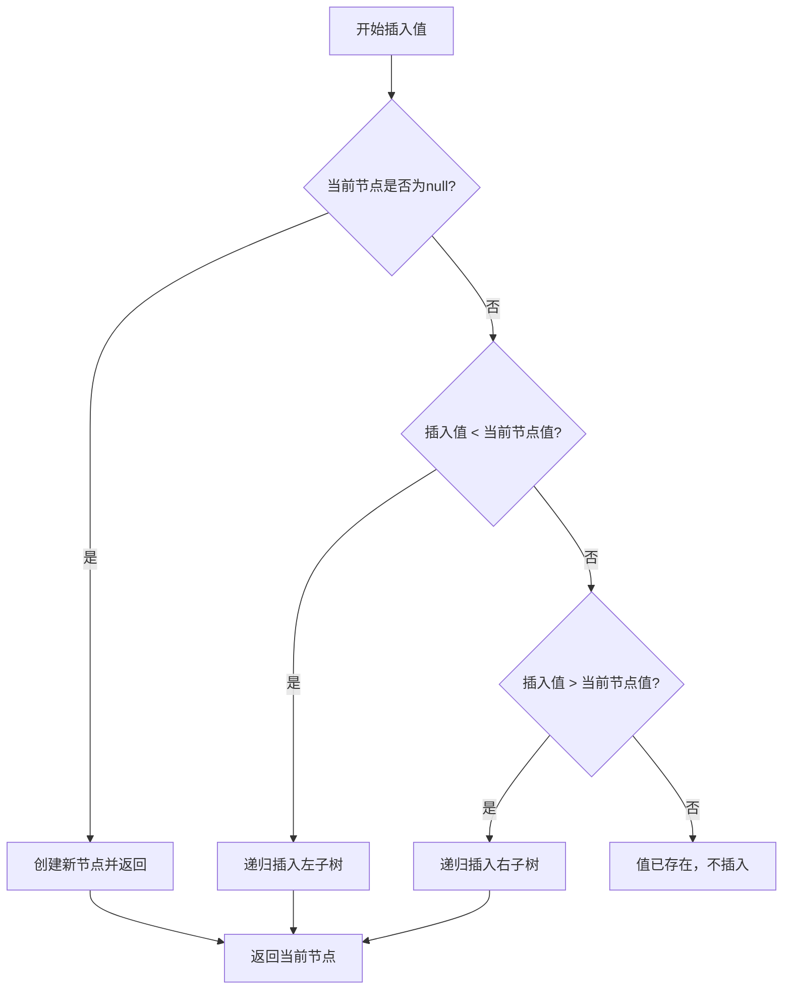
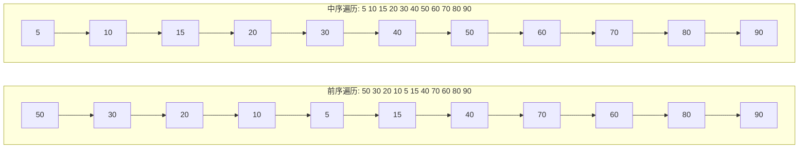
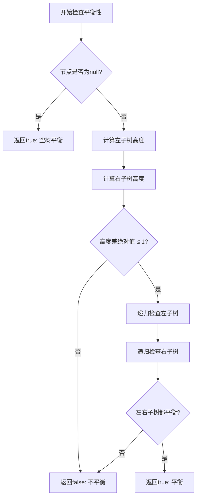

二叉树作为计算机科学中最基础且重要的数据结构之一，在算法设计、高效查找和性能优化中扮演着核心角色。本页将系统性地介绍二叉树的核心操作——遍历、插入与平衡性判断，通过实际的代码实现帮助开发者深入理解这些算法的本质，掌握在不同场景下选择合适方法的能力。无论你是在准备技术面试，还是在实际项目中需要处理树形数据结构，这些知识都将为你提供坚实的基础。

## 节点结构与二叉树基础

二叉树的每个节点最多包含两个子节点，分别称为左子节点和右子节点。这种结构特性使得二叉树既能保持数据的层次关系，又能通过递归方式简洁地表达复杂逻辑。在本项目的实现中，TreeNode 类作为树的构建单元，包含了三个核心属性：存储数据的 `value` 字段、指向左子树的 `left` 指针，以及指向右子树的 `right` 指针。Java 实现采用了简洁的构造函数模式，通过传入 value 值初始化节点，并将左右子节点默认设置为 null，为后续的插入操作提供了良好的基础。TypeScript 实现则提供了更灵活的参数配置，支持可选参数并包含默认值处理，体现了不同语言在 API 设计上的差异。

**节点类结构对比**

| 特性 | Java 实现 | TypeScript 实现 |
|------|-----------|-----------------|
| 包可见性 | `class TreeNode`（包级私有） | `class TreeNode`（公开） |
| 类型声明 | `int value` 基本类型 | `val: number` 可选类型 |
| 构造参数 | 单个 `int value` | 可选参数 `val?` `left?` `right?` |
| 初始化策略 | 显式 null 赋值 | 可选链与默认值处理 |

Sources: [BinaryTree.java](Java/二叉树/BinaryTree.java#L1-L80) [bts_check.ts](基本算法/平衡二叉树判断/bts_check.ts#L1-L22)

## 二叉搜索树的插入操作

二叉搜索树（Binary Search Tree）的插入操作基于一个简单而强大的规则：对于任意节点，左子树的所有值均小于该节点的值，右子树的所有值均大于该节点的值。这种性质使得插入操作可以在 O(log n) 的时间复杂度内完成（在平衡的情况下），而不需要遍历整个树结构。插入算法采用递归实现：从根节点开始，如果当前节点为 null，则在此位置创建新节点；如果插入值小于当前节点值，则递归进入左子树；如果插入值大于当前节点值，则递归进入右子树；如果值相等则不进行插入，避免重复值。

Java 实现中的 `insertRec` 方法完美体现了这一逻辑，通过递归调用自身逐步缩小搜索范围，最终在合适的位置插入新节点。需要注意的是，递归方法返回的是更新后的子树根节点，这是因为在递归过程中，原本为 null 的子树位置会被新节点替换，必须通过返回值将这一变化传递给父节点。这种方法避免了显式的指针操作，使得代码更加清晰且易于理解。

Sources: [BinaryTree.java](Java/二叉树/BinaryTree.java#L10-L28)

## 二叉树的遍历算法

遍历是二叉树最核心的操作之一，它定义了访问树中所有节点的顺序。三种深度优先遍历方式——前序遍历、中序遍历和后序遍历，虽然访问顺序不同，但都基于递归思想，且每个节点恰好被访问一次。中序遍历对于二叉搜索树具有特殊意义，它能按照从小到大的顺序输出所有节点值，这一性质常用于将树形结构转换为有序数组。前序遍历则适合需要先处理根节点的场景，例如树的序列化和复制操作。后序遍历则在需要先处理子节点再处理父节点的场景中发挥作用，比如计算树的高度或释放节点资源。

**三种遍历方式对比**

| 遍历类型 | 访问顺序 | 典型应用场景 | 时间复杂度 | 空间复杂度 |
|---------|---------|-------------|-----------|-----------|
| 前序遍历 | 根→左→右 | 树的复制、表达式前缀表示 | O(n) | O(h) |
| 中序遍历 | 左→根→右 | 有序输出、BST验证 | O(n) | O(h) |
| 后序遍历 | 左→右→根 | 计算高度、内存释放、表达式后缀 | O(n) | O(h) |

*注：n 为节点数，h 为树高，最坏情况下 h=n（链表），平衡树中 h=log₂n*

Java 实现采用了纯粹的递归方式，三个遍历方法的代码结构几乎相同，唯一的区别在于访问当前节点的时机。前序遍历在进入递归前访问节点，中序遍历在处理完左子树后访问节点，后序遍历在处理完左右子树后才访问节点。这种对称性使得记忆和理解变得容易，也体现了递归思想的优雅之处。需要注意的是，递归实现虽然代码简洁，但对于深度很大的树可能会遇到栈溢出的问题，在实际生产环境中可能需要考虑使用迭代或 Morris 遍历等非递归方法。

Sources: [BinaryTree.java](Java/二叉树/BinaryTree.java#L30-L61)

## 平衡性判断算法

平衡二叉树是指任意节点的左右子树高度差不超过 1 的二叉树。平衡性对于保证二叉搜索树的性能至关重要，因为不平衡的树可能会退化成链表，导致查找、插入和删除操作的时间复杂度从 O(log n) 降级到 O(n)。判断一棵树是否平衡需要递归检查每个节点：首先计算左右子树的高度差，如果差值超过 1 则不平衡；同时，还需要递归检查左右子树是否都平衡。只有当当前节点的左右子树高度差不超过 1，且左右子树各自都平衡时，整棵树才是平衡的。

TypeScript 实现提供了两个核心函数：`depth` 函数用于计算以给定节点为根的子树高度，`isBalanced` 函数用于判断整棵树的平衡性。`depth` 函数采用递归定义：空节点的高度为 -1（这样叶子节点的高度为 0），非空节点的高度为 1 加上左右子树的最大高度。`isBalanced` 函数则采用自顶向下的检查策略，先检查当前节点的左右子树高度差，再递归检查左右子树的平衡性。这种实现直观易懂，但存在重复计算的问题——在检查每个节点的平衡性时，其子树的高度会被重复计算多次，导致最坏情况下的时间复杂度为 O(n²)。

Sources: [bts_check.ts](基本算法/平衡二叉树判断/bts_check.ts#L9-L22)

## 实际应用与性能优化

在实际开发中，二叉树的操作通常需要在时间和空间效率之间做出权衡。对于遍历操作，递归实现虽然代码简洁，但可能面临栈溢出风险，可以考虑使用栈实现的迭代版本。对于平衡性判断，可以采用自底向上的优化策略，在计算高度的同时判断平衡性，将时间复杂度优化到 O(n)。插入操作在保证平衡性时需要使用更复杂的结构，如 AVL 树或红黑树，这些结构在插入后会进行旋转操作来重新平衡树。

项目中的 Java 实现提供了一个完整的二叉搜索树示例，通过 main 方法演示了如何构建一棵包含 11 个节点的树，并输出三种遍历的结果。这个示例帮助开发者直观地理解不同遍历方式的输出顺序，验证算法的正确性。而 TypeScript 的平衡性判断实现则展示了如何用简洁的函数式编程风格表达递归算法，适合在 LeetCode 等算法练习场景中使用。

**推荐的阅读路径**

1. 如果你刚开始学习数据结构，建议先理解二叉树的基本概念和节点结构，然后练习插入操作
2. 掌握遍历算法后，可以尝试实现非递归版本的遍历，加深对递归本质的理解
3. 平衡性判断是理解树的高度概念的好例子，也是后续学习 AVL 树和红黑树的基础
4. 有一定基础后，可以继续学习[堆：最小堆与最大堆的完整实现](14-dui-zui-xiao-dui-yu-zui-da-dui-de-wan-zheng-shi-xian)，了解二叉树的另一种重要应用
5. 如果对排序感兴趣，可以学习[归并排序：分治思想的经典体现](16-gui-bing-pai-xu-fen-zhi-si-xiang-de-jing-dian-ti-xian)，其中也大量应用了递归和分治思想