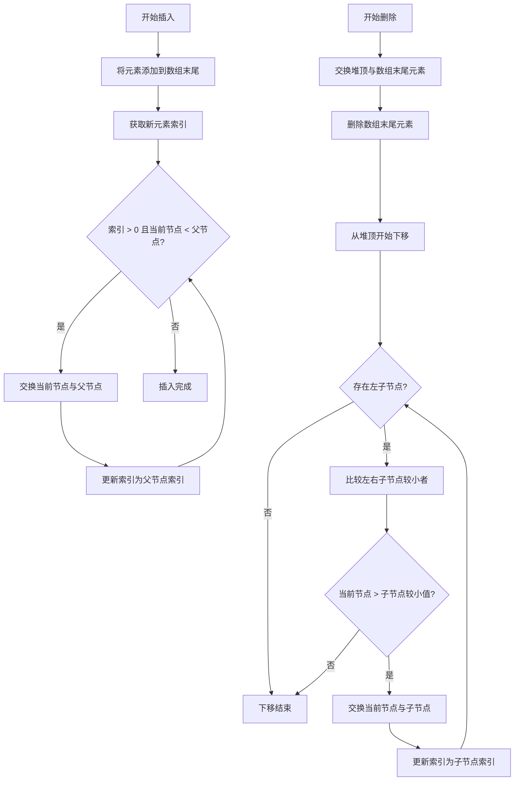

本页全面介绍堆的核心概念、最小堆与最大堆的完整实现及其应用场景。堆是一种特殊的二叉树结构，广泛应用于优先队列、堆排序、Top K 问题等场景。通过对本项目的堆实现代码进行剖析，你将掌握堆的插入、删除、获取堆顶元素等操作，并理解其在算法设计中的关键作用。

Sources: [JS/堆.js](JS/堆.js#L1-L153)

## 堆的基本原理与结构

堆是一种完全二叉树，其节点满足特定的顺序关系：最小堆中任意节点的值都小于或等于其子节点的值，因此堆顶元素为最小值；最大堆则相反，任意节点的值都大于或等于其子节点，堆顶为最大值。这种特性使得堆能够高效地获取极值元素。

堆通常使用数组实现，因为完全二叉树的结构使得数组索引与树的节点位置存在明确的对应关系。对于索引为 `i` 的节点，其左子节点索引为 `2*i+1`，右子节点索引为 `2*i+2`，父节点索引为 `(i-1) >> 1`（即 `Math.floor((i-1)/2)`）。这种索引关系简化了父子节点的查找与交换操作。

使用数组实现堆的优点包括内存紧凑、缓存友好，以及无需显式的指针操作。在算法竞赛和工程应用中，堆常作为优先队列的底层结构，用于调度任务、图的最短路径算法（如 Dijkstra）等。掌握堆的实现有助于理解更复杂的数据结构与算法，并提升解决实际问题的能力。

Sources: [JS/堆.js](JS/堆.js#L1-L12)

## 最小堆的完整实现

最小堆保证堆顶元素为整个堆中的最小值，插入和删除操作均通过“上移”和“下移”来维护堆的性质。本节以 `minHeap` 类为例，详细解析其核心方法。

### 插入操作（`insert`）

插入新元素时，先将元素添加到数组末尾，然后通过 `up` 方法将新元素与其父节点比较并交换，直到满足最小堆性质或到达根节点。插入的平均时间复杂度为 O(log n)，最坏情况下需要从叶子节点向上移动到根节点。

Sources: [JS/堆.js](JS/堆.js#L12-L18)

### 上移操作（`up`）

`up` 方法通过循环比较当前节点与父节点的值，若当前节点小于父节点，则交换二者位置，并将当前索引更新为父节点索引。该操作确保新插入的元素能够“上浮”到合适的位置，恢复堆序。

Sources: [JS/堆.js](JS/堆.js#L20-L25)

### 下移操作（`down`）

当堆顶元素被移除时，将数组末尾元素交换到堆顶，然后通过 `down` 方法将其与子节点比较并交换，直到满足堆序。`down` 方法会先选择左右子节点中较小的一个，然后比较并交换，直到节点不大于子节点或到达叶子节点。删除堆顶元素的时间复杂度也为 O(log n)。

Sources: [JS/堆.js](JS/堆.js#L27-L41)

### 交换与获取堆顶（`swap`、`peek`、`pop`）

`swap` 方法用于交换数组中两个位置的元素，是维护堆序的基础工具。`peek` 方法直接返回堆顶元素（索引 0），不修改堆结构。`pop` 方法先交换堆顶与末尾元素，删除末尾元素，再对新的堆顶执行 `down` 操作。

Sources: [JS/堆.js](JS/堆.js#L43-L60)

## 最大堆的完整实现

最大堆的逻辑与最小堆类似，唯一区别在于比较条件的反转。`maxHeap` 类的实现中，`up` 方法在当前节点大于父节点时交换，`down` 方法在当前节点小于子节点时交换。这使得堆顶始终为最大值，适用于需要快速获取最大值的场景，如维护动态数据集的最大值。

Sources: [JS/堆.js](JS/堆.js#L78-L117)

## 核心方法对比与示例

下表总结了最小堆和最大堆的核心方法及作用：

| 方法名 | 最小堆行为 | 最大堆行为 | 时间复杂度 |
|--------|------------|------------|------------|
| insert | 插入元素并上移维护最小堆序 | 插入元素并上移维护最大堆序 | O(log n) |
| up | 当前节点小于父节点时交换 | 当前节点大于父节点时交换 | O(log n) |
| down | 当前节点大于子节点时交换 | 当前节点小于子节点时交换 | O(log n) |
| pop | 交换堆顶与末尾，删除末尾，下移恢复 | 交换堆顶与末尾，删除末尾，下移恢复 | O(log n) |
| peek | 返回最小堆顶 | 返回最大堆顶 | O(1) |

示例演示了最小堆的插入和删除过程：插入 1, 5, 3, 4, 4, 5, 3, 5, 3 后，堆顶为 1；删除堆顶后，新的堆顶更新为 3。同样地，最大堆插入相同序列后堆顶为 5，删除后新堆顶为 5。这些操作均符合堆的性质验证。

Sources: [JS/堆.js](JS/堆.js#L62-L77)

## 堆操作流程

以下流程图展示了最小堆插入和删除操作的步骤，帮助你直观理解堆的维护过程：

Sources: [JS/堆.js](JS/堆.js#L12-L60)

## 堆的应用场景与进阶学习

堆在算法中有广泛应用，包括优先队列、堆排序、Top K 问题、哈夫曼编码、图的最短路径等。例如，在 Dijkstra 算法中，使用最小堆可以高效地获取当前距离最小的节点。本项目中的堆实现代码为这些算法提供了基础，你可以结合其他章节深入理解堆的用法。

为系统地学习堆及相关数据结构，建议按照以下顺序阅读项目文档：

1. [二叉树：遍历、插入与平衡性判断](13-er-cha-shu-bian-li-cha-ru-yu-ping-heng-xing-pan-duan) —— 了解树形结构的基本操作
2. [归并排序：分治思想的经典体现](16-gui-bing-pai-xu-fen-zhi-si-xiang-de-jing-dian-ti-xian) —— 学习排序算法的分治策略
3. [链表操作：合并、反转与环检测](15-lian-biao-cao-zuo-he-bing-fan-zhuan-yu-huan-jian-ce) —— 掌握链式结构的操作技巧