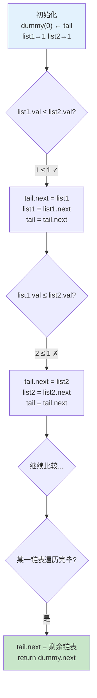
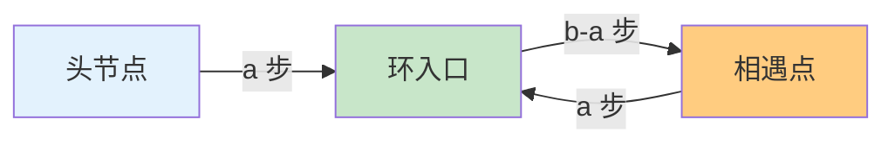

链表是算法学习中最重要的线性数据结构之一。与数组相比，链表在插入、删除操作上具有 O(1) 的时间复杂度，但随机访问则需要 O(n) 的时间。本文将深入剖析链表的三大核心操作：合并、反转与环检测，通过仓库中的实际代码实现，揭示链表操作的底层原理和编程技巧。

## 链表基础：节点结构与内存模型

链表由一系列节点组成，每个节点包含数据域和指向下一节点的指针域。仓库中提供了三种语言的节点定义，展示了不同语言对链表节点的实现方式：

```cpp
// C++ 定义（cpp/test.cpp#L4-L10）
struct ListNode {
    int val;
    ListNode* next;
    ListNode() : val(0), next(nullptr) {}
    ListNode(int x) : val(x), next(nullptr) {}
    ListNode(int x, ListNode* next) : val(x), next(next) {}
};
```

```javascript
// JavaScript 定义（JS/19.js#L6-L13）
class ListNode {
    constructor(val, next) {
        this.val = (val === undefined ? 0 : val);
        this.next = (next === undefined ? null : next);
    }
}
```

**内存模型差异**：C++ 使用原始指针 `ListNode*`，需要手动管理内存（`new` 分配，`delete` 释放）；JavaScript 和 Java 使用引用，由垃圾回收器自动管理。这种差异决定了不同语言中链表操作的注意事项——C++ 需要关注内存泄漏和悬空指针问题，而 JavaScript/Java 需要理解引用语义。

**节点的三种构造函数**：仓库中的 C++ 实现提供了三个重载构造函数，分别对应三种使用场景：`ListNode()` 创建哨兵节点，`ListNode(x)` 创建普通节点，`ListNode(x, next)` 插入已知后继节点。

Sources: [cpp/test.cpp](cpp/test.cpp#L4-L10), [JS/19.js](JS/19.js#L6-L13)

## 合并有序链表：哨兵节点的威力

### 算法核心思想

合并两个有序链表是 LeetCode 21 的经典题目，其核心思想是**双指针并行推进**：同时遍历两个链表，每次选择当前节点值较小的节点接入结果链表，然后推进该链表的指针，直到其中一个链表遍历完毕，最后将剩余链表直接挂接到结果链表尾部。

### C++ 迭代实现

仓库中的 C++ 实现采用**迭代 + 哨兵节点**策略，这是链表合并问题的标准范式：

```cpp
ListNode* mergeTwoLists(ListNode* list1, ListNode* list2) {
    ListNode dummy(0);                    // 哨兵节点：消除头节点特判
    ListNode* tail = &dummy;              // tail 指向当前结果链表尾部

    while (list1 != nullptr && list2 != nullptr) {
        if (list1->val <= list2->val) {
            tail->next = list1;           // 挂接 list1 当前节点
            list1 = list1->next;          // 推进 list1 指针
        } else {
            tail->next = list2;
            list2 = list2->next;
        }
        tail = tail->next;                // tail 前移
    }

    tail->next = (list1 != nullptr) ? list1 : list2;  // 拼接剩余链表
    return dummy.next;                    // 跳过哨兵节点
}
```

**哨兵节点的关键作用**：如果没有哨兵节点，每次挂接新节点时都需要特判"结果链表是否为空"。哨兵节点创建了一个虚拟头节点，使循环体逻辑完全统一，避免了边界条件的复杂性。

### JavaScript 递归实现

仓库中的 JavaScript 版本展示了递归风格的实现：

```javascript
var mergeTwoLists = function (l1, l2) {
    if (l1 === null) return l2;
    else if (l2 === null) return l1;
    else if (l1.val < l2.val) {
        l1.next = mergeTwoLists(l1.next, l2);  // 递归处理剩余部分
        return l1;
    } else {
        l2.next = mergeTwoLists(l1, l2.next);
        return l2;
    }
};
```

**递归思路**：每次选择头节点较小的链表，将其头节点取出，然后递归合并剩余部分。这种实现简洁优雅，但存在栈溢出风险（空间复杂度 O(n)），而迭代版的空间复杂度为 O(1)。

Sources: [cpp/test.cpp](cpp/test.cpp#L14-L31), [JS/21.js](JS/21.js#L14-L26)

### 执行流程可视化

下面的流程图展示了合并 `1→2→4` 和 `1→3→4` 的过程：



Sources: [cpp/test.cpp](cpp/test.cpp#L14-L31)

## 反转链表：三指针迭代法

### 算法原理

反转链表是链表操作中的"元技能"，其核心思想是**逐步改变指针方向**：对于每个节点，将其 `next` 指针从指向下一个节点改为指向其前一个节点。这需要三个指针协同工作：`pre`（前驱节点）、`curr`（当前节点）、`temp`（临时保存下一个节点）。

### 迭代反转实现

仓库中的 `JS/92.js` 提供了经典的反转函数 `reserveNodeList`：

```javascript
const reserveNodeList = (head) => {
    let pre = null
    let p1 = head
    
    while (p1) {
        let temp = p1.next      // 保存下一个节点
        p1.next = pre           // 反转指针
        pre = p1                // pre 前移
        p1 = temp               // curr 前移
    }
    return pre                  // 返回新的头节点
}
```

**指针变化示意**：假设原始链表为 `1→2→3→null`，反转过程如下：

| 步骤 | pre | curr(p1) | temp | 操作后链表 |
|------|-----|---------|------|-----------|
| 初始 | null | 1 | 2 | 1→2→3→null |
| 第1轮 | 1 | 2 | 3 | 1←2  3→null |
| 第2轮 | 2 | 3 | null | 1←2←3 |
| 第3轮 | 3 | null | - | 1←2←3 |

**关键技巧**：必须先用 `temp` 保存 `p1.next`，否则反转后无法访问原链表的后续节点。

### 递归反转实现

虽然仓库中没有提供递归反转的完整实现，但其思想是：**反转当前节点 + 递归反转剩余链表**。递归版本的代码更简洁，但需要理解递归栈的回溯过程：

```javascript
function reverseRecursive(head) {
    if (head === null || head.next === null) {
        return head;  // 基础情况：空链表或单节点
    }
    const newHead = reverseRecursive(head.next);  // 反转剩余部分
    head.next.next = head;  // 后一个节点指回当前节点
    head.next = null;       // 当前节点指向 null
    return newHead;         // 返回新的头节点
}
```

Sources: [JS/92.js](JS/92.js#L36-L47)

## 环检测：快慢指针的精妙应用

### 算法原理

链表环检测的核心思想是**快慢指针**：使用两个指针，慢指针每次移动一步，快指针每次移动两步。如果链表存在环，快指针最终会追上慢指针（就像在环形跑道上，跑得快的人会追上跑得慢的人）；如果链表无环，快指针会到达 `null`。

### C++ 实现方案

虽然仓库中没有提供环检测的代码，但基于已有的链表操作基础，可以快速实现：

```cpp
bool hasCycle(ListNode* head) {
    if (head == nullptr || head->next == nullptr) {
        return false;  // 空链表或单节点链表不可能有环
    }
    
    ListNode* slow = head;
    ListNode* fast = head->next;  // fast 从下一个节点开始
    
    while (slow != fast) {
        if (fast == nullptr || fast->next == nullptr) {
            return false;  // 快指针到达尾部，无环
        }
        slow = slow->next;         // 慢指针走一步
        fast = fast->next->next;   // 快指针走两步
    }
    
    return true;  // 快慢指针相遇，存在环
}
```

### 数学原理证明

假设环前链表长度为 `a`，环的长度为 `b`，快慢指针相遇时，慢指针走了 `f` 步，快指针走了 `2f` 步。在环中，快指针比慢指针多走了 `n` 圈（`n ≥ 1`），因此有：

```
2f - f = nb  →  f = nb
```

此时慢指针距离环入口的距离为 `f - a = nb - a = (n-1)b + (b - a)`。这意味着如果慢指针从相遇点继续走 `b - a` 步，就会到达环入口；同时，如果另一个指针从头开始走 `a` 步，也会到达环入口。这就是**寻找环入口算法**的基础。



Sources: [cpp/test.cpp](cpp/test.cpp#L4-L10)

## 综合应用：仓库中的链表题目

### 两数相加：链表的数值运算

仓库中的 `JS/2_2.js` 实现了 LeetCode 2（两数相加），这是链表操作与数学运算的典型案例：

```javascript
var addTwoNumbers = function (l1, l2) {
    let l3 = new ListNode(0, null)  // 哨兵节点
    let p1 = l1
    let p2 = l2
    let p3 = l3
    let carry = 0  // 进位
    
    while (p1 || p2) {
        let v1 = p1.val ? p1.val : 0
        let v2 = p2.val ? p2.val : 0
        let v3 = v1 + v2 + carry
        carry = Math.floor(v3 / 10)  // 计算进位
        p3.next = new ListNode(v3 % 10);  // 当前位
        if (p1) p1 = p1.next
        if (p2) p2 = p2.next
        p3 = p3.next
    }
    
    if (carry) {
        p3.next = new ListNode(carry)  // 处理最高位进位
    }
    return l3.next
};
```

**关键技巧**：使用 `carry` 变量传递进位，这是处理大数加法的标准方法。哨兵节点简化了构建结果链表的逻辑。

Sources: [JS/2_2.js](JS/2_2.js#L14-L36)

### 旋转链表：成环断链技巧

`JS/61.js` 展示了一种巧妙的链表操作：将链表尾节点连接到头节点形成环，然后在适当位置断开：

```javascript
let head = new ListNode(1, new ListNode(2, new ListNode(3, new ListNode(4, new ListNode(5)))));
let clonehead = head;
let p = head.next;

// 找到倒数第二个节点
while (head.next.next) {
    head = head.next;
    p = p.next;
}
head.next = null;  // 断开原尾节点
p.next = clonehead;  // 成环，将原倒数第二个节点连到头节点
```

**应用场景**：旋转链表问题（LeetCode 61）可以转化为：找到旋转点 → 将链表分为前后两部分 → 后半部分连到前半部分前面 → 形成新链表。成环断链技巧避免了复杂的指针操作。

Sources: [JS/61.js](JS/61.js#L6-L19)

### 删除操作：重复元素的两种处理方式

仓库中提供了两个删除重复元素的实现，分别对应 LeetCode 82 和 83：

**LeetCode 83（保留一个重复节点）**：

```javascript
var deleteDuplicates = function (head) {
    l1 = head
    while (l1 && l1.next) {
        if (l1.val == l1.next.val) {
            l1.next = l1.next.next ? l1.next.next : null
        } else {
            l1 = l1.next
        }
    }
    return head
};
```

**LeetCode 82（删除所有重复节点）**：`JS/82.js` 的实现更复杂，需要双指针跳过整个重复段：

```javascript
while (p1.next?.next) {
    if (p1.next.val === p1.next.next.val) {
        let p2 = p1.next
        while (p2.next && p2.val === p2.next.next) {
            p2 = p2.next
        }
        p1.next = p2.next  // 跳过整个重复段
    } else {
        p1 = p1.next
    }
}
```

**核心差异**：LeetCode 83 只需要删除连续重复的后继节点，而 LeetCode 82 需要找到重复段的起点和终点，整体跳过。

Sources: [JS/83.js](JS/83.js#L9-L18), [JS/82.js](JS/82.js#L20-L40)

## 跨语言实现对比

### 语法差异

| 特性 | C++ | JavaScript | Java |
|------|-----|-----------|------|
| **节点类型** | `struct ListNode` | `class ListNode` | `class ListNode` |
| **空值表示** | `nullptr` | `null` | `null` |
| **成员访问** | `ptr->val` | `ptr.val` | `ptr.val` |
| **内存管理** | 手动 `new/delete` | 自动 GC | 自动 GC |
| **哨兵节点分配** | 栈上 `ListNode dummy` | 堆上 `new ListNode()` | 堆上 `new ListNode()` |

**C++ 特有注意事项**：
1. 栈上分配的哨兵节点 `ListNode dummy(0)` 不需要 `delete`，函数返回后自动销毁
2. 使用 `->` 访问指针成员，`.` 访问对象成员
3. 必须显式判空 `if (ptr != nullptr)`，不能依赖隐式布尔转换

**JavaScript/Java 特有注意事项**：
1. 所有节点都在堆上分配，由 GC 管理
2. `null` 和 `undefined` 的区别（Java 只有 `null`）
3. `===` 严格相等 vs `==` 宽松相等

### 空间复杂度差异

| 操作 | C++ 迭代 | JavaScript 递归 | 递归风险 |
|------|---------|----------------|---------|
| 合并链表 | O(1) | O(n) | 栈溢出 |
| 反转链表 | O(1) | O(n) | 栈溢出 |
| 环检测 | O(1) | O(1) | 无 |

Sources: [cpp/test.cpp](cpp/test.cpp#L14-L31), [JS/21.js](JS/21.js#L14-L26), [JS/92.js](JS/92.js#L36-L47)

## 指针操作模式速查表

| 模式 | 指针变量 | 操作序列 | 适用场景 | 仓库实例 |
|------|---------|---------|---------|---------|
| **哨兵挂接** | `dummy`, `tail` | `tail->next = node; tail = tail->next` | 构建新链表、合并链表 | [cpp/test.cpp#L15-L30](cpp/test.cpp#L15-L30) |
| **原地删除** | `prev`, `curr` | `prev->next = curr->next; delete curr` | 删除指定节点 | [JS/83.js#L9-L18](JS/83.js#L9-L18) |
| **反转迭代** | `pre=null`, `curr`, `temp` | `temp=curr->next; curr->next=pre; pre=curr; curr=temp` | 全链表/区间反转 | [JS/92.js#L36-L47](JS/92.js#L36-L47) |
| **快慢指针** | `fast`, `slow` | `fast先走n步; 同步推进直到fast到尾` | 倒数定位、环检测 | [JS/19.js#L22-L35](JS/19.js#L22-L35) |
| **递归翻转** | `head`, `next` | `next=head->next; head->next=rec(next->next); next->next=head` | 相邻交换、全链反转 | [JS/24.js#L11-L19](JS/24.js#L11-L19) |
| **成环断链** | `tail`, `newHead` | `tail->next=head; 走k步; newHead=curr->next; curr->next=nullptr` | 旋转链表 | [JS/61.js#L6-L19](JS/61.js#L6-L19) |

Sources: [cpp/test.cpp](cpp/test.cpp#L14-L31), [JS/92.js](JS/92.js#L36-L47), [JS/24.js](JS/24.js#L11-L19), [JS/61.js](JS/61.js#L6-L19)

## 性能分析与最佳实践

### 时间复杂度

| 操作 | 时间复杂度 | 空间复杂度 | 备注 |
|------|-----------|-----------|------|
| 合并有序链表 | O(m+n) | O(1) | m,n 为两链表长度 |
| 反转链表 | O(n) | O(1) | 遍历一遍 |
| 环检测 | O(n) | O(1) | 最坏情况快指针遍历两圈 |
| 寻找环入口 | O(n) | O(1) | 需要先检测环 |

### C++ 链表编程陷阱

**陷阱 1：悬空指针**：解引用已释放的指针会导致未定义行为，可能段错误或返回错误数据。

**陷阱 2：内存泄漏**：算法练习中通常可接受不释放内存，但工程代码必须遍历链表并逐个 `delete`。

**陷阱 3：栈对象返回地址**：不能返回局部对象的地址，函数返回后栈帧被回收，指针变为悬空。

**陷阱 4：空指针解引用**：每次 `ptr->val` 前都要确认 `ptr != nullptr`。

### 推荐阅读路径

1. **基础操作**：先掌握合并链表（[cpp/test.cpp#L14-L31](cpp/test.cpp#L14-L31)）和单指针去重（[JS/83.js#L9-L18](JS/83.js#L9-L18)），练习哨兵节点和原地修改技巧。

2. **反转系列**：学习迭代反转（[JS/92.js#L36-L47](JS/92.js#L36-L47)），然后尝试两两交换（[JS/24.js#L11-L19](JS/24.js#L11-L19)），理解递归与迭代的转换。

3. **双指针应用**：从删除倒数第N个节点（[JS/19.js#L22-L35](JS/19.js#L22-L35)）开始，深入理解快慢指针，然后实现环检测。

4. **综合应用**：尝试两数相加（[JS/2_2.js#L14-L36](JS/2_2.js#L14-L36)）和旋转链表（[JS/61.js#L6-L19](JS/61.js#L6-L19)），综合运用多种技巧。

Sources: [cpp/test.cpp](cpp/test.cpp#L1-L60), [JS/2_2.js](JS/2_2.js#L1-L42), [JS/92.js](JS/92.js#L36-L47)

## 延伸学习

- **[C++ 题解：链表与指针实战](7-c-ti-jie-lian-biao-yu-zhi-zhen-shi-zhan)** — 深入 C++ 指针操作和哨兵节点技巧，包含 LeetCode 21 的详细实现分析
- **[双指针与滑动窗口：字符串与数组问题](9-shuang-zhi-zhen-yu-hua-dong-chuang-kou-zi-fu-chuan-yu-shu-zu-wen-ti)** — 双指针思想在数组和字符串场景的应用，与链表双指针形成对照
- **[JavaScript / TypeScript 题解：编号检索与多种解法对比](6-javascript-typescript-ti-jie-bian-hao-jian-suo-yu-duo-chong-jie-fa-dui-bi)** — 仓库 JS/TS 题解的完整索引，包含所有链表题目的多版本解法
- **[二叉树：遍历、插入与平衡性判断](13-er-cha-shu-bian-li-cha-ru-yu-ping-heng-xing-pan-duan)** — 从链表到树，理解指针在树形结构中的应用
- **[堆：最小堆与最大堆的完整实现](14-dui-zui-xiao-dui-yu-zui-da-dui-de-wan-zheng-shi-xian)** — 链表变形为完全二叉树的堆结构