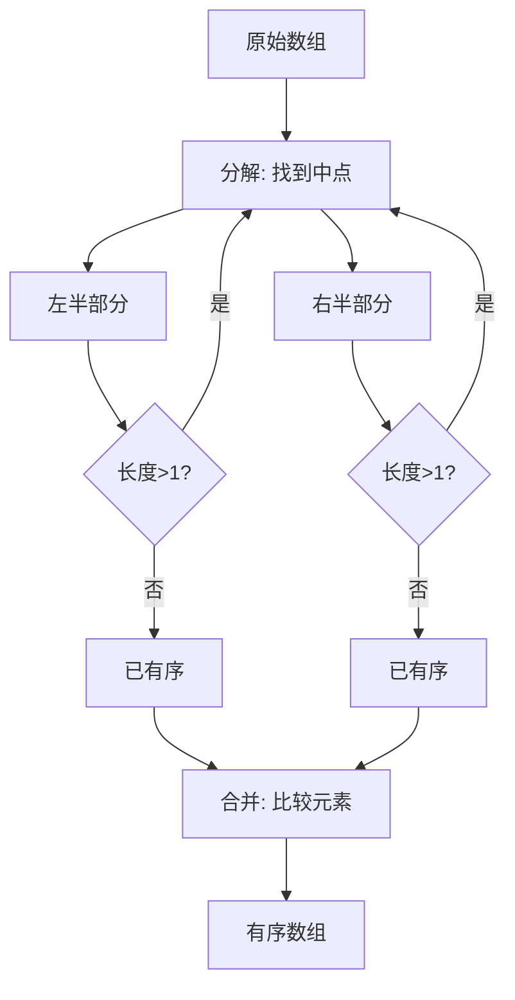

归并排序是理解分治算法最完美的入门选择。如果你正在寻找一种既优雅又高效的排序方式，归并排序不仅能带给你 O(n log n) 的时间复杂度保障，还能让你深刻领悟"分而治之"的算法设计哲学。

## 为什么选择归并排序

想象一下你需要整理一叠杂乱的扑克牌，直觉告诉你最自然的方法是：先把牌分成两堆，分别整理好，然后直接把这两堆有序的牌合并。这就是归并排序的核心思想——**分治法（Divide and Conquer）**。归并排序具有**稳定的排序特性**，这意味着相等的元素在排序后保持原有的相对顺序，这在某些实际应用场景中至关重要。

归并排序的另一个显著优势是它天生适合外部排序——当数据量太大无法全部装入内存时，可以将数据分段存储在磁盘上，分批读取、排序并合并，这是快速排序和堆排序难以做到的。

Sources: [JS/归并排序.js](JS/归并排序.js#L1-L30)

## 分治思想的核心机制

归并排序的运行过程可以清晰地划分为三个递归步骤：**分解**、**解决**和**合并**。理解这个流程图是掌握归并排序的第一步。



从图中可以看到，递归的终止条件是子数组长度为 1（单个元素天然有序），此时开始向上回溯执行合并操作。这个递归树的高度是 O(log n)，每一层都需要 O(n) 的时间来合并，因此总时间复杂度为 O(n log n)。

## 代码实现深度解析

让我们逐行拆解实际的 JavaScript 实现代码，理解每一部分的作用。

### 主函数：递归分解

```javascript
const mergeSort = (arr) => {
    // 递归终止条件：单元素数组无需排序
    if(arr.length == 1) { return arr }
    
    // 计算分割点
    let mid = Math.floor(arr.length / 2)
    
    // 分割数组为左右两部分
    let arrLeft = arr.slice(0, mid) 
    let arrRight = arr.slice(mid)
    
    // 递归排序并合并
    return merge(mergeSort(arrLeft), mergeSort(arrRight))
}
```

这段代码展现了典型的递归模式。**关键点在于 `arr.slice()` 的使用**——它在每次递归调用时创建了新数组，这意味着归并排序的空间复杂度是 O(n)，主要用于存储临时数组。如果需要原地排序的版本，需要更复杂的索引管理技巧。

Sources: [JS/归并排序.js](JS/归并排序.js#L17-L23)

### 合并函数：核心逻辑

合并操作是归并排序的灵魂，它将两个有序数组合并成一个有序数组。

```javascript
const merge = (left, right) => {
    let result = []
    let i = 0, j = 0
    
    // 双指针比较，依次选取较小元素
    while (i < left.length && j < right.length) {
        if (left[i] <= right[j]) {
            result.push(left[i])
            i++
        } else {
            result.push(right[j])
            j++
        }
    }
    
    // 处理剩余元素
    return result.concat(left.slice(i)).concat(right.slice(j))
}
```

这里使用了经典的**双指针技术**：`i` 和 `j` 分别指向左右数组的当前位置，每次比较选择较小的元素放入结果数组。当任一数组遍历完毕后，使用 `concat` 将另一数组的剩余元素直接追加，这部分剩余元素已经是有序的。

特别注意 `<=` 比较运算符的使用，这保证了排序的**稳定性**——当左元素等于右元素时优先选择左元素。

Sources: [JS/归并排序.js](JS/归并排序.js#L2-L15)

## 算法性能全面分析

理解算法的优势和局限是成为优秀程序员的关键。下表对比了归并排序与其他常见排序算法的性能特征。

| 特性 | 归并排序 | 快速排序 | 堆排序 | 冒泡排序 |
|------|----------|----------|--------|----------|
| **平均时间复杂度** | O(n log n) | O(n log n) | O(n log n) | O(n²) |
| **最坏时间复杂度** | O(n log n) | O(n²) | O(n log n) | O(n²) |
| **空间复杂度** | O(n) | O(log n) | O(1) | O(1) |
| **稳定性** | 稳定 | 不稳定 | 不稳定 | 稳定 |
| **是否原地排序** | 否 | 是 | 是 | 是 |
| **适用外部排序** | 是 | 否 | 否 | 否 |

从表格中可以看出，归并排序的优势在于**性能可预测**（最坏情况仍为 O(n log n)）和**稳定性**，代价是需要额外的 O(n) 空间。对于内存充足且需要稳定排序的场景，归并排序是理想选择。

Sources: [JS/堆.js](JS/堆.js#L1-L153)

## 实际运行示例

让我们跟踪一个具体的排序过程，理解数据如何逐步变得有序。

```javascript
console.log(mergeSort([1, 25, 1, 35, 6]))
```

假设输入数组为 `[1, 25, 1, 35, 6]`，排序过程如下：

```
[1, 25, 1, 35, 6]
      ↓ 分解
[1, 25]    [1, 35, 6]
   ↓           ↓ 分解
[1] [25]   [1] [35, 6]
               ↓ 分解
            [1] [35] [6]
               ↓ 合并
            [1] [6, 35]
               ↓ 合并
           [1, 6, 35]
      ↓ 合并
[1, 1, 6, 25, 35]
```

注意观察几个细节：
1. 每次分解都在中间位置 `mid = Math.floor(5/2) = 2` 处切割
2. `[35, 6]` 分解后合并为 `[6, 35]`（6 < 35）
3. 最终合并时，第一个 `1`（来自左数组）位于第二个 `1`（来自右数组）之前，体现了稳定性

Sources: [JS/归并排序.js](JS/归并排序.js#L29-L30)

## 常见应用场景

归并排序在以下场景中特别有价值：

**外部排序**：当处理 GB 级别的日志文件或数据库备份时，数据无法全部装入内存。归并排序可以先将数据分块排序到磁盘，然后通过多路归并的方式逐块读取、合并，最终得到完整的有序文件。

**稳定排序需求**：在电商系统中，如果先按用户等级排序，再按注册时间排序，但需要保持同级用户按注册时间的原始顺序，那么第二遍排序必须使用稳定算法。

**链表排序**：归并排序特别适合链表数据结构，因为链表的插入/删除操作是 O(1) 的，可以优化空间复杂度。虽然本实现基于数组，但核心逻辑可以轻松迁移到链表场景。

## 学习建议与扩展

掌握归并排序后，建议按以下路径继续学习，构建完整的算法知识体系：

1. **深入理解分治思想**：学习更多基于分治的算法，如快速排序、二分查找等。推荐阅读 [动态规划入门：从斐波那契到打家劫舍](8-dong-tai-gui-hua-ru-men-cong-fei-bo-na-qi-dao-da-jia-jie-she) 来对比不同的算法设计范式。

2. **掌握其他数据结构**：堆是另一种重要的排序基础，实现了堆就可以进行堆排序。查看 [堆：最小堆与最大堆的完整实现](14-dui-zui-xiao-dui-yu-zui-da-dui-de-wan-zheng-shi-xian) 了解堆的详细实现。

3. **TypeScript 类型化实践**：将本实现的 JavaScript 代码转换为 TypeScript，添加类型约束，提升代码健壮性。参考 [TypeScript 配置与类型化算法实践](19-typescript-pei-zhi-yu-lei-xing-hua-suan-fa-shi-jian) 了解类型系统在算法中的应用。

4. **解决实际问题**：尝试用归并排序解决 LeetCode 的"排序链表"、"数组中的第K个最大元素"等问题，在实战中巩固理解。

## 总结

归并排序以其优雅的递归结构和稳定高效的性能，成为了学习分治算法的经典案例。通过理解分解、递归解决、合并这三个核心步骤，你不仅掌握了一种实用的排序算法，更获得了一种解决复杂问题的思维方式——将大问题拆解为小问题，独立解决后再整合答案。这种思想在算法设计和工程实践中都有广泛应用。