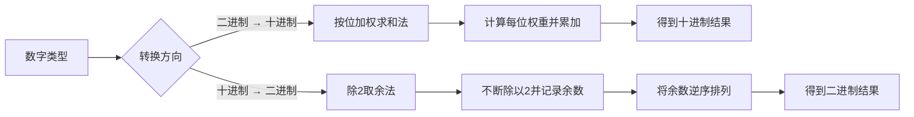
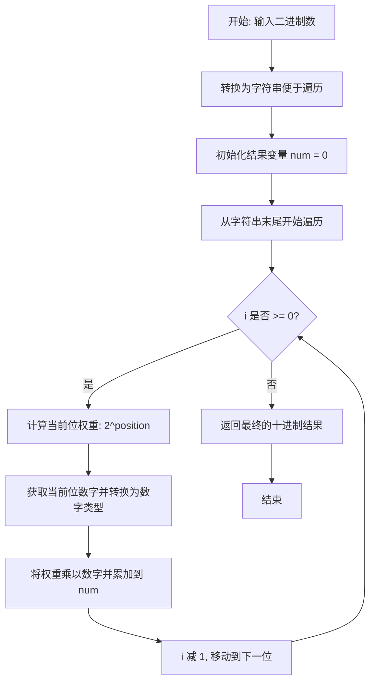
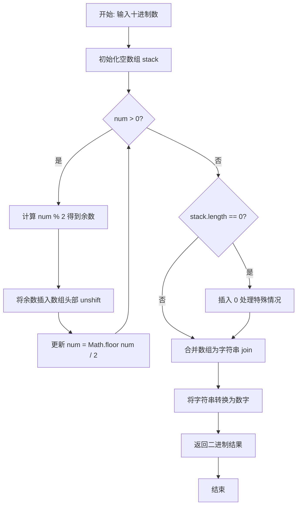

本页面详细介绍二进制与十进制之间的相互转换算法。进制转换是计算机科学的基础知识，理解其原理和实现方法对于程序员来说至关重要。我们将通过两个 TypeScript 函数来展示完整的转换逻辑：将二进制数转换为十进制数，以及将十进制数转换为二进制数。

Sources: [基本算法/二进制转十进制/TwoToTen.ts](基本算法/二进制转十进制/TwoToTen.ts#L1-L16), [基本算法/十进制转二进制/TenTotwo.ts](基本算法/十进制转二进制/TenTotwo.ts#L1-L19)

## 核心概念

### 进制转换的数学原理

**二进制**（Binary）是计算机内部使用的基础数字系统，只包含 0 和 1 两个数字。**十进制**（Decimal）是我们日常生活中使用的数字系统，包含 0 到 9 共十个数字。理解这两种进制之间的转换关系，需要掌握"位置计数法"的基本原理。

在位置计数法中，每一位数字的值取决于它在数字中的位置以及基数（进制）。对于二进制数，每一位的权重是 2 的幂次方；对于十进制数，每一位的权重是 10 的幂次方。例如，二进制数 `101` 可以表示为：`1×2² + 0×2¹ + 1×2⁰ = 4 + 0 + 1 = 5`（十进制）。

### 转换方向概述



Sources: [基本算法/二进制转十进制/TwoToTen.ts](基本算法/二进制转十进制/TwoToTen.ts#L1-L16), [基本算法/十进制转二进制/TenTotwo.ts](基本算法/十进制转二进制/TenTotwo.ts#L1-L19)

## 二进制转十进制

### 算法原理

二进制转十进制的核心思想是**按位加权求和**。从二进制数的最高位开始，每一位数字乘以 2 的对应幂次方（从右到左，幂次从 0 开始递增），然后将所有结果相加，最终得到十进制数值。

例如，将二进制数 `1101` 转换为十进制：
- 第 3 位（最右边）：1 × 2⁰ = 1
- 第 2 位：0 × 2¹ = 0
- 第 1 位：1 × 2² = 4
- 第 0 位（最左边）：1 × 2³ = 8
- 总和：1 + 0 + 4 + 8 = 13

### 代码实现

以下是基于 TypeScript 的二进制转十进制实现：

```typescript
/**
 * @param nums type number 二进制数
 * @returns type number  十进制数
 */
const twoToTen = function (nums: number) {
    let str = nums.toString()
    let num = 0
    for (let i = str.length - 1; i >= 0; i--) {
        num += Math.pow(2, +(str.length - 1 - i)) * +(str[i])
    }
    return num
}

export { twoToTen }
```

### 算法流程分析



**关键实现细节**：

1. **字符串转换**：使用 `nums.toString()` 将输入的数字转换为字符串，这样可以方便地遍历每一位数字。

2. **反向遍历**：`for (let i = str.length - 1; i >= 0; i--)` 从字符串末尾开始遍历，对应二进制数的最低位（2⁰）。

3. **权重计算**：`Math.pow(2, +(str.length - 1 - i))` 计算当前位的权重。`str.length - 1 - i` 确保了正确的幂次位置。

4. **类型转换**：`+(str[i])` 使用一元加号运算符将字符转换为数字类型。

5. **累加求和**：每次循环都将当前位的值（权重 × 数字）累加到 `num` 变量中。

### 复杂度分析

| 指标 | 复杂度 | 说明 |
|------|--------|------|
| **时间复杂度** | O(n) | n 为二进制数的位数，需要遍历每一位一次 |
| **空间复杂度** | O(n) | 主要空间用于存储字符串表示，n 为数字位数 |

Sources: [基本算法/二进制转十进制/TwoToTen.ts](基本算法/二进制转十进制/TwoToTen.ts#L1-L16)

## 十进制转二进制

### 算法原理

十进制转二进制采用**除 2 取余法**（也叫"短除法"）。核心思想是：不断将十进制数除以 2，记录每次的余数，直到商为 0。最后将所有余数**逆序排列**，就得到了对应的二进制数。

例如，将十进制数 `13` 转换为二进制：
- 13 ÷ 2 = 6 余 1（最低位）
- 6 ÷ 2 = 3 余 0
- 3 ÷ 2 = 1 余 1
- 1 ÷ 2 = 0 余 1（最高位）
- 余数逆序排列：1101（二进制）

### 代码实现

以下是基于 TypeScript 的十进制转二进制实现：

```typescript
/**
 * @param num type number  十进制数
 * @returns type number  二进制数
 */
const TenTotwo = function (num: number) {
    let stack = []
    while (num > 0) {
        stack.unshift(num % 2)
        num = Math.floor(num / 2)
    }
    if (stack.length == 0) {
        stack.unshift(0)
    }
    return +stack.join('')
}

export { TenTotwo }
```

### 算法流程分析



**关键实现细节**：

1. **栈式存储**：使用数组 `stack` 来存储每次得到的余数，利用 `unshift()` 方法将新元素插入数组头部，这样最终的数组顺序就是正确的二进制顺序。

2. **取余操作**：`num % 2` 计算当前除法的余数，余数只能是 0 或 1，正好对应二进制的两个数字。

3. **整数除法**：`Math.floor(num / 2)` 确保除法结果是整数，向下取整。

4. **边界处理**：当输入为 0 时，`stack.length == 0`，此时需要手动插入 0，因为 while 循环不会执行。

5. **类型转换**：`+stack.join('')` 先将数组合并为字符串，再用一元加号转换为数字类型。

### 复杂度分析

| 指标 | 复杂度 | 说明 |
|------|--------|------|
| **时间复杂度** | O(log n) | n 为十进制数大小，循环次数约等于 log₂(n) |
| **空间复杂度** | O(log n) | 需要存储约 log₂(n) 位的二进制结果 |

Sources: [基本算法/十进制转二进制/TenTotwo.ts](基本算法/十进制转二进制/TenTotwo.ts#L1-L19)

## 对比与总结

### 两种转换方法对比

| 转换方向 | 核心算法 | 数据结构 | 迭代方式 | 时间复杂度 |
|----------|----------|----------|----------|------------|
| **二进制 → 十进制** | 按位加权求和 | 变量累加 | 正向/反向遍历 | O(n) |
| **十进制 → 二进制** | 除 2 取余法 | 数组（栈） | 重复除法 | O(log n) |

### 实现对比表

| 特性 | twoToTen 函数 | TenTotwo 函数 |
|------|---------------|---------------|
| **输入类型** | number | number |
| **输出类型** | number | number |
| **辅助结构** | 字符串 + 循环变量 | 数组（模拟栈） |
| **循环次数** | 位数次数 | log₂(输入值) 次 |
| **特殊处理** | 无 | 输入为 0 时的边界情况 |
| **主要操作** | Math.pow 求幂 | % 取余、Math.floor 除法 |

### 使用建议

1. **二进制转十进制**：适用于处理已知位数的二进制数据，如网络协议、文件权限等场景。算法直观，易于理解和调试。

2. **十进制转二进制**：适用于需要将人类可读的数值转换为计算机存储格式的场景。使用栈式存储使得最终的输出顺序正确。

3. **边界情况处理**：
   - 二进制转十进制：输入应仅包含 0 和 1，否则会导致错误结果
   - 十进制转二进制：正确处理了输入为 0 的特殊情况，返回 0 而非空值

Sources: [基本算法/二进制转十进制/TwoToTen.ts](基本算法/二进制转十进制/TwoToTen.ts#L1-L16), [基本算法/十进制转二进制/TenTotwo.ts](基本算法/十进制转二进制/TenTotwo.ts#L1-L19)

## 扩展学习路径

掌握了二进制与十进制的基础转换后，您可以继续探索以下相关主题：

- **[归并排序：分治思想的经典体现](16-gui-bing-pai-xu-fen-zhi-si-xiang-de-jing-dian-ti-xian)** — 深入理解分治算法的递归实现，与进制转换的迭代思想形成对比

- **[JavaScript / TypeScript 题解：编号检索与多种解法对比](6-javascript-typescript-ti-jie-bian-hao-jian-suo-yu-duo-chong-jie-fa-dui-bi)** — 学习更多 TypeScript 在算法实践中的应用模式

- **[双指针与滑动窗口：字符串与数组问题](9-shuang-zhi-zhen-yu-hua-dong-chuang-kou-zi-fu-chuan-yu-shu-zu-wen-ti)** — 探索处理字符串和数组的其他经典算法技巧

进制转换是计算机科学的基础，掌握它将为学习更复杂的算法打下坚实基础。通过实践这两个函数，您可以深入理解位运算原理，这对于后续学习位图、哈希表、加密算法等高级主题都非常重要。