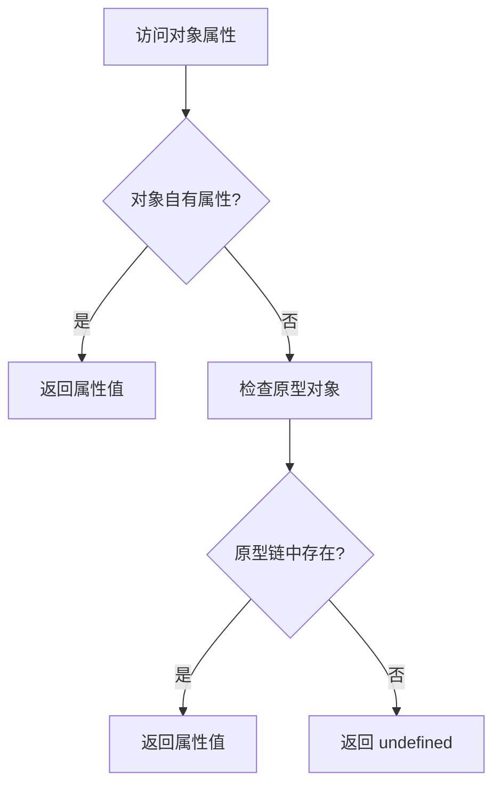
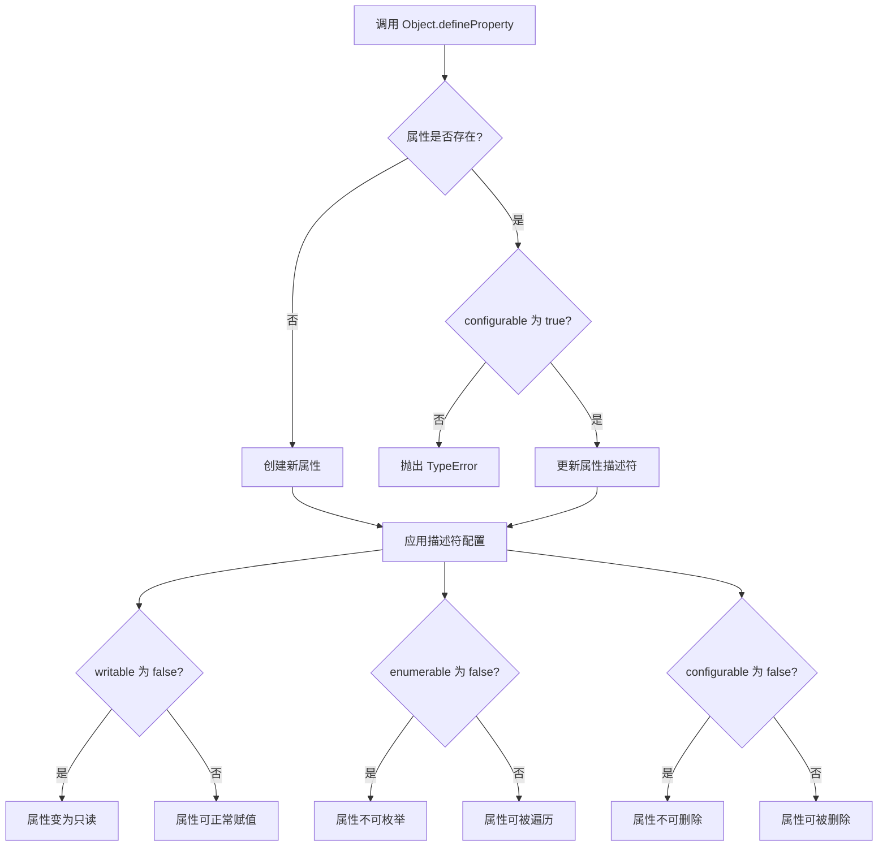

本页面深入探讨 JavaScript 对象的底层运作机制，包括属性描述符系统、原型链继承模型以及对象静态方法的工作原理。通过代码实例和底层机制解析，帮助中级开发者掌握对象属性控制与继承关系的核心概念。

## 对象属性描述符系统

JavaScript 对象的属性并非简单的键值对，每个属性都拥有对应的属性描述符（Property Descriptor），通过 Object.defineProperty 方法可以精确控制属性的行为。属性描述符包含数据描述符和存取描述符两种形式，数据描述符主要用于定义常规属性的读写特性。

在属性描述符中，writable 属性决定属性是否可以被重新赋值。当 writable 设置为 false 时，即使通过赋值操作尝试修改属性值，属性也不会发生变化。这种机制为数据提供了只读保护。例如，当对象的 name 属性设置为 writable: false 后，尝试赋值为"李四"时，属性值仍然保持为"张三"。

Sources: [defineProperty_test.js](JS/Object/defineProperty_test.js#L1-L58)

## 可枚举性与属性遍历

enumerable 属性控制属性是否能够在 for...in 循环和 Object.keys() 方法中被遍历到。默认情况下，通过 Object.defineProperty 创建的属性，其 enumerable 默认值为 false，这使得属性"不可见"但并非不存在。这意味着不可枚举的属性仍然可以通过直接访问读取，只是不会出现在常规的属性遍历操作中。

通过 Object.getOwnPropertyDescriptor 方法可以获取对象属性的完整描述符信息。返回的对象包含 value、writable、enumerable、configurable 等属性，这些属性反映了属性的当前配置状态。对于通过对象字面量直接定义的属性，其 enumerable 和 configurable 默认均为 true。

Sources: [defineProperty_test.js](JS/Object/defineProperty_test.js#L1-L58)

## 配置性与属性删除控制

configurable 属性决定属性描述符是否可以被修改以及属性是否可以被删除。当 configurable 设置为 false 时，属性描述符将变为"密封"状态，无法再通过 Object.defineProperty 重新配置。同时，configurable 为 false 的属性也不能通过 delete 操作符删除。

属性描述符的配置机制为 JavaScript 提供了精细的属性控制能力。开发者可以创建只读属性、不可枚举属性、不可配置属性，或者这三者的任意组合。这种机制在实现不可变对象、私有属性模拟等场景中具有重要应用价值。

Sources: [defineProperty_test.js](JS/Object/defineProperty_test.js#L1-L58)

## instanceof 操作符与类型检测

instanceof 操作符用于检测构造函数的 prototype 属性是否出现在对象的原型链上。需要注意的是，基本数据类型通过字面量创建时并非对象实例，因此通过 instanceof 检测基本类型会返回 false。例如，数字 5 instanceof Number 返回 false，而通过 new Number(5) 创建的对象实例 instanceof Number 则返回 true。

这种差异揭示了 JavaScript 中基本类型值和包装对象之间的本质区别。当使用 new Object(5) 创建时，实际上是创建了 Number 类型的包装对象，其内部包含原始值 5，但在原型链查找时表现为 Number 的实例。

Sources: [instanceof.js](JS/Object/instanceof.js#L1-L7)

## 原型链修改与 Object.setPrototypeOf

Object.setPrototypeOf 方法允许在对象创建后动态修改其原型对象。这种操作会影响整个原型链的查找路径。例如，将数组对象的原型修改为普通空对象后，数组将失去对 Array.prototype 中方法的访问能力，转而继承新原型对象的属性和方法。

原型链修改是强大的机制，但需要注意其对性能的影响。现代 JavaScript 引擎会对原型链进行优化，动态修改原型可能会导致优化失效。在绝大多数场景中，应该优先考虑在对象创建时通过 Object.create 或构造函数设置原型，而非后期修改。

Sources: [setPrototypeOf_test.js](JS/Object/setPrototypeOf_test.js#L1-L5)

## 对象静态方法：Object.values

Object.values 方法返回对象自身所有可枚举属性的值组成的数组。这个方法仅遍历对象自身的可枚举属性，不会沿着原型链查找，也不会包含 Symbol 类型的属性。返回的数组包含字符串值、数值、函数等任意类型的属性值。

对于包含方法作为属性的对象，Object.values 会将方法作为函数引用包含在返回的数组中。这与 Object.keys 方法形成互补，后者返回的是属性的键名数组。这两个方法在对象序列化、属性遍历等场景中提供了便捷的工具函数。

Sources: [value_test.js](JS/Object/value_test.js#L1-L10)

## 属性描述符完整配置表

Object.defineProperty 的属性描述符配置选项如下表所示，理解这些选项对于精确控制对象行为至关重要：

| 属性名 | 数据描述符 | 默认值 | 说明 |
|--------|-----------|--------|------|
| value | ✓ | undefined | 属性的值 |
| writable | ✓ | false | 属性是否可被赋值修改 |
| enumerable | ✓ | false | 属性是否可被 for...in 遍历 |
| configurable | ✓ | false | 属性描述符是否可修改、属性是否可删除 |
| get | ✗ | undefined | 属性的 getter 函数 |
| set | ✗ | undefined | 属性的 setter 函数 |

当使用 Object.defineProperty 定义属性时，如果不明确指定 writable、enumerable、configurable，它们默认都是 false。而通过对象字面量或构造函数创建的属性，这些属性默认为 true。

Sources: [defineProperty_test.js](JS/Object/defineProperty_test.js#L1-L58)

## 原型链查找机制

原型链是 JavaScript 实现继承的核心机制，其查找流程遵循特定路径：

当访问对象属性时，JavaScript 引擎首先在对象自身属性中查找，如果未找到则沿着原型链向上查找，直至到达 Object.prototype 的原型（null）。整个过程称为原型链查找，这是继承属性查找的底层机制。

Sources: [instanceof.js](JS/Object/instanceof.js#L1-L7)

## defineProperty 工作流程

Object.defineProperty 的执行过程可以分解为以下步骤：

这个过程确保了属性描述符配置的完整性和一致性，当尝试修改不可配置的属性时会抛出错误，防止意外的行为变更。

Sources: [defineProperty_test.js](JS/Object/defineProperty_test.js#L1-L58)

## 对象属性操作最佳实践

在实际开发中，应遵循对象属性操作的最佳实践原则。优先使用对象字面量或构造函数创建对象，这种方式创建的属性默认都是可配置、可枚举、可写入的，符合大多数使用场景。当需要创建只读属性或隐藏属性时，再考虑使用 Object.defineProperty。

对于原型操作，应避免在运行时动态修改对象原型，这会破坏 JavaScript 引擎的优化并可能导致代码难以维护。正确的方式是在对象创建时通过 Object.create 或类继承设置原型链。对于属性遍历，明确区分 Object.keys（仅可枚举自有属性）、Object.getOwnPropertyNames（所有自有属性）、for...in（包含原型链的可枚举属性）的使用场景。

Sources: [defineProperty_test.js](JS/Object/defineProperty_test.js#L1-L58)

## 进阶学习路径

掌握对象底层机制后，可以进一步学习 TypeScript 的类型化对象实践，了解如何在保持 JavaScript 动态特性的同时引入静态类型检查。推荐阅读 [TypeScript 配置与类型化算法实践](19-typescript-pei-zhi-yu-lei-xing-hua-suan-fa-shi-jian)。

对于工程化项目中的模块化开发，对象机制与模块导出紧密结合，可以学习 [Express 框架与模块化开发](20-express-kuang-jia-yu-mo-kuai-hua-kai-fa) 了解框架如何利用对象原型系统实现中间件机制。