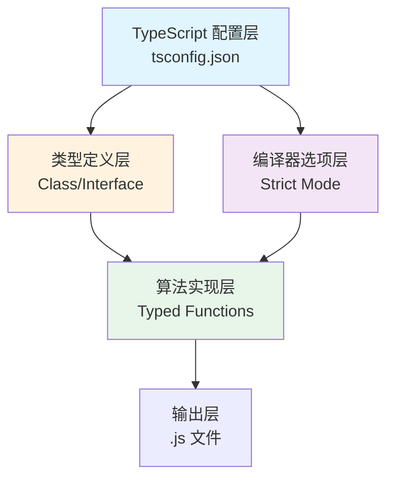
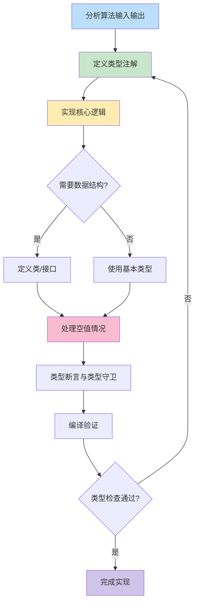
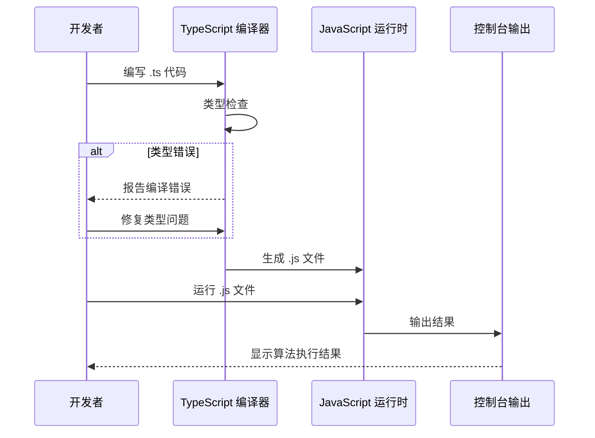

本页深入探讨项目中的 TypeScript 配置策略与类型化算法实现模式，展示如何通过类型系统提升算法代码的健壮性与可维护性。通过分析项目中的实际案例，你将掌握在算法实践中应用 TypeScript 的核心方法，为后续学习 [JavaScript / TypeScript 题解：编号检索与多种解法对比](6-javascript-typescript-ti-jie-bian-hao-jian-suo-yu-duo-chong-jie-fa-dui-bi) 和其他算法主题奠定坚实基础。

Sources: [JS/tsconfig.json](JS/tsconfig.json#L1-L11)

## 项目 TypeScript 架构概览

项目采用渐进式 TypeScript 集成策略，在 JavaScript 算法实现基础上引入类型安全层。核心架构分为配置层、类型定义层和算法实现层，形成清晰的类型化开发流程。



项目使用 TypeScript 6.0.3 作为核心依赖，通过配置文件定义了编译器行为。所有 TypeScript 文件与对应的 JavaScript 文件并存于 JS 目录，形成类型化与非类型化实现的对比学习资源。这种双轨并行的架构设计既保留了 JavaScript 的灵活性，又引入了 TypeScript 的类型安全保障。

Sources: [JS/package.json](JS/package.json#L1-L6) | [JS/tsconfig.json](JS/tsconfig.json#L1-L11)

## TypeScript 编译器配置详解

项目的 tsconfig.json 配置体现了类型安全与开发效率的平衡策略，每个选项都针对算法实践场景进行了优化。

| 配置选项 | 值 | 作用说明 | 算法实践影响 |
|---------|---|---------|-------------|
| `target` | ES2015 | 指定编译目标为 ECMAScript 2015 | 支持箭头函数、类、let/const 等现代语法 |
| `module` | commonjs | 采用 CommonJS 模块系统 | 兼容 Node.js 运行环境，便于测试执行 |
| `strict` | true | 启用所有严格类型检查选项 | 在算法编写时捕获类型错误，减少运行时异常 |
| `esModuleInterop` | true | 允许导入 CommonJS 模块 | 增强模块系统的兼容性 |
| `skipLibCheck` | true | 跳过声明文件类型检查 | 加快编译速度，专注于业务代码类型检查 |
| `moduleDetection` | force | 强制模块检测 | 确保所有文件按模块处理，统一导入导出机制 |

**严格模式**的启用是配置中的关键决策，它自动包含 `noImplicitAny`、`strictNullChecks`、`strictFunctionTypes` 等子选项，确保代码在编译阶段就能发现潜在的类型错误。这对于算法实现尤为重要，因为算法中的边界条件和空值处理往往是 bug 的温床。

Sources: [JS/tsconfig.json](JS/tsconfig.json#L1-L11)

## 核心类型定义模式

### 数据结构类定义

项目中定义了两种核心数据结构类，用于表示链表和二叉树，这些类型定义在多个算法题解中复用。

**链表节点（ListNode）**：
```typescript
class ListNode {
    val: number
    next: ListNode | null
    constructor(val?: number, next?: ListNode | null) {
        this.val = (val === undefined ? 0 : val)
        this.next = (next === undefined ? null : next)
    }
}
```

这种定义模式采用**联合类型** `ListNode | null` 来处理链表末尾的空指针情况，确保类型系统对 `null` 的严格检查。构造函数使用可选参数并提供默认值，简化了节点创建过程。

**树节点（TreeNode）**：
```typescript
class TreeNode {
    val: number
    left: TreeNode | null
    right: TreeNode | null
    constructor(val?: number, left?: TreeNode | null, right?: TreeNode | null) {
        this.val = (val === undefined ? 0 : val)
        this.left = (left === undefined ? null : left)
        this.right = (right === undefined ? null : right)
    }
}
```

树节点定义扩展了链表的概念，增加了左右子树的联合类型，为树形算法（如 DFS、BFS）提供类型基础。

Sources: [JS/19.ts](JS/19.ts#L1-L16) | [JS/110.ts](JS/110.ts#L9-L21)

### 函数类型注解模式

算法函数采用明确的参数类型和返回类型注解，形成清晰的类型契约。以下是三种典型模式：

**1. 简单类型注解**：
```typescript
function removeDuplicates(nums: number[]): number {
    const map = new Map()
    nums.forEach((item, index) => {
        if (!map.has(item)) {
            map.set(item, index)
        }
    })
    nums = [...map.keys()]
    return map.size
}
```

**2. 联合类型处理**：
```typescript
function removeNthFromEnd(head: ListNode | null, n: number): ListNode | null {
    if (!head) {
        return null
    }
    // 算法实现...
}
```

**3. 复杂数组类型**：
```typescript
function permute(arr: number[]): number[][] {
    const res: number[][] = []
    // 算法实现...
}
```

这些模式展示了如何根据算法输入输出的特点选择合适的类型注解，从基本类型到复杂的嵌套数组类型，确保类型系统的完整覆盖。

Sources: [JS/26.ts](JS/26.ts#L1-L12) | [JS/19.ts](JS/19.ts#L18-L22) | [JS/排列组合模拟.ts](JS/排列组合模拟.ts#L4-L15)

## 类型化算法实现流程

将算法从 JavaScript 转换为 TypeScript 遵循系统化的流程，确保类型安全的同时保持算法逻辑的清晰性。



### 步骤详解

1. **分析输入输出类型**：确定算法需要处理的数据类型，如数字、数组、链表等
2. **定义类型注解**：为函数参数和返回值添加类型声明
3. **实现核心逻辑**：编写算法主体，利用 TypeScript 的类型检查捕获错误
4. **处理空值情况**：使用联合类型和条件判断处理 `null` 或 `undefined`
5. **类型断言**：在必要位置使用 `as` 关键字进行类型断言
6. **编译验证**：运行 `tsc` 验证类型检查结果

Sources: [JS/19.ts](JS/19.ts#L18-L59) | [JS/110.ts](JS/110.ts#L28-L67)

## 常见算法场景的类型实践

### 动态规划类型化

动态规划算法通常使用数组存储状态，TypeScript 的类型系统可以确保数组元素类型的一致性。

```typescript
let nums = [1, 2, 3, 1]
let dp = new Array(nums.length).fill(0)

dp[0] = nums[0]
dp[1] = Math.max(nums[0], nums[1])
for (let i = 2; i < nums.length; i++) {
    dp[i] = Math.max(...dp.slice(0, i - 1)) + nums[i]
}
console.log(dp)
```

在这个打家劫舍问题的实现中，`dp` 数组自动被推断为 `number[]` 类型，确保所有状态转移操作都基于数值类型。TypeScript 的严格模式会在编译时检查 `dp[i]` 等索引访问是否越界，并提供类型安全的数组方法调用。

Sources: [JS/198.ts](JS/198.ts#L1-L12)

### 回溯算法类型化

回溯算法涉及递归和路径管理，类型注解可以帮助追踪递归参数和结果类型。

```typescript
function permute(arr: number[]): number[][] {
    const res: number[][] = [];

    function backtrack(path: number[], used: boolean[]) {
        if (path.length === arr.length) {
            res.push([...path]);
            return;
        }

        for (let i = 0; i < arr.length; i++) {
            if (used[i]) continue;
            used[i] = true;
            path.push(arr[i]);
            backtrack(path, used);
            path.pop();
            used[i] = false;
        }
    }

    backtrack([], []);    
    return res;
}
```

该实现中，`path` 参数明确为 `number[]` 类型，`used` 参数为 `boolean[]` 类型，返回结果 `res` 为 `number[][]` 类型。类型系统确保了回溯过程中路径操作的正确性，避免类型不匹配的 push/pop 操作。

Sources: [JS/排列组合模拟.ts](JS/排列组合模拟.ts#L3-L27)

### 双指针与滑动窗口类型化

双指针和滑动窗口算法通常涉及数组索引操作，类型注解可以防止索引计算中的类型错误。

```typescript
function removeDuplicates(nums: number[]): number {
    let l = 0
    let r = 1
    while (r < nums.length) {
        if (nums[l] == nums[r]) {
            nums.splice(r, 1)
            continue
        } else {
            l++
            r++
        }
    }
    console.log(nums)
    return nums.length
}
```

在这个删除有序数组重复项的实现中，指针 `l` 和 `r` 被推断为 `number` 类型，确保所有索引操作都是数值类型。TypeScript 会检查 `nums.splice()` 等数组方法的参数类型，防止传入非数值索引。

Sources: [JS/26_1.ts](JS/26_1.ts#L1-L19)

### 树算法类型化

树的递归算法对类型安全性要求较高，TypeScript 的类型系统可以有效处理树节点的空值情况。

```typescript
const isBalanced = function (root: TreeNode | null): boolean {
    if (!root) return true
    return Math.abs(depth(root.left) - depth(root.right)) <= 1
        && isBalanced(root.left)
        && isBalanced(root.right)
}

const depth = function (node: TreeNode | null): number {
    if (!node) return -1
    return 1 + Math.max(depth(node.left), depth(node.right))
}
```

平衡二叉树判断的实现展示了如何使用 `TreeNode | null` 联合类型处理树的边界情况。`!root` 的类型守卫确保了在访问 `root.left` 和 `root.right` 时，TypeScript 能够正确识别类型 narrowing，避免潜在的空值访问错误。

Sources: [基本算法/平衡二叉树判断/bts_check.ts](基本算法/平衡二叉树判断/bts_check.ts#L11-L22)

## TypeScript 与 JavaScript 实现对比

项目中许多算法题同时提供了 JavaScript 和 TypeScript 两个版本，通过对比可以直观感受类型化带来的改进。

### 基础算法对比

**JavaScript 版本（无类型）**：
```javascript
const twoToTen = function (nums) {
    let str = nums.toString()
    let num = 0
    for (let i = str.length - 1; i >= 0; i--) {
        num += Math.pow(2, +(str.length - 1 - i)) * +(str[i])
    }
    return num
}
```

**TypeScript 版本（类型化）**：
```typescript
const twoToTen = function (nums: number) {
    let str = nums.toString()
    let num = 0
    for (let i = str.length - 1; i >= 0; i--) {
        num += Math.pow(2, +(str.length - 1 - i)) * +(str[i])
    }
    return num
}
```

通过添加 `: number` 参数类型注解，TypeScript 版本明确了函数期望的输入类型，在调用时如果传入非数值参数，编译器会立即报错，而不是等到运行时才发现问题。

Sources: [基本算法/二进制转十进制/TwoToTen.ts](基本算法/二进制转十进制/TwoToTen.ts#L4-L14)

### 复杂数据结构对比

**栈算法的 TypeScript 实现**：
```typescript
const checkString = (str: string) => {
    if (str.length === 0) {
        return true
    }
    let stack = []
    for (let i = 0; i < str.length; i++) {
        if (str[i] === '(') {
            stack.push('(')
        } else {
            if (stack[stack.length - 1] === '(') {
                stack.pop()
            } else {
                return false
            }
        }
    }
    return stack.length === 0
}
```

虽然这个示例中的 `stack` 没有显式注解类型（会被推断为 `any[]`），但函数参数 `str: string` 和返回类型 `boolean` 仍然提供了基本的类型保障。在实际项目中，可以进一步将 `stack` 注解为 `string[]` 以获得更严格的类型检查。

Sources: [JS/checkString.ts](JS/checkString.ts#L2-L21)

## 类型进阶技巧

### 类型断言的正确使用

在算法实现中，有时需要使用类型断言来覆盖类型推断，但应谨慎使用以确保类型安全。

```typescript
let p1: ListNode | null = head as ListNode
let p2: ListNode | null = head as ListNode
```

在这个链表操作示例中，`as ListNode` 断言告诉编译器 `head` 不会为 `null`。这种断言应该仅在开发者能够确保运行时条件满足的情况下使用，否则可能导致运行时错误。更好的做法是先进行空值检查，再使用类型守卫进行 narrowing。

Sources: [JS/19.ts](JS/19.ts#L23-L24)

### 数组类型推断与显式注解

TypeScript 能够自动推断数组类型，但在复杂场景中显式注解可以提高代码可读性。

```typescript
let levelArr: number[]
levelArr = []
```

显式声明 `levelArr: number[]` 后，数组初始化为空数组时仍然保持 `number[]` 类型，而不是被推断为 `any[]`。这在后续填充数组元素时提供了类型安全保障，确保只有数值类型能被 push 到数组中。

Sources: [JS/110.ts](JS/110.ts#L42-L43)

### 导出类型化函数

对于需要模块化的算法实现，TypeScript 的导出机制可以保留类型信息。

```typescript
/**
 * @param nums type number 二进制数
 * @returns type number  十进制数
 */
const twoToTen = function (nums: number) {
    let str = nums.toString()
    let num = 0
    for (let i = str.length - 1; i >= 0; i--) {
        num += Math.pow(2, +(str.length - 1 - i)) * +(str[i])
    }
    return num
}

export { twoToTen }
```

通过 `export` 导出函数时，TypeScript 会生成对应的类型声明文件（.d.ts），使其他模块在导入该函数时能够获得完整的类型提示和检查。配合 JSDoc 注释，可以在 IDE 中获得更丰富的文档提示。

Sources: [基本算法/二进制转十进制/TwoToTen.ts](基本算法/二进制转十进制/TwoToTen.ts#L3-L16)

## 类型化算法的最佳实践

基于项目中的实际案例，总结出以下类型化算法开发的最佳实践：

| 实践原则 | 说明 | 示例场景 |
|---------|------|---------|
| **优先使用类型推断** | 在类型系统能够正确推断时，避免冗余的类型注解 | 简单的数值赋值、数组初始化 |
| **显式注解复杂类型** | 对于复杂的数据结构，显式注解提高可读性 | `number[][]`、`TreeNode \| null` |
| **利用类型守卫** | 使用条件判断进行类型 narrowing，减少类型断言 | `if (!head) return null` |
| **处理所有分支** | 确保 switch/if-else 的所有分支都有返回值或处理 | 递归算法的边界条件 |
| **使用可选参数** | 对于可选的构造参数使用 `?` 语法 | `constructor(val?: number)` |
| **避免 any 类型** | 尽量避免使用 `any`，使用 `unknown` 或具体类型 | 替代隐式 any 的数组声明 |

这些实践原则旨在平衡类型安全性和开发效率，在算法编写过程中提供类型系统的保护，同时避免过度复杂化代码。

Sources: [JS/110.ts](JS/110.ts#L9-L21) | [JS/19.ts](JS/19.ts#L18-L59)

## 编译与运行流程

完成类型化算法实现后，需要通过编译和运行来验证代码的正确性。



项目中的 TypeScript 文件可以通过以下方式编译和运行：

1. **手动编译**：在 JS 目录下运行 `tsc` 编译所有 .ts 文件
2. **自动编译**：使用 `tsc --watch` 监听文件变化并自动重新编译
3. **直接运行**：使用 `ts-node` 直接执行 .ts 文件（需额外安装）

编译后的 JavaScript 文件保留了所有算法逻辑，可以在 Node.js 环境中直接运行，与原始 JavaScript 实现产生相同的输出结果，但编译过程已经捕获了所有类型错误。

Sources: [JS/tsconfig.json](JS/tsconfig.json#L1-L11) | [JS/package.json](JS/package.json#L1-L6)

## 总结与进阶学习

TypeScript 配置与类型化算法实践为算法学习提供了类型安全的开发环境。通过项目中的实际案例，我们掌握了从配置编译器、定义数据结构类型到实现类型化算法的完整流程。类型系统不仅能够在编译时捕获错误，还能通过类型提示提高开发效率，是现代 JavaScript 算法开发的重要工具。

**下一步学习建议**：
- 深入探索 [JavaScript / TypeScript 题解：编号检索与多种解法对比](6-javascript-typescript-ti-jie-bian-hao-jian-suo-yu-duo-chong-jie-fa-dui-bi)，查看更多类型化算法实现
- 学习 [Express 框架与模块化开发](20-express-kuang-jia-yu-mo-kuai-hua-kai-fa)，了解 TypeScript 在后端开发中的应用
- 研究 [对象底层机制：defineProperty 与原型链](18-dui-xiang-di-ceng-ji-zhi-defineproperty-yu-yuan-xing-lian)，理解 JavaScript 类型系统与 TypeScript 类型系统的关系