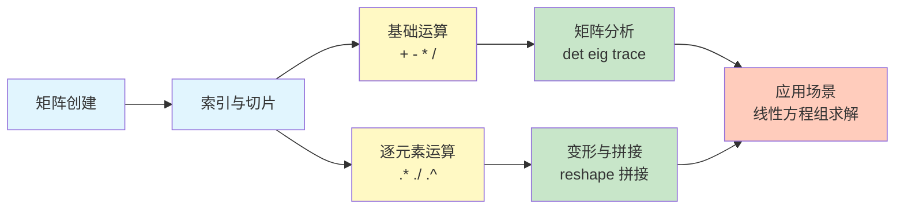
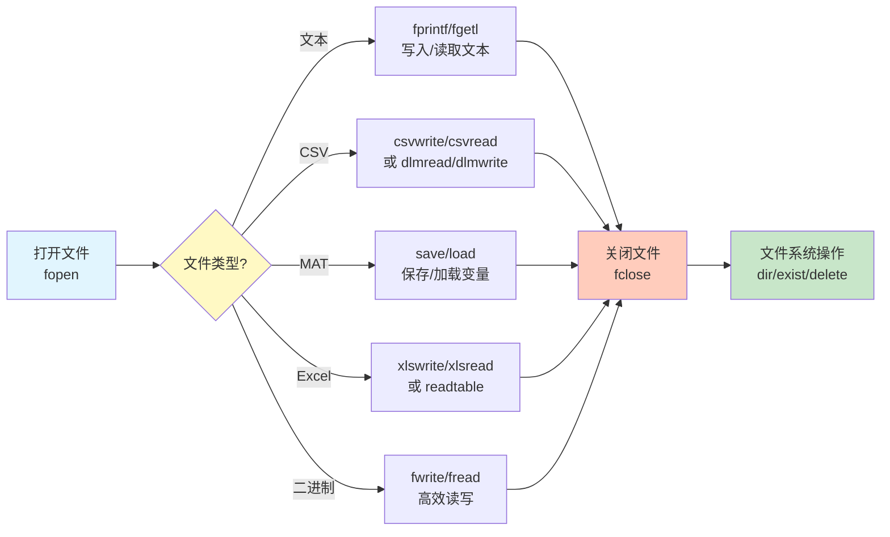

MATLAB（Matrix Laboratory）是一种专为数值计算、算法开发和数据可视化设计的高级编程语言。本页面将系统性地介绍 MATLAB 的核心语法、矩阵操作以及文件输入输出（I/O）功能，这些是数值计算和科学计算的基础技能。掌握这些基础后，你可以进一步学习线性方程组求解等高级数值分析方法，详见[线性方程组求解：高斯消元、LU 分解与雅可比迭代](22-xian-xing-fang-cheng-zu-qiu-jie-gao-si-xiao-yuan-lu-fen-jie-yu-ya-ke-bi-die-dai)。

Sources: [basic_syntax.m](matlab/matlab_learn/01_basic_syntax/basic_syntax.m#L1-L10), [learn.md](matlab/matlab_learn/learn.md#L1-L30)

## MATLAB 基础语法

MATLAB 的语法设计简洁直观，特别适合矩阵和数值运算。理解其变量定义、数据类型和基本运算规则是入门的第一步。

### 变量赋值与数据类型

MATLAB 是弱类型语言，变量无需提前声明类型，直接赋值即可使用。内置注释使用百分号 `%` 开头，单行注释简洁明了，多行注释则使用 `%{ ... %}` 包裹，便于代码调试和文档说明。变量名区分大小写，命名建议使用有意义的标识符。

Sources: [basic_syntax.m](matlab/matlab_learn/01_basic_syntax/basic_syntax.m#L7-L16)

MATLAB 支持多种基本数据类型：

| 数据类型 | 示例 | 说明 |
|---------|------|------|
| double | `[1,2,3;4,5,6]` | 双精度浮点数，MATLAB 的默认数值类型 |
| char | `'hello'` | 字符串 |
| logical | `true`/`false` | 布尔类型 |
| struct | `info.name = 'test'` | 结构体，类比对象，可包含多个字段 |
| cell | `{1, 'text', [1,2]}` | 单元数组，可存储不同类型的数据 |

变量末尾加分号 `;` 可抑制控制台输出，这是 MATLAB 代码组织和性能优化的重要习惯，尤其是在处理大型矩阵时。

Sources: [basic_syntax.m](matlab/matlab_learn/01_basic_syntax/basic_syntax.m#L7-L12), [learn.md](matlab/matlab_learn/learn.md#L4-L9)

### 基本运算符

MATLAB 提供了丰富的算术运算符，既包括标准的四则运算，也支持矩阵运算：

```matlab
a = 10;
b = 3;
% 基本运算
a + b      % 加法：13
a - b      % 减法：7
a * b      % 乘法：30
a / b      % 除法：3.3333
a \ b      % 左除（相当于 b/a）：0.3
a ^ b      % 幂运算：1000
mod(a, b)  % 取模：1
```

特别需要注意的是，MATLAB 使用 `\` 表示左除，这在解线性方程组时非常有用。此外，还有逐元素运算符（如 `.*`、`./`、`.^`），用于矩阵的元素级操作，这将在矩阵运算部分详细介绍。

Sources: [basic_syntax.m](matlab/matlab_learn/01_basic_syntax/basic_syntax.m#L18-L31)

### 常用数学函数

MATLAB 内置了大量数学函数，覆盖了从基础运算到高级数学的所有领域：

- **基础函数**：`sqrt()`（平方根）、`abs()`（绝对值）、`round()`（四舍五入）
- **对数与指数**：`log()`（自然对数）、`log10()`（常用对数）、`exp()`（指数函数）
- **三角函数**：`sin()`、`cos()`、`tan()` 及其反函数
- **常量**：`pi`（圆周率）、`Inf`（无穷大）、`NaN`（非数值）

这些函数可以直接应用于标量或数组/矩阵，体现了 MATLAB 的向量化编程优势。

Sources: [basic_syntax.m](matlab/matlab_learn/01_basic_syntax/basic_syntax.m#L41-L52)

## 数组和矩阵操作

MATLAB 的核心优势在于其矩阵运算能力，理解数组与矩阵的创建、索引和运算是掌握 MATLAB 的关键。

### 创建数组和矩阵

MATLAB 提供了多种创建数组和矩阵的方式，从手动输入到内置函数，满足不同场景需求：

```matlab
% 行向量
row1 = [1, 2, 3, 4, 5];              % 手动输入
row2 = 10:10:50;                     % 冒号操作符：起始:步长:结束
row3 = linspace(0, 1, 10);           % 线性间距：生成10个等间距点

% 列向量
col1 = [1; 2; 3; 4; 5];              % 分号分隔行
col2 = (1:5)';                       % 转置行向量得到列向量

% 特殊矩阵
zeros(3, 4);                         % 3x4 零矩阵
ones(2, 3);                          % 2x3 全1矩阵
eye(3);                              % 3x3 单位矩阵
rand(3, 3);                          % 3x3 随机矩阵（0-1之间）
magic(5);                            % 5x5 魔方矩阵
```

冒号操作符 `:` 是 MATLAB 中最强大的工具之一，它不仅用于创建序列，还在索引切片中扮演核心角色。

Sources: [arrays_matrices.m](matlab/matlab_learn/02_arrays_matrices/arrays_matrices.m#L9-L37)

### 索引和切片

MATLAB 的索引系统灵活且强大，支持从单个元素到复杂子矩阵的提取：

```matlab
A = [10, 20, 30, 40, 50;
     60, 70, 80, 90, 100;
     110, 120, 130, 140, 150];

A(2, 3)          % 第2行第3列元素：80
A(1, :)          % 第1行所有列：[10, 20, 30, 40, 50]
A(:, 2)          % 所有行的第2列：[20; 70; 120]
A(1:2, 2:4)      % 子矩阵（第1-2行，第2-4列）
A(end, :)        % 最后一行
A(:, end-1)      % 倒数第二列
```

使用 `end` 关键字可以避免硬编码维度，使代码更健壮。索引从 1 开始（而非 0），这是与 C/Java 等语言的重要区别。

Sources: [arrays_matrices.m](matlab/matlab_learn/02_arrays_matrices/arrays_matrices.m#L41-L63)

### 矩阵运算

MATLAB 的矩阵运算分为两类：**矩阵运算**（遵循线性代数规则）和**逐元素运算**（对应元素操作）：

```matlab
B = [1, 2; 3, 4];
C = [5, 6; 7, 8];

B + C            % 矩阵加法：[6, 8; 10, 12]
B * C            % 矩阵乘法：[19, 22; 43, 50]
B .* C           % 逐元素乘法：[5, 12; 21, 32]
B ^ 2            % 矩阵平方（B*B）：[7, 10; 15, 22]
B .^ 2           % 逐元素平方：[1, 4; 9, 16]
```

记住一个简单的规则：**加点 `.` 的运算符是逐元素操作**。这个区分在信号处理、图像处理等领域尤为重要。

Sources: [arrays_matrices.m](matlab/matlab_learn/02_arrays_matrices/arrays_matrices.m#L65-L86)

### 矩阵转置、逆与常用函数

矩阵转置使用单引号 `'`，逆矩阵使用 `inv()` 函数：

```matlab
D = [1, 2, 3; 4, 5, 6];
D'               % 转置：[1, 4; 2, 5; 3, 6]

E = [1, 2; 3, 4];
inv(E)           % 逆矩阵：[-2, 1; 1.5, -0.5]
E * inv(E)       % 验证：结果应接近单位矩阵
```

常用矩阵分析函数包括：

| 函数 | 功能 | 示例结果 |
|------|------|----------|
| `size(A)` | 返回矩阵维度 | `[3, 5]` |
| `length(A)` | 返回最大维度的长度 | `5` |
| `numel(A)` | 返回元素总数 | `15` |
| `sum(A)` | 每列求和 | 列向量 |
| `mean(A)` | 每列平均值 | 列向量 |
| `max(A)/min(A)` | 每列最大/最小值 | 列向量 |
| `det(A)` | 行列式 | 标量 |
| `eig(A)` | 特征值 | 列向量 |
| `trace(A)` | 矩阵的迹（对角线元素和） | 标量 |

Sources: [arrays_matrices.m](matlab/matlab_learn/02_arrays_matrices/arrays_matrices.m#L88-L132)

### 数组拼接与变形

拼接和变形是数据预处理中的常见操作：

```matlab
G = [1, 2; 3, 4];
H = [5, 6; 7, 8];

[G, H]           % 水平拼接：[1, 2, 5, 6; 3, 4, 7, 8]
[G; H]           % 垂直拼接：[1, 2; 3, 4; 5, 6; 7, 8]

I = 1:12;
reshape(I, 3, 4) % 变形成 3x4 矩阵（按列填充）
```

`reshape` 函数按列填充新矩阵，这是 MATLAB 的列优先（column-major）存储顺序决定的。

Sources: [arrays_matrices.m](matlab/matlab_learn/02_arrays_matrices/arrays_matrices.m#L134-L157)

为了更直观地理解 MATLAB 矩阵操作的工作流程，下图展示了从创建到高级运算的完整流程：



## 文件输入输出操作

文件 I/O 是数据持久化和交互的核心，MATLAB 支持多种文件格式，从简单文本到专用二进制格式。

### 文本文件读写

文本文件操作使用标准的文件流模式，类似于 C 语言：

```matlab
% 写入文本文件
fid = fopen('example.txt', 'w');      % 'w' 表示写入模式
fprintf(fid, '这是一个示例文本文件\n');
fprintf(fid, '数字: %d, %.2f, %s\n', 42, pi, 'Hello');
fclose(fid);

% 读取文本文件
fid = fopen('example.txt', 'r');      % 'r' 表示读取模式
while ~feof(fid)                        % 循环直到文件结束
    line = fgetl(fid);                  % 读取一行
    fprintf('%s\n', line);
end
fclose(fid);
```

`fopen` 返回文件标识符，使用完毕后必须调用 `fclose` 释放资源。常见的文件模式包括：`'r'`（读取）、`'w'`（写入）、`'a'`（追加）、`'rb'`/`'wb'`（二进制读写）。

Sources: [file_io.m](matlab/matlab_learn/05_file_io/file_io.m#L12-L31)

### CSV 文件读写

CSV（Comma Separated Values）是数据交换的通用格式，MATLAB 提供了专用函数：

```matlab
data = [1, 2, 3, 4, 5;
        6, 7, 8, 9, 10;
        11, 12, 13, 14, 15];

csvwrite('example.csv', data);         % 写入 CSV
data_read = csvread('example.csv');     % 读取 CSV

% 更灵活的分隔符支持
dlmwrite('example_tab.txt', data, '\t');    % 使用 Tab 分隔
data_tab = dlmread('example_tab.txt', '\t'); % 读取 Tab 分隔文件
```

`dlmread`/`dlmwrite` 支持自定义分隔符，适用于处理各种文本格式的数据表。

Sources: [file_io.m](matlab/matlab_learn/05_file_io/file_io.m#L33-L47)

### MAT 文件（MATLAB 专用格式）

MAT 文件是 MATLAB 的原生二进制格式，用于存储工作区变量，支持所有 MATLAB 数据类型：

```matlab
% 创建变量
A = magic(5);
B = rand(3, 4);
C = 'Hello World';
D = struct('name', 'Alice', 'age', 25);

% 保存为 MAT 文件
save('example.mat', 'A', 'B', 'C', 'D');   % 保存指定变量
save('example.mat', '-mat');               % 保存所有变量到 MAT 格式

% 加载 MAT 文件
loaded = load('example.mat');              % 加载到结构体
disp(loaded.A);                            % 访问变量
load('example.mat', 'A', 'C');             % 只加载指定变量
```

MAT 文件的优点是**读写速度快**、**保留数据类型**、**支持压缩**。验证 MAT 文件是否生效可以使用 `whos -file test.mat` 命令。值得注意的是，`load` 函数在文件打不开时只给出笼统的错误提示，不会显示系统层面的具体错误原因（如权限不足、路径含中文等）。

Sources: [file_io.m](matlab/matlab_learn/05_file_io/file_io.m#L49-L64), [DataCreate.m](matlab/matlab_learn/mat/DataCreate.m#L1-L6), [test.m](matlab/matlab_learn/mat/test.m#L1-L3), [learn.md](matlab/matlab_learn/learn.md#L11-L14)

### Excel 文件读写

MATLAB 可以直接读写 Excel 文件（需要安装 Excel 或 MATLAB 的 Excel 支持）：

```matlab
data_excel = [1, 2, 3; 4, 5, 6; 7, 8, 9];
xlswrite('example.xlsx', data_excel);     % 写入 Excel

[num, txt, raw] = xlsread('example.xlsx'); % 读取 Excel
% num: 数值数据
% txt: 文本数据
% raw: 原始数据（混合类型）
```

`xlsread` 已被较新的 `readtable` 和 `readmatrix` 函数逐步取代，后者提供了更强大的功能。在实际应用中，建议使用新函数以获得更好的兼容性和性能。

Sources: [file_io.m](matlab/matlab_learn/05_file_io/file_io.m#L66-L81)

### 二进制文件读写

对于高性能需求，二进制文件读写是最佳选择：

```matlab
% 写入二进制文件
fid = fopen('example.bin', 'wb');
data_binary = [1.1, 2.2, 3.3, 4.4, 5.5];
fwrite(fid, data_binary, 'double');       % 写入 double 类型数据
fclose(fid);

% 读取二进制文件
fid = fopen('example.bin', 'rb');
data_binary_read = fread(fid, inf, 'double')';  % 读取所有 double
fclose(fid);
```

`fwrite` 和 `fread` 的第三个参数指定数据类型，如 `'double'`、`'single'`、`'int32'` 等。注意 `'wb'` 和 `'rb'` 中的 `'b'` 表示二进制模式，这在 Windows 系统中尤为重要。

Sources: [file_io.m](matlab/matlab_learn/05_file_io/file_io.m#L122-L137)

### 文件系统操作

MATLAB 提供了丰富的文件系统操作函数：

```matlab
% 列出文件
files = dir('example.*');                 % 列出匹配的文件
for i = 1:length(files)
    fprintf('%s (大小: %d bytes)\n', files(i).name, files(i).bytes);
end

% 检查文件是否存在
if exist('example.mat', 'file')
    % 文件存在，执行操作
end

% 删除文件
delete('example.txt');                    % 删除单个文件
```

`dir` 返回一个结构体数组，包含文件名、大小、日期等信息。`exist` 函数可以检查文件、目录、变量等的存在性，返回值表示对象类型。

Sources: [file_io.m](matlab/matlab_learn/05_file_io/file_io.m#L105-L121)

文件 I/O 操作的完整工作流程可以总结如下：



## 变量管理与调试技巧

有效的工作区管理和调试技巧能显著提高开发效率。

### 变量查看与清除

```matlab
whos                 % 列出工作区所有变量
whos A               % 显示变量 A 的详细信息
clear                % 清除所有变量
clear A              % 清除特定变量 A
clc                  % 清除命令行窗口
```

`whos` 返回一个结构体数组，包含变量名、大小、字节数、类型和属性等详细信息，这是调试和分析代码状态的重要工具。

Sources: [basic_syntax.m](matlab/matlab_learn/01_basic_syntax/basic_syntax.m#L75-L81), [learn.md](matlab/matlab_learn/learn.md#L15-L18)

### 全局变量与持久变量

在模块化编程中，有时需要在函数间共享变量：

- **`persistent` 变量**：函数内持久变量，函数调用后保留值
- **`global` 变量**：全局变量，可在多个函数间共享

使用 `persistent` 可以实现函数的状态记忆功能，而 `global` 则用于跨函数共享数据（但应谨慎使用，因为会增加代码耦合度）。

Sources: [learn.md](matlab/matlab_learn/learn.md#L2-L3)

### 函数参数检查

在编写自定义函数时，`nargin` 和 `nargout` 是两个内置变量：

```matlab
function result = myFunction(a, b, c)
    if nargin < 2
        error('至少需要2个参数');
    end
    
    if nargin < 3
        c = 0;  % 默认值
    end
    
    result = a + b + c;
end
```

`nargin` 返回实际传入的参数个数，`nargout` 返回要求的输出参数个数。这种模式允许函数具有可选参数和默认行为，提高了函数的灵活性。

Sources: [learn.md](matlab/matlab_learn/learn.md#L19-L21)

## 实践建议与进阶路径

掌握 MATLAB 基础后，以下实践建议能帮助你快速提升：

### 代码组织规范

- 每个脚本开头使用注释说明功能、作者和日期
- 变量命名使用有意义的英文名称
- 矩阵运算优先使用向量化操作（避免循环）
- 复杂逻辑使用函数封装，提高可读性和复用性

### 性能优化技巧

- **预分配数组**：使用 `zeros(n, m)` 预分配，避免动态增长
- **向量化**：使用 `A .* B` 代替循环逐元素乘法
- **内存管理**：定期 `clear` 不再使用的大变量
- **使用稀疏矩阵**：对于大型稀疏矩阵，使用 `sparse` 函数

### 学习路径建议

完成基础学习后，建议按照以下顺序深入：

1. **数值计算进阶**：学习[数值分析进阶：范数、积分、拟合与最速下降法](23-shu-zhi-fen-xi-jin-jie-fan-shu-ji-fen-ni-he-yu-zui-su-xia-jiang-fa)，掌握更复杂的数值方法
2. **算法实现**：结合 LeetCode 题解体系，参考[动态规划入门：从斐波那契到打家劫舍](8-dong-tai-gui-hua-ru-men-cong-fei-bo-na-qi-dao-da-jia-jie-she)和[双指针与滑动窗口：字符串与数组问题](9-shuang-zhi-zhen-yu-hua-dong-chuang-kou-zi-fu-chuan-yu-shu-zu-wen-ti)
3. **工具箱开发**：探索 MATLAB 工具箱开发，包括类和函数的模块化组织

MATLAB 的强大之处在于其丰富的工具箱生态系统，掌握基础后，可以根据领域需求深入学习信号处理、图像处理、控制系统等专门工具箱。