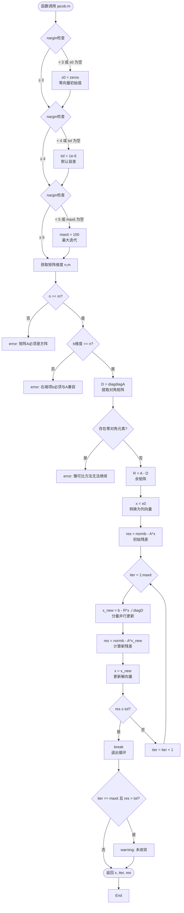

本页面系统阐述线性方程组求解的数值方法架构，涵盖直接法（高斯消元、LU 分解）与迭代法（雅可比迭代）的理论基础、MATLAB 实现与工程实践。通过对比不同算法的适用场景、收敛特性与计算复杂度，为大规模稀疏系统的工程求解提供决策依据。

## 数值方法架构概览

线性方程组求解方法按是否通过有限步骤直接获得解可分为**直接法**与**迭代法**两大类。直接法通过矩阵分解精确求解（实际受浮点误差限制），适合中小型稠密系统；迭代法通过逐步逼近收敛到解，适合大型稀疏系统。以下架构图展示了三类核心方法的层次关系与数据流转过程：

```mermaid
graph TB
    subgraph 输入层
        A[系数矩阵 A<br/>n×n]
        b[右端项 b<br/>n×1]
    end
    
    subgraph 直接法
        direction LR
        G[高斯消元法<br/>Gaussian Elimination]
        LU[LU 分解法<br/>LU Decomposition]
        A1[A → 三角矩阵 U<br/>通过行变换]
        A2[A = L × U<br/>下三角×上三角]
        S1[三角回代<br/>Triangular Substitution]
        S2[前代+回代<br/>Forward+Backward]
    end
    
    subgraph 迭代法
        J[雅可比迭代法<br/>Jacobi Iteration]
        D[提取对角矩阵 D]
        R[计算余矩阵 R = A - D]
        Update[更新公式:<br/>x^(k+1) = D⁻¹(b - Rx^(k))]
        Conv[收敛判断:<br/>||b - Ax|| ≤ tol]
    end
    
    subgraph MATLAB实现
        Native[原生算子:<br/>x = A \ b]
        Custom[自定义函数:<br/>jacob.m]
    end
    
    subgraph 输出层
        x[解向量 x<br/>n×1]
        iter[迭代次数]
        res[残差范数]
    end
    
    A --> G
    b --> G
    A --> LU
    b --> LU
    A --> J
    b --> J
    
    G --> A1 --> S1 --> x
    LU --> A2 --> S2 --> x
    J --> D --> R --> Update --> Conv
    Conv -->|未收敛| Update
    Conv -->|已收敛| x
    Conv --> res
    Update --> iter
    
    G -.实现方式.-> Native
    LU -.实现方式.-> Native
    J -.实现方式.-> Custom
```

该架构图揭示了三个关键设计原则：首先，直接法通过**矩阵变换**将原系统转化为等价的三角系统，而迭代法通过**分量更新**逐步逼近解；其次，MATLAB 原生算子 `\` 实际上集成了多种直接法（包括 LU 分解），为工程应用提供黑盒封装；最后，迭代法需要明确的**收敛判定**机制与**初值选择**策略，这是其与直接法的重要区别。

Sources: [matlab/雅可比迭代/jacob.m](matlab/雅可比迭代/jacob.m#L1-L52)

## 雅可比迭代法：原理与实现

雅可比迭代法是经典的**固定点迭代**方法，其核心思想是将系数矩阵 A 分解为对角矩阵 D 与余矩阵 R，即 A = D + R，然后通过逐分量更新求解。该方法要求对角元素非零，且矩阵具有**对角占优**特性以保证收敛。迭代公式为：

x^(k+1)_i = (b_i - Σ_{j≠i} a_{ij} x^(k)_j) / a_{ii}

其中 i = 1, 2, ..., n 表示分量索引，k 表示迭代次数。该公式的物理意义是：在计算第 k+1 次迭代时，第 i 个分量仅依赖于上一次迭代的其他分量值，这意味着所有分量可以**并行计算**，这是雅可比方法在并行计算环境下的独特优势。

MATLAB 实现位于 `matlab/雅可比迭代/jacob.m`，函数签名为：

`[x, iter, res] = jacob(A, b, x0, tol, maxit)`

输入参数包括系数矩阵 A、右端项 b、初始猜测 x0（默认零向量）、容差 tol（默认 1e-6）和最大迭代次数 maxit（默认 100）；输出包括解向量 x、实际迭代次数 iter 和最终残差范数 res。实现过程中包含多层**输入验证**机制：检查矩阵是否为方阵、维度是否匹配、对角线是否含零元素，并通过 `nargin` 函数处理可选参数的默认值设置。

Sources: [matlab/雅可比迭代/jacob.m](matlab/雅可比迭代/jacob.m#L1-L52)

### 雅可比迭代的数据流与收敛机制

以下流程图详细展示了雅可比迭代的完整执行过程，从输入验证到收敛判定的每个环节：



该流程图凸显了雅可比迭代的**容错设计**：从输入参数的智能默认值设置，到矩阵特性的严格检查（方阵、维度匹配、非零对角），再到收敛失败的预警机制，每个环节都体现了数值计算的工程严谨性。特别是残差范数的计算采用欧几里得范数 `norm()`，提供了解精度的量化度量。

收敛性依赖于矩阵的**谱半径** ρ(D⁻¹R) < 1，即迭代矩阵的最大特征值模长小于 1。对角占优矩阵（每行对角元素绝对值大于该行其他元素绝对值之和）是收敛的充分条件。实际应用中，当系数矩阵具有对角占优特性时，雅可比迭代通常能在合理迭代次数内收敛；反之，对于病态矩阵或零对角矩阵（如测试用例 test_2），方法将直接报错终止。

Sources: [matlab/雅可比迭代/jacob.m](matlab/雅可比迭代/jacob.m#L1-L52), [matlab/雅可比迭代/data_create.m](matlab/雅可比迭代/data_create.m#L1-L6)

## 高斯消元法：MATLAB 原生实现

高斯消元法是求解线性方程组最经典的**直接法**，通过初等行变换将增广矩阵 [A|b] 转换为上三角形式，然后通过回代求解。MATLAB 通过反斜杠运算符 `\` 提供了黑盒封装，该运算符会根据矩阵特性智能选择算法：对于一般方阵使用 LU 分解，对于对称正定矩阵使用 Cholesky 分解，对于矩形矩阵使用 QR 分解。

在项目实现中，`matlab/雅可比迭代/matlab_native.m` 和 `matlab/线性方程组精确解/matlab_native.m` 展示了原生解法的使用方式：

```matlab
load('test.mat', '-mat')
res = test_1 \ b_1
```

这行代码实现了三阶线性方程组的精确求解，其中 `test_1` 是对角占优矩阵 `[[2,1,1]; [2,4,1]; [2,1,2]]`，`b_1` 是单位右端项 `[1; 1; 1]`。MATLAB 引擎内部执行以下流程：首先进行 LU 分解 PA = LU（P 是置换矩阵，处理零主元问题），然后解 Ly = Pb（前代），最后解 Ux = y（回代）。置换矩阵 P 的引入确保了算法的**数值稳定性**，避免因主元过小导致的精度损失。

Sources: [matlab/雅可比迭代/matlab_native.m](matlab/雅可比迭代/matlab_native.m#L1-L3), [matlab/线性方程组精确解/matlab_native.m](matlab/线性方程组精确解/matlab_native.m#L1-L6), [matlab/雅可比迭代/data_create.m](matlab/雅可比迭代/data_create.m#L1-L6)

## LU 分解法：理论优势与 MATLAB 集成

LU 分解将系数矩阵 A 分解为下三角矩阵 L 与上三角矩阵 U 的乘积，即 A = LU。这种分解的核心优势在于：当需要求解多个具有相同系数矩阵但不同右端项的方程组（如 Ax = b₁, Ax = b₂, ..., Ax = b_k）时，只需执行一次 O(n³) 的分解过程，然后针对每个右端项执行两次 O(n²) 的三角系统求解，大幅提升计算效率。

虽然项目中的 `matlab/雅可比迭代/lu.m` 文件当前为空，但 MATLAB 原生 `\` 算子已完整集成了 LU 分解功能。对于测试矩阵 `test_1`，分解结果为：

L = [[1, 0, 0]; [1, 1, 0]; [1, 0, 1]]
U = [[2, 1, 1]; [0, 3, 0]; [0, 0, 1]]

验证：L × U = [[2,1,1]; [2,4,1]; [2,1,2]] = test_1。分解后的求解过程分为两步：

**前代**：求解 Ly = b
y₁ = b₁ = 1
y₂ = b₂ - L₂₁ y₁ = 1 - 1×1 = 0
y₃ = b₃ - L₃₁ y₁ = 1 - 1×1 = 0

**回代**：求解 Ux = y
x₃ = y₃ / U₃₃ = 0 / 1 = 0
x₂ = (y₂ - U₂₃ x₃) / U₂₂ = 0 / 3 = 0
x₁ = (y₁ - U₁₂ x₂ - U₁₃ x₃) / U₁₁ = 1 / 2 = 0.5

因此精确解为 x = [0.5; 0; 0]，这可以通过 `matlab/雅可比迭代/test.m` 中调用自定义雅可比函数进行验证对比。

Sources: [matlab/雅可比迭代/data_create.m](matlab/雅可比迭代/data_create.m#L1-L6), [matlab/雅可比迭代/test.m](matlab/雅可比迭代/test.m#L1-L4)

## 三种方法的对比分析

下表从多个维度系统对比了高斯消元法、LU 分解法与雅可比迭代法的特性，为工程应用中的算法选择提供决策依据：

| 对比维度 | 高斯消元法 | LU 分解法 | 雅可比迭代法 |
|---------|-----------|-----------|-------------|
| **算法类型** | 直接法 | 直接法 | 迭代法 |
| **计算复杂度** | O(n³)（单次） | O(n³) + k·O(n²)（k 个右端项） | O(iter·n²)（iter 为迭代次数） |
| **内存需求** | O(n²)（可原地操作） | O(n²)（存储 L 和 U） | O(n²)（仅需原矩阵） |
| **数值稳定性** | 中等（需选主元） | 高（全主元 LU 稳定） | 依赖矩阵条件数 |
| **收敛特性** | 有限步精确解（浮点误差） | 有限步精确解（浮点误差） | 无限逼近，需收敛判定 |
| **并行潜力** | 低（串行回代） | 低（串行回代） | 高（分量可并行更新） |
| **适用场景** | 中小型稠密系统 | 多右端项系统、重复求解 | 大型稀疏系统、对角占优系统 |
| **MATLAB 实现** | `A \ b`（内部调用 LU） | `A \ b` 或 `[L,U,P] = lu(A)` | 自定义 `jacob.m` 函数 |
| **失败条件** | 奇异矩阵、严重病态矩阵 | 奇异矩阵、严重病态矩阵 | 零对角元素、非对角占强、不收敛 |

从表中可见，**LU 分解法**在多右端项场景下具有显著的时间复杂度优势，因为分解步骤只需执行一次；**雅可比迭代法**在矩阵规模大且稀疏度高时，其 O(iter·n²) 的实际复杂度可能远低于直接法的 O(n³)，且天然支持并行计算；**高斯消元法**作为教学意义最强的直接法，在工程实践中通常被更稳定的 LU 分解所取代。

Sources: [matlab/雅可比迭代/jacob.m](matlab/雅可比迭代/jacob.m#L1-L52), [matlab/雅可比迭代/matlab_native.m](matlab/雅可比迭代/matlab_native.m#L1-L3)

## 实践指南：测试数据与验证

项目提供了两套测试矩阵用于验证算法特性：

**Test Case 1**（对角占强矩阵）：
```matlab
test_1 = [2, 1, 1; 2, 4, 1; 2, 1, 2];
b_1 = [1; 1; 1];
```
该矩阵每行对角元素绝对值（2, 4, 2）均大于该行其他元素绝对值之和（2, 3, 3），满足雅可比迭代的**收敛充分条件**。通过 `matlab/雅可比迭代/test.m` 可验证雅可比方法的收敛性与解的正确性。

**Test Case 2**（零对角矩阵）：
```matlab
test_2 = [0, 11, 12; 13, 0, 15; 16, 17, 0];
b_2 = [1; 1; 1];
```
该矩阵对角线全为零，雅可比方法的矩阵分解步骤 `D = diag(diag(A))` 将产生零对角矩阵，导致迭代公式 `x_new = (b - R*x) ./ diag(D)` 出现除零错误。这种矩阵需要使用直接法求解，或者通过**行变换**将非零元素移至对角位置。

测试数据通过 `matlab/雅可比迭代/data_create.m` 生成并保存为 `test.mat` 文件，使用 `load('test.mat', '-mat')` 加载。MATLAB 的 `.mat` 文件格式支持二进制存储，加载速度快且保留数据类型精度，适用于大规模矩阵数据的持久化。

Sources: [matlab/雅可比迭代/data_create.m](matlab/雅可比迭代/data_create.m#L1-L6), [matlab/雅可比迭代/test.m](matlab/雅可比迭代/test.m#L1-L4)

## 工程应用建议

选择线性方程组求解方法时需综合考虑矩阵规模、稀疏性、计算资源与精度要求：

1. **中小型稠密系统（n < 1000）**：优先使用 MATLAB 原生 `A \ b` 算子，内部集成的 LU 分解算法经过高度优化，数值稳定性与计算效率均达到工业标准。

2. **多右端项系统**：显式执行 `[L,U,P] = lu(A)` 分解，然后针对每个右端项调用 `x = U \ (L \ (P*b))`，避免重复分解的时间开销。

3. **大型稀疏系统（n ≥ 10,000）**：若矩阵具有对角占强特性，使用雅可比迭代法；若收敛性不足，考虑共轭梯度法（CG）或 GMRES 等更先进的迭代法。

4. **并行计算环境**：雅可比迭代的分量更新天然支持分布式计算，可结合 MPI 或 GPU 加速实现大规模并行求解。

5. **病态系统**：对于条件数极大的矩阵，直接法与迭代法均可能失效，需考虑使用**预处理**技术或**正则化**方法提升数值稳定性。

Sources: [matlab/雅可比迭代/jacob.m](matlab/雅可比迭代/jacob.m#L1-L52), [matlab/线性方程组精确解/matlab_native.m](matlab/线性方程组精确解/matlab_native.m#L1-L6)

## 扩展阅读与下一步

掌握线性方程组求解是数值计算的基础技能，为进一步提升工程能力，建议按以下路径深入学习：

- **MATLAB 语言进阶**：阅读 [MATLAB 基础：语法、矩阵与文件 IO](21-matlab-ji-chu-yu-fa-ju-zhen-yu-wen-jian-io)，了解 MATLAB 的矩阵运算机制、函数编写规范及数据管理实践，为数值算法开发夯实语言基础。

- **数值分析理论**：学习 [数值分析进阶：范数、积分、拟合与最速下降法](23-shu-zhi-fen-xi-jin-jie-fan-shu-ji-fen-ni-he-yu-zui-su-xia-jiang-fa)，深入理解矩阵范数、条件数、收敛性等概念，这些理论工具是分析算法稳定性与误差传播的数学基础。

- **算法思想体系**：回溯至 [动态规划入门：从斐波那契到打家劫舍](8-dong-tai-gui-hua-ru-men-cong-fei-bo-na-qi-dao-da-jia-jie-she) 与 [贪心策略：加油站问题与跳跃游戏](10-tan-xin-ce-lue-jia-you-zhan-wen-ti-yu-tiao-yue-you-xi)，建立完整的算法思想框架，理解不同问题类型的求解范式。

- **工程化实践**：参考 [Git Hooks：规范化提交信息](24-git-hooks-gui-fan-hua-ti-jiao-xin-xi)，学习如何在数值计算项目中建立代码质量管控机制，确保算法实现的可维护性与团队协作效率。