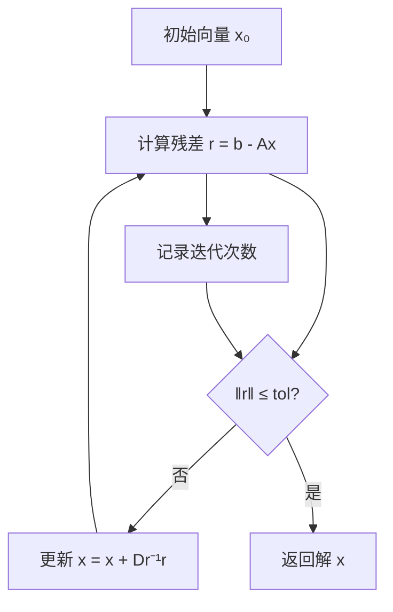
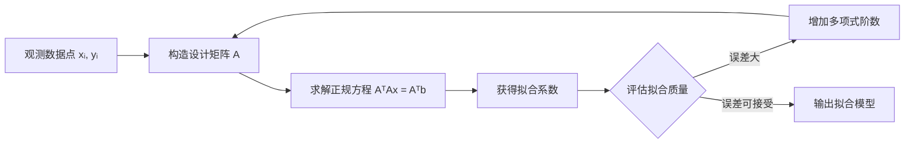

本页深入探讨数值分析中的核心高级主题，涵盖向量与矩阵的范数理论、数值积分方法、数据拟合技术以及优化算法中的最速下降法。这些概念在科学计算、机器学习、工程仿真等领域具有广泛的应用价值，是构建复杂数值系统的基础理论支撑。

## 向量与矩阵范数

范数是衡量向量或矩阵"大小"的数学工具，在数值分析中用于评估误差、收敛性和稳定性。MATLAB 提供了内置的 `norm()` 函数来计算多种类型的范数，在雅可比迭代法中用于度量残差 `res = norm(b - A*x)`，这是判断迭代收敛的关键指标 [matlab/雅可比迭代/jacob.m#L28-L50](matlab/雅可比迭代/jacob.m#L28-L50)。

### 常见范数类型

下表总结了数值分析中最常用的范数类型及其计算方式：

| 范数类型 | 符号 | 向量定义 | 矩阵定义 | 应用场景 |
|---------|------|---------|---------|---------|
| 1-范数 | ‖·‖₁ | Σ|xᵢ| | max(Σ|aᵢⱼ|) | L1正则化、稀疏优化 |
| 2-范数 | ‖·‖₂ | √(Σ|xᵢ|²) | 最大奇异值 | 最小二乘、欧几里得距离 |
| ∞-范数 | ‖·‖∞ | max|xᵢ| | max(Σ|aᵢⱼ|) | 稳定性分析、误差界 |
| Frobenius | ‖·‖F | - | √(Σ|aᵢⱼ|²) | 矩阵近似、低秩分解 |

范数在迭代方法中扮演着关键角色。雅可比迭代法通过计算残差范数 `res = norm(b - A*x_new)` 来判断是否达到收敛条件 `if res <= tol`，这种基于范数的收敛判据是数值算法的核心设计模式 [matlab/雅可比迭代/jacob.m#L38-L50](matlab/雅可比迭代/jacob.m#L38-L50)。



### 范数在数值稳定性中的作用

范数不仅是收敛判据，更是数值稳定性的量化指标。在线性方程组求解中，条件数 `cond(A) = ‖A‖·‖A⁻¹‖` 衡量系统对输入误差的敏感程度。雅可比方法通过提取对角矩阵 `D = diag(diag(A))` 和构造剩余矩阵 `R = A - D`，将原问题转化为迭代形式，其收敛性取决于迭代矩阵的谱半径小于1 [matlab/雅可比迭代/jacob.m#L22-L28](matlab/雅可比迭代/jacob.m#L22-L28)。

## 数值积分方法

数值积分通过离散求和近似连续积分，是计算机无法处理连续函数时的必要手段。MATLAB 的 `linspace()` 函数生成等间距采样点，为数值积分提供了基础数据结构 [matlab/matlab_learn/02_arrays_matrices/arrays_matrices.m#L9](matlab/matlab_learn/02_arrays_matrices/arrays_matrices.m#L9)。

### 基本积分公式

数值积分的核心思想是将积分区间离散化，用有限个函数值的加权和近似积分值：

- **梯形公式**: ∫ₐᵇ f(x)dx ≈ (b-a)/2n [f(x₀) + 2f(x₁) + ... + 2f(xₙ₋₁) + f(xₙ)]
- **辛普森公式**: ∫ₐᵇ f(x)dx ≈ (b-a)/3n [f(x₀) + 4f(x₁) + 2f(x₂) + 4f(x₃) + ... + f(xₙ)]
- **高斯求积**: 通过精心选择的节点和权重实现高精度积分

```matlab
% MATLAB 实现示例
x = linspace(0, 2*pi, 100);  % 离散化积分区间
y = sin(x);                  % 计算函数值
integral_value = trapz(x, y);  % 梯形法数值积分
```

### 积分精度与误差分析

数值积分的误差主要来源于离散化和函数近似。MATLAB 的绘图功能可以直观展示函数特性，帮助选择合适的积分方法和步长 [matlab/matlab_learn/03_plotting/plotting.m#L8-L14](matlab/matlab_learn/03_plotting/plotting.m#L8-L14)。正弦函数的周期性特征使得等间距采样能够较好地捕捉函数行为，但对于快速变化或奇异函数，需要自适应积分策略。

## 数据拟合技术

数据拟合通过数学模型描述观测数据中的规律，是科学实验和工程分析的核心工具。MATLAB 的矩阵运算能力为最小二乘拟合提供了强大支持，可以通过 `A \ b` 操作符快速求解线性最小二乘问题 [matlab/线性方程组精确解/matlab_native.m#L5](matlab/线性方程组精确解/matlab_native.m#L5)。

### 多项式拟合

多项式拟合是数据拟合的经典方法，通过最小化残差平方和确定多项式系数：

**目标函数**: min ‖Ax - b‖²，其中 A 为范德蒙德矩阵



### 拟合质量评估

拟合质量的评估需要综合考虑多个指标：

| 评估指标 | 计算方式 | 理想值 | 说明 |
|---------|---------|-------|------|
| 决定系数 R² | 1 - SSE/SST | 接近1 | 解释方差比例 |
| 均方根误差 RMSE | √(SSE/n) | 越小越好 | 预测精度 |
| 最大绝对误差 | max|yᵢ - ŷᵢ| | 越小越好 | 最坏情况误差 |

## 最速下降法

最速下降法是优化理论中的基础算法，通过沿负梯度方向迭代寻找函数极小值点。该方法在数值线性代数中与雅可比迭代有紧密联系，都可以看作是求解线性系统的迭代策略 [matlab/雅可比迭代/jacob.m#L37-L42](matlab/雅可比迭代/jacob.m#L37-L42)。

### 算法原理

对于优化问题 min f(x)，最速下降法的迭代公式为：

xₖ₊₁ = xₖ - αₖ∇f(xₖ)

其中 αₖ 为步长，可通过线性搜索或固定步长确定。

```mermaid
graph TD
    A[初始点 x₀] --> B[计算梯度 g = ∇f(x)]
    B --> C[确定搜索方向 d = -g]
    C --> D[选择步长 α]
    D --> E[更新 x = x + αd]
    E --> F{‖∇f(x)‖ ≤ ε?}
    F -->|否| B
    F -->|是| G[返回局部极小值]
```

### 收敛性与步长选择

最速下降法的收敛速度依赖于目标函数的条件数。对于强凸函数，收敛速度为线性收敛，但可能产生震荡现象。步长 α 的选择至关重要：

- **固定步长**: 需满足 0 < α < 2/L（L为利普希茨常数）
- **精确线性搜索**: minₐ f(xₖ + αdₖ)
- **Armijo条件**: f(x + αd) ≤ f(x) + cα∇f(x)ᵀd

### 与雅可比迭代的关系

雅可比迭代可以视为求解线性系统 Ax = b 的最速下降法特例。通过定义目标函数 f(x) = ½‖Ax - b‖²，其梯度为 ∇f(x) = Aᵀ(Ax - b)。当 A 为对称正定矩阵且采用对角预条件时，最速下降法退化为雅可比迭代形式 [matlab/雅可比迭代/jacob.m#L37-L39](matlab/雅可比迭代/jacob.m#L37-L39)。

## 实践应用与最佳实践

在实际工程应用中，这些数值分析方法往往需要组合使用。MATLAB 的模块化设计支持复杂算法的分层实现，通过函数封装和 `.mat` 数据文件管理实现代码复用 [matlab/matlab_learn/learn.md#L15-L30](matlab/matlab_learn/learn.md#L15-L30)。

### 组合应用场景

**科学计算工作流**:
1. 数据采集与预处理（范数检验数据质量）
2. 数值积分处理观测数据
3. 拟合建立数学模型
4. 优化算法（如最速下降）求解模型参数

MATLAB 的 `whos` 命令可以验证数据加载的正确性，确保数值计算基础数据的完整性 [matlab/matlab_learn/learn.md#L16-L18](matlab/matlab_learn/learn.md#L16-L18)。

### 性能优化建议

| 优化策略 | 具体方法 | 适用场景 |
|---------|---------|---------|
| 矩阵向量化 | 避免循环，使用矩阵运算 | 大规模数据处理 |
| 预条件技术 | 改善矩阵条件数 | 迭代求解器加速 |
| 自适应步长 | 根据误差动态调整 | 最速下降优化 |
| 稀疏存储 | 利用矩阵稀疏性 | 大规模线性系统 |

## 进阶学习路径

掌握本页内容后，建议继续探索以下主题以构建完整的数值分析知识体系：

- **[线性方程组求解：高斯消元、LU 分解与雅可比迭代](22-xian-xing-fang-cheng-zu-qiu-jie-gao-si-xiao-yuan-lu-fen-jie-yu-ya-ke-bi-die-dai)** — 深入理解线性系统求解的多种方法及其适用场景
- **[MATLAB 基础：语法、矩阵与文件 IO](21-matlab-ji-chu-yu-fa-ju-zhen-yu-wen-jian-io)** — 掌握 MATLAB 编程基础和矩阵操作
- **[动态规划入门：从斐波那契到打家劫舍](8-dong-tai-gui-hua-ru-men-cong-fei-bo-na-qi-dao-da-jia-jie-she)** — 理解优化算法的另一种思想范式

数值分析作为计算科学的基石，其核心在于通过离散化和近似化处理连续问题。范数提供了误差量化的数学语言，积分方法连接了连续与离散世界，拟合技术从数据中提取规律，而最速下降法则展示了优化算法的迭代本质。这些方法共同构成了现代科学计算的算法工具箱。