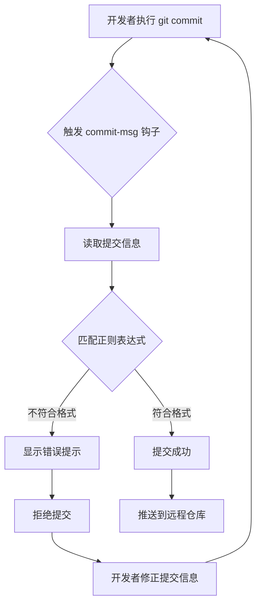
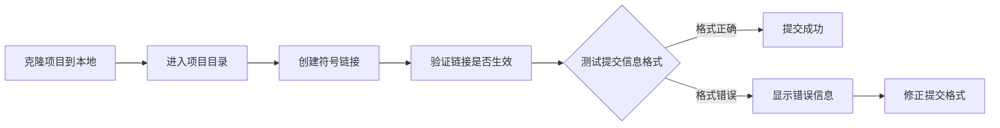
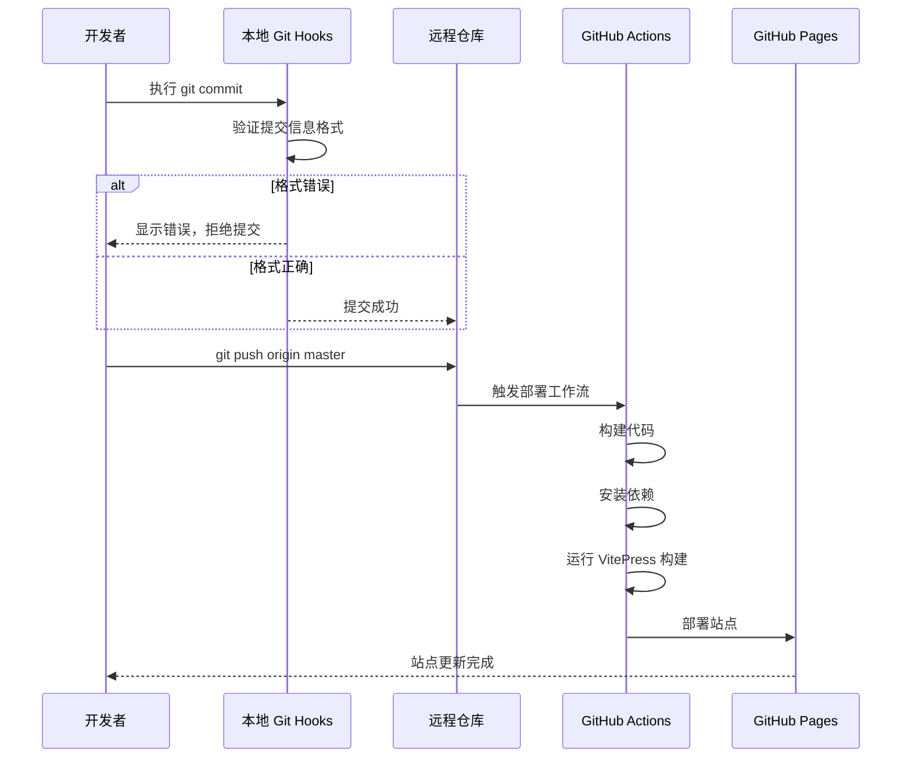

Git Hooks 是在 Git 执行特定事件（如提交、推送）前后自动触发的脚本，本项目通过配置 `commit-msg` 钩子实现了提交信息的自动化验证，确保团队协作时代码提交遵循统一的规范格式。

## 核心架构

Git Hooks 的工作原理是在 Git 操作的关键节点插入自定义脚本，当满足特定条件时自动执行预设逻辑。本项目采用客户端钩子策略，在提交信息创建后立即进行格式校验，从源头上保证提交历史的规范性和可读性。Sources: [githook/commit-msg](githook/commit-msg#L1-L13)



## 提交规范详解

项目采用 Conventional Commits 规范，通过正则表达式 `^(feat|fix|docs|style|refactor|test|chore): .+` 对提交信息进行严格校验。该格式包含类型标识和描述文本，二者之间用英文冒号和空格分隔。Sources: [githook/commit-msg](githook/commit-msg#L3-L5)

| 类型 | 说明 | 示例 |
|------|------|------|
| feat | 新功能 | feat: 添加用户登录功能 |
| fix | 修复 Bug | fix: 修复数组越界问题 |
| docs | 文档变更 | docs: 更新 README 部署说明 |
| style | 代码格式调整 | style: 统一代码缩进规范 |
| refactor | 代码重构 | refactor: 优化算法时间复杂度 |
| test | 测试相关 | test: 添加单元测试用例 |
| chore | 构建配置或工具变更 | chore: 更新依赖包版本 |

## 钩子实现解析

`commit-msg` 钩子脚本位于 `githook` 目录下，是一个 Shell 脚本，通过接收 Git 传递的提交信息文件路径作为参数实现自动验证。脚本首先读取文件内容，然后使用正则表达式进行模式匹配，当格式不符合要求时输出中文错误提示并返回非零状态码从而终止提交流程。Sources: [githook/commit-msg](githook/commit-msg#L1-L13)

## 安装配置流程

将钩子脚本安装到 Git 配置目录是启用自动验证的关键步骤，推荐使用符号链接方式确保脚本的更新能够即时生效。Sources: [README.md](README.md#L200-L271)



**安装命令示例**：

```bash
# Windows (使用 Git Bash)
cd /path/to/algorithm
ln -s $(pwd)/githook/commit-msg .git/hooks/commit-msg
chmod +x .git/hooks/commit-msg

# 或直接复制文件
cp githook/commit-msg .git/hooks/commit-msg
chmod +x .git/hooks/commit-msg
```

## 验证示例对比

通过对比正确和错误的提交信息可以直观理解规范的必要性，钩子脚本会在提交时即时反馈验证结果。

| 提交信息 | 验证结果 | 原因 |
|----------|----------|------|
| `feat: 添加用户登录功能` | ✅ 通过 | 格式正确，类型和描述清晰 |
| `fix: 修复数组越界问题` | ✅ 通过 | 符合规范要求 |
| `添加新功能` | ❌ 拒绝 | 缺少类型前缀 |
| `feat:添加新功能` | ❌ 拒绝 | 冒号后缺少空格 |
| `new feature` | ❌ 拒绝 | 未使用规范类型 |
| `FEAT: 添加功能` | ❌ 拒绝 | 类型标识必须小写 |

## 与 CI/CD 集成

Git Hooks 在本地进行预验证，配合 GitHub Actions 的远程构建流程形成完整的质量保障体系。当提交信息通过本地校验并推送到 `master` 分支后，自动化部署流程会触发 VitePress 站点的构建和部署，确保文档站点的实时更新。Sources: [.github/workflows/deploy.yml](.github/workflows/deploy.yml#L1-L66)



## 团队协作最佳实践

在团队环境中，统一的提交规范能够显著提升代码审查效率和问题追溯能力。建议通过以下方式推广使用：Sources: [README.md](README.md#L200-L271)

1. **初始化配置**：在新成员加入项目时，将钩子安装步骤纳入开发环境配置清单
2. **文档同步**：在项目的 [代码规范与贡献流程](4-dai-ma-gui-fan-yu-gong-xian-liu-cheng) 页面中明确说明提交信息要求
3. **示例参考**：通过历史提交记录展示规范的提交信息，帮助团队成员快速掌握
4. **定期检查**：结合 CI/CD 流程添加提交历史扫描，及时发现不规范提交

## 扩展与定制

当前实现的 `commit-msg` 钩子专注于格式验证，可以根据项目需求扩展其他类型的钩子功能：

- **pre-commit**：在提交前运行代码风格检查、单元测试
- **pre-push**：在推送前执行完整的测试套件
- **prepare-commit-msg**：自动生成默认的提交信息模板
- **post-commit**：提交成功后自动通知或更新文档

通过组合使用多种钩子类型，可以构建完整的代码质量自动化保障体系。

## 下一步学习

掌握 Git Hooks 基础后，建议继续学习以下相关内容：

- [代码规范与贡献流程](4-dai-ma-gui-fan-yu-gong-xian-liu-cheng) - 了解项目整体的代码规范和团队协作流程
- [SCSS 预处理器实践](25-scss-yu-chu-li-qi-shi-jian) - 学习前端代码样式的规范管理
- [Express 框架与模块化开发](20-express-kuang-jia-yu-mo-kuai-hua-kai-fa) - 探索项目中的工程化实践