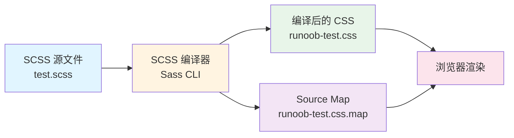
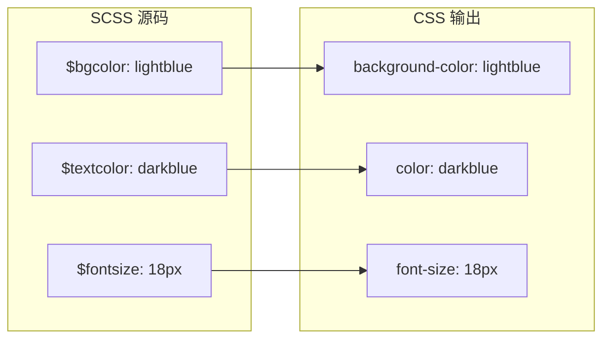

SCSS（Sassy CSS）是 CSS 的预处理器，它扩展了 CSS 的功能，允许使用变量、嵌套规则、混合、函数等编程特性，使样式表更加模块化、可维护和可扩展。本页面将基于项目中的实际 SCSS 示例，系统讲解 SCSS 的核心特性和实践方法，帮助中级开发者掌握 SCSS 在实际项目中的应用。

## SCSS 架构概述

SCSS 预处理器的工作流程可以概括为编写 SCSS 源文件、通过编译器转换为标准 CSS、最终在浏览器中应用样式。下图展示了 SCSS 在项目中的完整处理流程：



在本项目中，SCSS 文件位于 `scss/` 目录下，采用模块化的组织方式。核心文件包括 SCSS 源文件、编译后的 CSS 文件以及 Source Map 映射文件，后者用于调试时将 CSS 源码映射回 SCSS 源码。Sources: [scss/test.scss](scss/test.scss#L1-L11), [scss/runoob-test.css](scss/runoob-test.css#L1-L11)

## 核心特性实践

### 变量系统

变量是 SCSS 最基础的特性，允许将常用的值存储起来并在整个样式表中复用。项目中定义了三个变量：背景色、文本颜色和字体大小。变量的命名约定是使用 `$` 符号作为前缀，采用小写字母或驼峰命名法，以提高代码的可读性和一致性。Sources: [scss/test.scss](scss/test.scss#L2-L4)

| 变量名 | 值 | 用途 | 命名规范 |
|--------|-----|------|----------|
| $bgcolor | lightblue | 页面背景色 | 小写+描述性 |
| $textcolor | darkblue | 文本颜色 | 小写+描述性 |
| $fontsize | 18px | 基础字体大小 | 小写+描述性 |

通过使用变量，我们可以轻松地统一管理设计系统中的颜色、间距、字体等属性。当需要修改主题时，只需更新变量定义即可，无需在多处修改相同的值，这大大提升了样式表的可维护性。Sources: [scss/test.scss](scss/test.scss#L7-L10)

### 嵌套规则

嵌套规则使 CSS 的结构更加清晰，允许将子元素的选择器嵌套在父元素选择器内部。这种方式减少了代码重复，使层级关系一目了然。在项目的 `body` 选择器中，背景色、文本颜色和字体大小的声明被嵌套在 `body` 内部，形成了清晰的父子关系结构。Sources: [scss/test.scss](scss/test.scss#L6-L10)

### 编译机制

SCSS 编译器将 SCSS 语法转换为标准 CSS 语法。编译后的文件 `runoob-test.css` 保留了原始注释，并将变量替换为实际值。编译器还会生成 Source Map 文件，其中包含了源文件到生成文件的映射信息，版本为 3，支持浏览器开发者工具的调试功能。Sources: [scss/runoob-test.css](scss/runoob-test.css#L1-L11), [scss/runoob-test.css.map](scss/runoob-test.css.map#L1)



Source Map 文件包含了编译过程中的映射信息，包括版本号、源文件路径、名称映射和生成文件的映射关系，这些都是实现精确调试的关键元数据。Sources: [scss/runoob-test.css.map](scss/runoob-test.css.map#L1)

## 编译配置与命令

SCSS 的编译可以通过命令行工具或构建工具完成。虽然本项目中没有显式展示构建配置，但根据行业标准，常用的编译方式包括：

**命令行编译方式**：
```bash
# 单文件编译
sass scss/test.scss scss/runoob-test.css

# 监听模式（文件变化自动重新编译）
sass --watch scss:test.css

# 压缩输出
sass --style compressed input.scss output.css
```

**构建工具集成**：
在现代前端项目中，SCSS 通常与构建工具（如 Webpack、Vite、Parcel）集成。这些工具提供了更强大的功能，包括模块化导入、自动前缀添加、优化压缩等。

## 进阶特性扩展

虽然项目中的示例展示了基础的变量和嵌套特性，但在实际开发中，SCSS 提供了更多强大的功能：

### 混合

混合允许定义可复用的样式块，并支持参数传递。这对于创建跨浏览器兼容的样式、实现设计模式的组件特别有用。

### 继承与占位符选择器

继承允许一个选择器继承另一个选择器的样式，减少代码重复。占位符选择器 `%` 则用于定义不会被编译到 CSS 中的样式块，仅在继承时使用。

### 函数与运算

SCSS 内置了丰富的函数库，包括颜色函数、字符串函数、数学运算等。同时支持基本的算术运算，可以实现动态计算尺寸和颜色值。

| 特性 | 作用场景 | 优势 |
|------|----------|------|
| 混合 | 跨浏览器兼容、可复用样式 | 代码复用性高 |
| 继承 | 组件样式共享 | 减少 CSS 输出体积 |
| 函数 | 颜色操作、数学计算 | 动态样式生成 |
| 模块化 | 大型项目样式组织 | 维护性强 |

## 最佳实践建议

### 文件组织结构

对于中大型项目，建议采用模块化的文件组织方式：
- `variables.scss` - 全局变量定义
- `mixins.scss` - 可复用的混合
- `base/` - 基础样式（重置、排版）
- `components/` - 组件样式
- `layouts/` - 布局样式
- `themes/` - 主题变量

### 命名规范

- 变量：`$component-property-state`（如 `$button-primary-bg`）
- 混合：`mixin-variant`（如 `@mixin button-primary`）
- 占位符：`%component-state`（如 `%button-disabled`）

### 性能优化

- 避免过深的嵌套（建议不超过 3 层）
- 合理使用 `@extend`，避免选择器爆炸
- 使用 `@use` 替代 `@import`，实现真正的模块化
- 优化 Source Map 生成，在生产环境禁用

## 调试技巧

Source Map 是 SCSS 调试的关键工具。在浏览器开发者工具中，Source Map 允许开发者直接查看和调试 SCSS 源码，而不是编译后的 CSS。项目中的 `runoob-test.css.map` 文件记录了源文件和目标文件之间的映射关系，版本为 3，这是目前主流的 Source Map 格式。Sources: [scss/runoob-test.css.map](scss/runoob-test.css.map#L1)

## 与其他技术的集成

SCSS 可以与多种前端技术栈无缝集成：

- **VitePress**：本项目使用的文档框架，支持通过配置集成 SCSS 处理器
- **TypeScript**：类型化的 JavaScript，可以与 SCSS 配合实现强类型样式系统
- **模块化开发**：SCSS 的模块化特性与 JavaScript/TypeScript 的模块系统形成良好的互补

Sources: [Vitepress/.vitepress/config.mjs](Vitepress/.vitepress/config.mjs#L1-L65)

## 总结与进阶学习路径

SCSS 预处理器通过引入变量、嵌套、混合等编程特性，显著提升了 CSS 的可维护性和开发效率。本项目中的示例展示了基础的变量使用和编译机制，为更深入的学习奠定了基础。通过合理组织 SCSS 文件结构、遵循命名规范、利用模块化特性，开发者可以构建出可扩展、易维护的样式系统。

下一步，建议学习以下主题以深入掌握 SCSS：
1. **动态规划入门**：了解算法思想，理解模块化设计的数学基础 → [动态规划入门：从斐波那契到打家劫舍](8-dong-tai-gui-hua-ru-men-cong-fei-bo-na-qi-dao-da-jia-jie-she)
2. **TypeScript 配置与类型化算法实践**：学习如何在算法项目中应用 TypeScript，与 SCSS 配合实现类型安全 → [TypeScript 配置与类型化算法实践](19-typescript-pei-zhi-yu-lei-xing-hua-suan-fa-shi-jian)
3. **Express 框架与模块化开发**：理解后端模块化思想，借鉴到前端样式系统的组织 → [Express 框架与模块化开发](20-express-kuang-jia-yu-mo-kuai-hua-kai-fa)