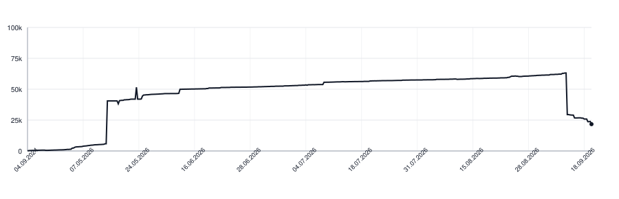

# Algorithm

  
  
  
  

<picture>
  <source media="(prefers-color-scheme: dark)" srcset=".github/loc-history-dark.svg">
  <source media="(prefers-color-scheme: light)" srcset=".github/loc-history-light.svg">
  
</picture>

  <b>深入学习算法与数据结构 | 主要写TS/JS 力扣题目，在目录ts/leetcode目录下</b>

